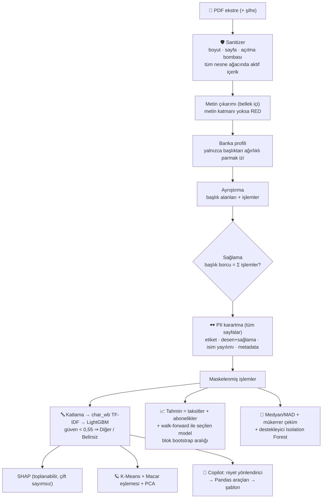

# 🧠 FinWise-AI: Kredi Kartı Ekstreleri İçin Uygulamalı Yapay Zeka

> PDF ekstre → güvenlik denetimi → ayrıştırma + **kuruşu kuruşuna sağlama** → PII karartma → POS sınıflandırma (+SHAP) → bileşen tabanlı tahmin → anomali → kümeleme → deterministik soru-cevap.
> Tamamı CPU'da, sıfır API maliyetiyle, **sentetik veriyle** ve ölçülmüş rakamlarla.

[](https://github.com/berkayyukunc/finwise-ai/actions/workflows/ci.yml)
[](https://www.python.org/)
[](https://opensource.org/licenses/MIT)

**Bu repoda gerçek kişisel veri yoktur.** Tüm ekstreler ve eğitim verisi sentetiktir; bunun metriklere etkisi [`MODEL_CARD.md`](MODEL_CARD.md) içinde açıkça tartışılır.

---

## Ölçülmüş sonuçlar

Aşağıdaki her sayı `make train`, `make benchmark` ya da `make test` ile yeniden üretilebilir.

| Alan | Ölçüm | Sonuç |
| :-- | :-- | :-- |
| **POS sınıflandırma** | Altın set (195 satır, eğitimde yok) macro-F1 | **0,837** |
| | Görülmemiş işyeri (GroupShuffleSplit) macro-F1 | 0,762 → esnaf+anahtar kelime **0,949**, anahtar kelimesiz yeni marka 0,555 (beklenen sınır) |
| | **Gerçek ekstre satırları** (ilk sürümün tamamını yanlış bildiği 10 satır) | **10/10 doğru** |
| | Görülmüş marka macro-F1 (iyimser üst sınır) | 0,965 |
| | Emin-ama-yanlış oranı (güven ≥ 0,90) | %2,1 |
| | Gecikme / boyut | 0,79 ms tekil · 0,06 ms/satır batch · 2,2 MB |
| **Document AI** | 8 farklı yerleşim: işlem sayısı, dönem borcu, asgari, son 4 hane, tarihler | 8/8 birebir; sağlama farkı 0,00 TL |
| | PII sızıntısı (ad, TC, adres, 3. kişi adı, metadata; tüm sayfalar) | 0 |
| | **Gerçek ekstrelerde saha doğrulaması** (yazarın kendi ekstreleri; repoda yer almaz) | 5 Vakıfbank PDF'i uçtan uca: 5/5 sağlama tuttu (fark 0,00 TL). 4 Ziraat ekstresi ekran görüntüsünden aktarılan satırlarla: 4/4 (PDF metin çıkarımı sınanmadı) |
| **Tahmin** | Aylık %95 aralığın ampirik kapsaması (100 simülasyon) | **%92** |
| **Anomali** | Anomalisiz sentetik ekstrelerde yanlış alarm | **%0,5** (ekstrelerin %76'sında hiç alarm yok) |
| **Kümeleme** | Centroid→arketip eşleme doğruluğu | 6/6 (4 farklı tohumda) · saflık > %95 |
| **Kalite** | Test / kapsama / lint | 282 test · %95 satır+dal kapsaması · ruff temiz |

> **İlk sürümle fark:** İlk sürüm "%99,9 F1" bildiriyordu; bu, sentetik veride rastgele ayrımın yol açtığı şablon sızıntısıydı (test satırlarının %35,5'i eğitimde vardı; markalar ayrılınca F1 0,205'e düşüyordu). Hikâyenin tamamı: [`PROJE_AMACI_VE_DEGERLENDIRME.md`](PROJE_AMACI_VE_DEGERLENDIRME.md).

---

## Mimari



**Sıra bilinçlidir:** PII, ayrıştırmadan *sonra* karartılır. Önce karartmak, sağlama için gereken başlık alanlarını (dönem borcu, son 4 hane) da yok eder. Ham PDF ve ham metin `process_pdf` dışına çıkmaz.

| Modül | Dosya | Tasarım kararı |
| :-- | :-- | :-- |
| Sanitizer | `src/document_ai/sanitizer.py` | Aktif içerik yalnızca kökte değil tüm nesnelerde aranır; akışlar sınırlı bellekle açılır |
| Ayrıştırıcı | `src/document_ai/bank_parsers/` | Veri güdümlü `BankProfile`; tek motor; gerçek sağlama (`None` = doğrulanamadı ≠ geçerli) |
| Karartıcı | `src/document_ai/redactor.py` | Sabit "üst %20" yerine kelime koordinatı bazlı tespit; içerik akışından siler |
| Ön işlemci | `src/nlp/preprocessor.py` | NFC + 6 Türkçe çiftin tamamında katlama; idempotent (hypothesis ile test edilir) |
| Sınıflandırıcı | `src/nlp/models.py` | Sızıntısız protokol; abstain; tek geçişli inference |
| Açıklayıcı | `src/nlp/explainer.py` | Toplanabilirlik ve n-gram→kelime dağıtımı testle kanıtlı |
| Tahmin | `src/predictive/forecasting.py` | Deterministik yükümlülükler ayrı; model seçimi gerçek adaylar üzerinde; yetersiz veride sayı uydurmaz |
| Anomali | `src/predictive/anomaly.py` | `contamination` yok: temiz ekstrede alarm üretmez |
| Kümeleme | `src/clustering/archetypes.py` | Küme kimliği keyfidir → centroid'ler prototiplere Macar algoritmasıyla eşlenir |
| Copilot | `src/copilot/agent.py` | LLM/RAG **değildir**; yanıttaki her tutar araç çıktısından gelir (testli); bilmediğini söyler |

---

## Hızlı başlangıç

```bash
python3 -m venv venv && source venv/bin/activate
make install        # kilitli bağımlılıklar + geliştirme araçları
make train          # sentetik veri → sızıntısız değerlendirme → model + metrik JSON
make check          # ruff + 282 test + %85 kapsama kapısı
make run            # http://localhost:8501
```

Docker (model, kilitli sürümlerle imaj içinde eğitilir; root olmayan kullanıcı):

```bash
docker build -t finwise-ai . && docker run --rm -p 7860:7860 finwise-ai
```

Diğer hedefler: `make benchmark` (Arena tablosunu yeniden ölç) · `make samples` (8 yerleşimde PDF + `truth.json`).

---

## Arayüz ve grafik paleti

Açık, sıcak bir tema kullanılır (turuncu marka rengi, kağıt tonunda zemin). Renkler tek kaynaktan gelir
([`src/ui/theme.py`](src/ui/theme.py)); sayfalarda elle yazılmış renk kalmadığını bir test doğrular.

Palet göz kararı seçilmedi, **ölçüldü**: kategorik sıra renk körlüğü (CVD) ve normal görme ayrım
eşiklerinden geçen adaylar arasından seçildi (komşu çiftlerde CVD ΔE 16,3 ve normal görme ΔE 19,6;
eşikler 8 ve 15). Uygulanan kurallar:

- 7 kategorik slot; fazlası 8. renk uydurulmadan nötr **"Diğer kategoriler"** kovasında toplanır.
- Büyüklük zaten çubuk uzunluğundaysa renkle tekrar kodlanmaz (günlük harcama tek renktir).
- SHAP'te yeşil/kırmızı yerine **ıraksak kırmızı ↔ mavi**: yeşil-kırmızı ikilisi en yaygın renk körlüğü
  türünde ayırt edilemez. Renk tek başına anlam taşımaz; her kutucuk SHAP değerini ipucunda gösterir.
- 3B galakside 6 kümeyi renkle ayırmak ölçülen eşiği geçemediği için popülasyon nötr çizilir ve
  yalnızca kullanıcının kümesi vurgulanır.

## Ekstreniz ayrıştırılamazsa

Sistem uydurmaz: işlem bulamazsa ya da sağlama tutmazsa bunu açıkça söyler. Nedenini **içeriği ifşa etmeden** görmek için:

```bash
PYTHONPATH=. python scripts/diagnose_statement.py /yol/ekstre.pdf
```

Çıktıda harfler `A`, rakamlar `9` ile maskelenir (`99.99.9999 AAAAA AAA 9,999.99`); yalnızca biçim kalır. Bu çıktıyı bir issue'ya güvenle yapıştırabilirsiniz.
Arayüz birden çok ayın ekstresini birlikte kabul eder; geçmiş uzadıkça mevsimsel tahmin modelleri ve abonelik tespiti devreye girer.

## Gizlilik

Gerçek ekstrenizi **yalnızca yerelde** işleyin. Herkese açık bir bulut kurulumuna gerçek ekstre yüklemek KVKK md. 9 kapsamında yurt dışına veri aktarımı sayılabilir; canlı demo yalnızca sentetik örnekler içindir. Proje PCI-DSS ya da KVKK uyumlu olduğunu **iddia etmez**; neyin korunduğu ve neyin korunmadığı [`SECURITY.md`](SECURITY.md) içindedir.

## Bilinen sınırlar

- Ayrıştırıcı yalnızca Vakıfbank'ın gerçek PDF'leriyle uçtan uca, Ziraat'in ise ekran görüntüsünden aktarılan satırlarıyla doğrulanmıştır; bu iki sentetik yerleşim o ekstrelerin *yapısından* (içeriğinden değil) türetilmiştir. Diğer altı banka yerleşimi temsilidir. İlk sürüm gerçek ekstrede 0 işlem ayrıştırmıştı (İngilizce sayı biçimi, çok sütunlu tutarlar, devir muhasebesi); ayrıntı için [`PROJE_AMACI_VE_DEGERLENDIRME.md`](PROJE_AMACI_VE_DEGERLENDIRME.md).
- Altın set yazarın elle yazdığı satırlardan oluşur; bağımsız bir etiketleyiciyle doğrulanmamıştır.
- OCR yoktur: taranmış PDF'ler açık bir hata mesajıyla reddedilir.
- Etiketsiz serbest metindeki kişi adları için NER gerekir.
- Arketip popülasyonu sentetiktir; kümeleme bir yöntem gösterimidir, segmentasyon bulgusu değildir.
- Getiri simülatörü deterministik senaryodur; yatırım tavsiyesi değildir.

## Dokümanlar

[`PROJE_AMACI_VE_DEGERLENDIRME.md`](PROJE_AMACI_VE_DEGERLENDIRME.md) tasarım kararları ve ödünleşimler · [`MODEL_CARD.md`](MODEL_CARD.md) · [`SECURITY.md`](SECURITY.md) · [`OGRENME_REHBERI.md`](OGRENME_REHBERI.md) mülakat anlatımı · [`docs/planning/`](docs/planning/) tarihsel planlama arşivi

**Lisans:** MIT
