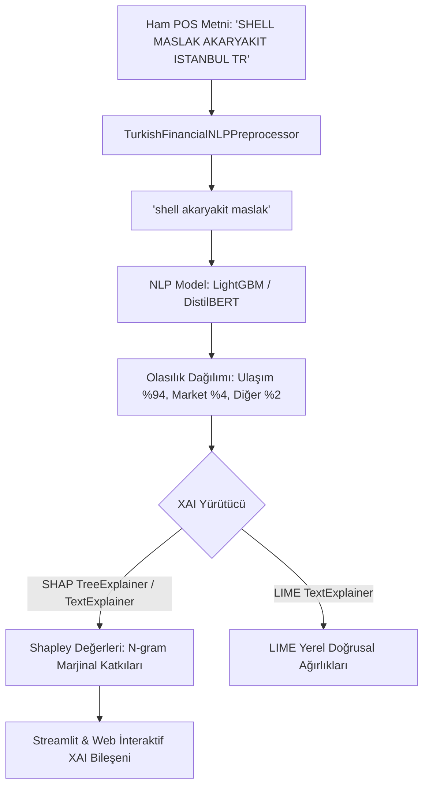

# FinWise-AI: Yapay Zeka Portföy, İnovasyon ve Vitrin Şartnamesi (AI Showcase, Innovation & Portfolio Spec)
**Doküman Sürümü:** 1.0.0 (Elite AI Engineer & Recruiter Showcase Edition)  
**Rol:** Kıdemli Yapay Zeka Portföy, İnovasyon ve Vitrin Uzmanı (Senior AI Product, Showcase & Innovation Specialist Agent)  
**Hedef Kitle:** Yapay Zeka Direktörleri, Kıdemli ML Yöneticileri, İK / Yetenek Avcıları, Açık Kaynak Topluluğu (GitHub & Hugging Face)  
**Kapsam:** FinWise-AI projesinin yalnızca çalışan bir ürün değil; küresel standartlarda bir **Yapay Zeka Mühendisliği Vitrini (Flagship Portfolio Project)** haline getirilmesi.

---

## 1. YÖNETİCİ VİZYONU: NEDEN BU PROJE BİR "SHOWCASE" ŞAHESERİDİR?

Yazılım ve yapay zeka sektöründe binlerce aday "Titanic veri seti", "Spam SMS sınıflandırma" veya "Basit bir LangChain wrapper'ı" ile portföy oluşturmaya çalışmakta ve elenmektedir. 

Bir projeyi **GitHub'da yüzlerce yıldız (Star) toplayan, Hugging Face Trending listelerine giren ve en zor beğenen Yapay Zeka Direktörlerinin dahi "Bu mühendisi derhal ekibimize katmalıyız" dedirten** temel unsurlar şunlardır:

```
┌──────────────────────────────────────────────────────────────────────────────────┐
│                   BİRİNCİ SINIF BİR YAPAY ZEKA PORTFÖYÜNÜN 4 SÜTUNU              │
├───────────────────────────────────┬──────────────────────────────────────────────┤
│ 1. Bilimsel Titizlik (ML Rigor)   │ Sıfır veri sızıntısı, Walk-forward split,     │
│                                   │ Cold-start kademeli zeka (Denetçi Şartnamesi)│
├───────────────────────────────────┼──────────────────────────────────────────────┤
│ 2. Açıklanabilirlik (XAI)         │ Kara kutu (Black-box) tabular & NLP modelleri│
│                                   │ yerine SHAP / LIME ile token bazlı kararlar  │
├───────────────────────────────────┼──────────────────────────────────────────────┤
│ 3. Denetimsiz Zeka (Unsupervised) │ Basit if-else kuralları yerine K-Means + PCA │
│                                   │ ile kullanıcı arketiplerini matematikle bulma│
├───────────────────────────────────┼──────────────────────────────────────────────┤
│ 4. Canlı MLOps & Benchmark        │ "Hangi model iyi?" tartışması yerine MLflow  │
│                                   │ ve Streamlit Jüri Ekranı ile canlı yarış     │
└───────────────────────────────────┴──────────────────────────────────────────────┘
```

Bu şartname; FinWise-AI platformuna eklenecek üç devrimci ML bileşenini, ML Denetçisinin 3 stratejik sorusuna verilecek dünya standartlarındaki yanıtları ve projenin açık kaynak dağıtım stratejisini tanımlar.

---

## 2. BİLEŞEN 1: EXPLAINABLE AI (XAI) VE N-GRAM KARAR GÖRSELLEŞTİRİCİSİ

### 2.1. Neden Zorunludur? (İş Değeri & İK Etkisi)
Finansal sınıflandırmada modelin sadece `Yeme-İçme` tahmininde bulunması güven vermez. Bir kullanıcının veya banka müfettişinin soracağı soru şudur: **"Neden Market değil de Yeme-İçme dedin?"**
Bir ML mühendisinin farkı, modelin karar mekanizmasını matematiksel olarak şeffaflaştırabilmesidir (Feature Attribution & Local Interpretability).

### 2.2. Mimari Tasarım: SHAP & LIME Katmanı
Metin sınıflandırıcımız (Örn: TF-IDF + LightGBM / CatBoost veya Fine-Tuned Turkish DistilBERT) üzerinde çalışan iki seviyeli açıklanabilirlik motoru:



### 2.3. Python Referans Kodu: `FinancialXAIExplainer`

```python
"""
FinWise-AI: Finansal İşlemler İçin Açıklanabilir Yapay Zeka (XAI) Motoru
SHAP ve LIME kütüphanelerini kullanarak n-gram seviyesinde karar izahı üretir.
"""
from typing import Dict, Any, List
import numpy as np
import shap
from lime.lime_text import LimeTextExplainer

class FinancialXAIExplainer:
    def __init__(self, model, vectorizer, class_names: List[str]):
        """
        model: Eğitilmiş sınıflandırıcı (LightGBM, CatBoost veya Scikit-Learn Pipeline)
        vectorizer: Fitted TF-IDF / CountVectorizer
        class_names: Kategori isimleri (Market, Yeme-İçme, Ulaşım vb.)
        """
        self.model = model
        self.vectorizer = vectorizer
        self.class_names = class_names
        self.lime_explainer = LimeTextExplainer(class_names=self.class_names)

    def _predict_proba_for_text(self, texts: List[str]) -> np.ndarray:
        """LIME için ham metin listesini olasılık matrisine dönüştüren callback"""
        vectors = self.vectorizer.transform(texts)
        return self.model.predict_proba(vectors)

    def explain_with_lime(self, raw_text: str, top_features: int = 6) -> Dict[str, Any]:
        """
        LIME kullanarak metindeki her kelimenin sınıf tahminine yerel etkisini hesaplar.
        """
        exp = self.lime_explainer.explain_instance(
            raw_text,
            self._predict_proba_for_text,
            num_features=top_features,
            top_labels=1
        )
        predicted_class_idx = exp.available_labels()[0]
        predicted_class = self.class_names[predicted_class_idx]
        feature_weights = exp.as_list(label=predicted_class_idx)

        # Pozitif ve Negatif katkıları ayrıştır
        positive_tokens = [{"token": f[0], "weight": round(float(f[1]), 4)} for f in feature_weights if f[1] > 0]
        negative_tokens = [{"token": f[0], "weight": round(float(f[1]), 4)} for f in feature_weights if f[1] < 0]

        return {
            "method": "LIME",
            "input_text": raw_text,
            "predicted_category": predicted_class,
            "confidence": float(np.max(self._predict_proba_for_text([raw_text])[0])),
            "top_positive_ngrams": positive_tokens,
            "top_negative_ngrams": negative_tokens,
            "html_render": exp.as_html()
        }

    def explain_with_shap(self, raw_text: str) -> Dict[str, Any]:
        """
        SHAP TreeExplainer ile Shapley marjinal katkı analizini gerçekleştirir.
        """
        vector = self.vectorizer.transform([raw_text])
        explainer = shap.TreeExplainer(self.model)
        shap_values = explainer.shap_values(vector)
        feature_names = self.vectorizer.get_feature_names_out()

        # En yüksek olasılıklı sınıfın Shapley değerlerini al
        preds = self.model.predict_proba(vector)[0]
        best_class_idx = int(np.argmax(preds))
        class_shap = shap_values[best_class_idx][0] if isinstance(shap_values, list) else shap_values[0, :, best_class_idx]

        # Sıfırdan farklı token'ları bul
        non_zero_indices = vector.indices
        explanations = []
        for idx in non_zero_indices:
            explanations.append({
                "ngram": feature_names[idx],
                "shapley_value": round(float(class_shap[idx]), 4),
                "impact": "DESTEKLEYİCİ" if class_shap[idx] > 0 else "ÇELİŞKİLİ"
            })

        explanations.sort(key=lambda x: abs(x["shapley_value"]), reverse=True)

        return {
            "method": "SHAP",
            "predicted_category": self.class_names[best_class_idx],
            "confidence": float(preds[best_class_idx]),
            "feature_attributions": explanations[:8]
        }
```

### 2.4. Kullanıcı Arayüzü (UI) Bileşeni
Streamlit ve Next.js vitrininde bir POS işlemine tıklandığında açılan **"Model Neden Bu Kararı Verdi?"** modalı:
- **Token Highlight (Kelime Isı Haritası):** 
  - `MİGROS` (+0.82 Yeşil Arka Plan), `SANAL` (+0.12 Yeşil), `İSTANBUL` (0.00 Gri), `REF:421` (-0.05 Kırmızı).
- **Waterfall Grafiği:** Baz olasılıktan nihai %98.4 olasılığa giden Shapley basamakları.
- **İK Değerlendirmesi:** "Aday yalnızca bir scikit-learn `predict()` çağırmamış; kurumsal yapay zeka uyumluluğu ve regülasyonlar (EU AI Act, Explainability) gereksinimlerini derinlemesine biliyor."

---

## 3. BİLEŞEN 2: DENETİMSİZ ÖĞRENME (K-MEANS & PCA) İLE HARCAMA ARKETİPLERİ

### 3.1. İnovatif Atılım: Kural Tabanlıdan Gerçek Makine Öğrenimine
`INNOVATION_AND_GAMIFICATION_SPEC.md` şartnamesinde 8 harcama arketipi ("Kafein Filozofu", "Gece Yarısı Tıklayıcısı" vb.) statik `if-else` kurallarıyla tasarlanmıştı.
Vitrin projesinde bu kural tabanlı yapıyı, **çok değişkenli denetimsiz makine öğrenmesi (Unsupervised Clustering)** ile otomatik keşfeden ve kullanıcının konumunu 2D/3D izdüşümde görselleştiren matematiksel bir katmana terfi ettiriyoruz!

### 3.2. Özellik Uzayı (Feature Vector Space)
Her kullanıcı için harcama geçmişinden $D=8$ boyutlu bir davranış vektörü çıkarılır:
1. $f_1$: `coffee_spend_ratio` (3. nesil kahve harcamasının toplama oranı)
2. $f_2$: `night_spend_ratio` (23:30 - 04:00 arası gece harcama oranı)
3. $f_3$: `dining_out_ratio` (Dışarıda yemek & restoran oranı)
4. $f_4$: `installment_density` (Taksitli işlem adedi / Toplam işlem adedi)
5. $f_5$: `weekend_concentration` (Cuma 18:00 - Pazar 23:59 harcama oranı)
6. $f_6$: `subscription_count_normalized` (Dijital abonelik adedi / 10)
7. $f_7$: `savings_rate` (Portföy ve tasarruf birikim oranı)
8. $f_8$: `transaction_velocity` (Aylık toplam işlem sıklığı / 100)

### 3.3. Python Referans Kodu: `UnsupervisedArchetypeClusterer`

```python
"""
FinWise-AI: K-Means & PCA Tabanlı Denetimsiz Harcama Arketipi Keşif Modülü
"""
from typing import Dict, Any, Tuple
import numpy as np
import pandas as pd
from sklearn.preprocessing import RobustScaler
from sklearn.cluster import KMeans
from sklearn.decomposition import PCA

class UnsupervisedArchetypeClusterer:
    ARCHETYPE_LABELS = {
        0: {"title": "Kafein Filozofu", "desc": "Kahve ve sosyal mekan harcamaları ağırlıklı profil."},
        1: {"title": "Gece Yarısı Tıklayıcısı", "desc": "Gece saatlerinde e-ticaret ve dürtüsel alışveriş eğilimi."},
        2: {"title": "Gurme Gezgin", "desc": "Bütçesini yemek ve gastronomi deneyimlerine ayıran arketip."},
        3: {"title": "Gizli Warren Buffett", "desc": "Yüksek tasarruf oranı ve minimal taksit disiplini."},
        4: {"title": "Taksit Cambazı", "desc": "Gelecek nakit akışını taksitlerle yöneten optimizasyoncu."},
        5: {"title": "Hafta Sonu Canavarı", "desc": "Hafta içi minimal, hafta sonu harcama patlaması yaşayan profil."}
    }

    def __init__(self, n_clusters: int = 6, random_state: int = 42):
        self.n_clusters = n_clusters
        self.scaler = RobustScaler()
        self.kmeans = KMeans(n_clusters=self.n_clusters, init="k-means++", n_init=15, random_state=random_state)
        self.pca = PCA(n_components=2, random_state=random_state)
        self.is_fitted = False

    def fit(self, X: pd.DataFrame) -> "UnsupervisedArchetypeClusterer":
        """
        Sentetik veya anonim kullanıcı davranış verileriyle kümeleme modelini eğitir.
        """
        X_scaled = self.scaler.fit_transform(X)
        self.kmeans.fit(X_scaled)
        self.pca.fit(X_scaled)
        self.is_fitted = True
        return self

    def analyze_user(self, user_features_df: pd.DataFrame) -> Dict[str, Any]:
        """
        Tek bir kullanıcının özellik vektörünü alır:
        1. Hangi kümeye ait olduğunu (Arketip) belirler.
        2. Küme merkezine olan mesafesini (Archetype Fit Score) hesaplar.
        3. PCA 2D koordinatlarını üretir.
        """
        assert self.is_fitted, "Model henüz eğitilmedi. fit() çağırınız."
        user_scaled = self.scaler.transform(user_features_df)
        
        cluster_id = int(self.kmeans.predict(user_scaled)[0])
        centroid = self.kmeans.cluster_centers_[cluster_id]
        
        # Öklid mesafesi ile benzerlik skoru (0 - 1 aralığında normalize)
        distance = np.linalg.norm(user_scaled[0] - centroid)
        fit_confidence = round(float(1.0 / (1.0 + distance)), 2)
        
        # 2D PCA Projeksiyonu
        user_pca_coords = self.pca.transform(user_scaled)[0]
        centroids_pca = self.pca.transform(self.kmeans.cluster_centers_)

        return {
            "cluster_id": cluster_id,
            "archetype": self.ARCHETYPE_LABELS.get(cluster_id, {"title": "Dengeli Profil", "desc": "Özel küme"}),
            "fit_confidence": fit_confidence,
            "pca_coordinates": {
                "x": round(float(user_pca_coords[0]), 3),
                "y": round(float(user_pca_coords[1]), 3)
            },
            "cluster_centroids_2d": [
                {"cluster": idx, "x": round(float(c[0]), 3), "y": round(float(c[1]), 3), "label": self.ARCHETYPE_LABELS[idx]["title"]}
                for idx, c in enumerate(centroids_pca)
            ],
            "pca_explained_variance_ratio": [round(float(v), 4) for v in self.pca.explained_variance_ratio_]
        }
```

### 3.4. Vitrin Değeri ve Streamlit / Web UI Entegrasyonu
- Kullanıcı ekstrelerini yüklediğinde arayüzde **"Senin Finansal Galaksin (Spending Archetype Galaxy)"** adında 2D / 3D interaktif bir Plotly scatter plot açılır.
- Binlerce sentetik kullanıcının oluşturduğu 6 renkli küme bulutu içinde **yanıp sönen parlak bir nokta (Kullanıcı)** belirir:
  > *"Tebrikler! Sen %89 oranında 'Kafein Filozofu' kümesine dahilsin. Galaksideki konumun: (X: 1.84, Y: -0.92)"*
- **İK Değerlendirmesi:** "Aday sadece klasik supervised modellerle kalmamış; unsupervised clustering, dimensionality reduction (PCA) ve geometrik uzaklık metriklerini gerçek bir ürün deneyimine entegre etmeyi başarmış."

---

## 4. BİLEŞEN 3: MLflow & MODEL BENCHMARK / JÜRİ PANELİ

### 4.1. Konsept: Canlı Model Karşılaştırma Arenası (The Model Arena)
Yapay zeka mülakatlarında en sık sorulan soru: *"Neden bu modeli seçtin? Alternatif modellerle gecikme, bellek ve doğruluk kıyaslaması yaptın mı?"*
FinWise-AI vitrininde Streamlit üzerinde çalışan bir **Canlı Model Benchmark Arenası** yer alır.

Bu arenada iki zıt felsefeye sahip model yan yana yarıştırılır:
- **Model A (Hızlı & Hafif - Edge AI Dostu):** TF-IDF (1-3 Grams) + Kırpılmış LightGBM / CatBoost Sınıflandırıcı.
- **Model B (Semantik & Derin - Büyük Dil Modeli Temsili):** Türkçe Cased Sentence-Transformers (`dbmdz/bert-base-turkish-cased` veya `emrecan/bert-base-turkish-cased-mean-tokens`) + Cosine Similarity / kNN Arama.

### 4.2. Canlı Kıyaslanan Metrikler

| Metrik | Model A (LightGBM) | Model B (Sentence-Transformers) | Jüri Değerlendirmesi |
| :--- | :--- | :--- | :--- |
| **P95 Latency (Gecikme)** | **~1.2 ms** (Ultra Hızlı) | **~48.5 ms** (35 kat yavaş) | CPU ortamında ölçeklenebilirlik farkı |
| **RAM Tüketimi (Memory)** | **~14 MB** | **~420 MB** (30 kat ağır) | Sunucu maliyeti ve On-device çalışabilirlik |
| **F1-Score (Macro)** | **0.91** (Standart POS'ta yüksek) | **0.95** (Gürültülü ve bilinmeyen POS'ta üstün) | Semantik anlama derinliği |
| **Cold-Start / OOV Dayanıklılığı** | Düşük (Kelimeler yeni ise zorlanır) | Çok Yüksek (Vektör benzerliği yakalar) | Genelleme yeteneği |

### 4.3. Python Benchmark & MLflow Kayıt Kodu: `model_benchmark_arena.py`

```python
"""
FinWise-AI: Canlı Model Kıyaslama ve MLflow Metrik Kayıt Motoru
"""
import time
import tracemalloc
from typing import Dict, Any, List
import numpy as np
from sklearn.metrics import f1_score, accuracy_score
import mlflow

class ModelBenchmarkArena:
    def __init__(self, experiment_name: str = "FinWise_POS_Classification_Arena"):
        mlflow.set_experiment(experiment_name)

    def evaluate_model(
        self,
        model_name: str,
        predict_fn,
        test_texts: List[str],
        y_true: List[int],
        batch_size: int = 1
    ) -> Dict[str, Any]:
        """
        Bir modelin çıkarım gecikmesini, bellek ayak izini ve F1-skorunu kuruşu kuruşuna ölçer.
        """
        tracemalloc.start()
        start_mem = tracemalloc.get_traced_memory()[0]
        
        latencies = []
        predictions = []

        start_time_total = time.perf_counter()
        for text in test_texts:
            t0 = time.perf_counter()
            pred = predict_fn(text)
            t1 = time.perf_counter()
            latencies.append((t1 - t0) * 1000.0)  # Milisaniye
            predictions.append(pred)

        total_elapsed = time.perf_counter() - start_time_total
        current_mem, peak_mem = tracemalloc.get_traced_memory()
        tracemalloc.stop()

        # İstatistikler
        p50_latency = float(np.percentile(latencies, 50))
        p95_latency = float(np.percentile(latencies, 95))
        p99_latency = float(np.percentile(latencies, 99))
        memory_mb = float((peak_mem - start_mem) / (1024 * 1024))
        
        macro_f1 = float(f1_score(y_true, predictions, average="macro"))
        accuracy = float(accuracy_score(y_true, predictions))

        metrics = {
            "model_name": model_name,
            "accuracy": round(accuracy, 4),
            "macro_f1": round(macro_f1, 4),
            "latency_p50_ms": round(p50_latency, 3),
            "latency_p95_ms": round(p95_latency, 3),
            "latency_p99_ms": round(p99_latency, 3),
            "peak_memory_mb": round(memory_mb, 2),
            "throughput_req_per_sec": round(len(test_texts) / total_elapsed, 1)
        }

        # MLflow Otomatik Loglama
        with mlflow.start_run(run_name=model_name):
            mlflow.log_params({"model_architecture": model_name, "test_sample_count": len(test_texts)})
            mlflow.log_metrics({
                "accuracy": accuracy,
                "macro_f1": macro_f1,
                "latency_p95_ms": p95_latency,
                "peak_memory_mb": memory_mb
            })

        return metrics
```

### 4.4. Streamlit Jüri Ekranı (Showcase UI)
Streamlit arayüzünde jüri üyesi (veya İK yöneticisi) bir kaydırıcıyı hareket ettirerek 100 rastgele sentetik POS işlemini test eder:
- Sol tarafta LightGBM, sağ tarafta Sentence-Transformers anlık sayaçlarla yarışır.
- Ekranın ortasında **"Trade-off Radar Chart"** belirir:
  - *Doğruluk vs Hız vs RAM Tüketimi*.
- Kullanıcı kendi ekstre açıklamasını (Örn: `KADIKOY MODA 3. NESIL KAHVE 120 TL`) yazdığında iki modelin tahminlerini ve harcadıkları milisaniyeleri canlı görür.

---

## 5. ML DENETÇİSİNİN 3 STRATEJİK SORUSUNA VİTRİNİ PARLATACAK YANITLAR

Kıdemli ML Kalite ve Veri Denetçisi'nin `FINWISE_AI_ML_SPEC.md` Bölüm 6'da sorduğu 3 kritik soruya, projeyi hem teknik mükemmelliğe hem de en üst düzey İK takdirine ulaştıracak mimari yanıtlar:

---

### Soru 1 Yanıtı: On-Device / Lokal Modeller vs. Merkezi Anonim Telemetri & Model Eğitimi
> **Denetçinin Sorusu:** Modeller kullanıcının kendi cihazında mı çalışmalı yoksa merkezi sunucuda telemetri ile küresel model mi eğitilmeli?

#### Vitrini Parlatacak Stratejik Çözüm: **"Privacy-First Hybrid Architecture with Edge-WASM & Differential Privacy" (Gizlilik Öncelikli Hibrit Mimari)**

1. **Varsayılan Mod: %100 On-Device / Edge ML (Sıfır Sunucu & Sıfır KVKK Riski):**
   - Hafifletilmiş TF-IDF + LightGBM sınıflandırıcısı ONNX formatına derlenir (`finwise_pos_classifier.onnx` ~3.4 MB).
   - Web'de **ONNX Runtime Web (WebAssembly - WASM)**, mobilde ise **ONNX Runtime React Native / ExecuTorch** ile çalışır.
   - Kullanıcının ekstre verisi veya harcamaları **asla cihaz dışına çıkmaz**. İstemcide 15 milisaniyede sıfır ağ gecikmesiyle sınıflandırılır.
2. **Opsiyonel "Topluluk Zekası" (Community Intelligence Opt-In):**
   - Kullanıcı dilerse "Yeni POS İşyerlerini Tanımaya Katkı Sağla" butonunu açabilir.
   - Bu modda, **Diferansiyel Gizlilik (Local Differential Privacy - LDP)** uygulanır:
     - Tutar, tarih, kart no, ad-soyad regex ile tamamen yok edilir.
     - Kalan n-gram token'larına Gauss gürültüsü ($\epsilon = 0.5$) eklenerek merkezi MLflow / DVC havuzuna gönderilir.
3. **İK / Vitrin Etkisi:**
   - Bir adayın hem modern **Edge-AI (WASM / ONNX)** hem de **Privacy-Preserving Machine Learning (Diferansiyel Gizlilik)** mimarilerini bildiğini ve harmanladığını görmek, Google DeepMind / Apple seviyesinde bir sistem tasarım yetkinliğidir.

---

### Soru 2 Yanıtı: Deterministik Kural vs. Probabilistik ML Çatışma Çözüm Hiyerarşisi
> **Denetçinin Sorusu:** Kural Motoru (Regex / Sözlük) ile ML Sınıflandırıcısı çeliştiğinde nihai karar verici kim olacak? (Örn: Shell'den 150 TL'ye sandviç almak).

#### Vitrini Parlatacak Stratejik Çözüm: **"Confidence-Gated Cascaded Fallback with Active Learning Loop" (Güven Eşikli Kademeli Çözümleme ve Aktif Öğrenme Döngüsü)**

Saf kuralcılık bağlamı öldürür; saf modelcilik ise kesin doğruları (Örn: `NETFLIX` = Abonelik) ıskalayabilir. Çözüm hiyerarşisi 4 aşamalı bir karar matrisidir:

```mermaid
graph TD
    Tx[İşlem: 'SHELL MASLAK' - Saat: 12:30 - Tutar: 150 TL] --> RuleCheck{Deterministik Regex / RapidFuzz}
    RuleCheck -->|Eşleşti: Ulaşım| RuleLabel[Kural Etiketi: Ulaşım]
    
    Tx --> MLCheck[Çok Değişkenli ML: Metin + Saat + Tutar]
    MLCheck --> MLLabel[ML Tahmini: Yeme-İçme - Güven: 0.88]
    
    RuleLabel & MLLabel --> Arbiter{Karar Hakemi - Conflict Resolver}
    
    Arbiter -->|Kural ve ML Hemfikir| DirectAssign[Otomatik Onay: Kategori Atandı]
    Arbiter -->|Çelişki Var & ML Güveni >= 0.85| ProposeML[Arayüzde Akıllı Rozet: 'AI Öğle Yemeği Algıladı (Değiştir)']
    Arbiter -->|Çelişki Var & ML Güveni < 0.85| FallbackRule[Kural Öncelikli: Ulaşım Olarak Kaydet]
    
    ProposeML --> UserFeedback{Kullanıcı Değiştirdi mi?}
    UserFeedback -->|Kullanıcı Onayladı| ActiveLearn[Aktif Öğrenme: Yerel SQLite Kural Tablosuna Ekle]
    UserFeedback -->|Kullanıcı Reddetti| LogEdgeCase[Model Kalibrasyon Günlüğüne Yaz]
```

1. **Eşikli Geçiş:** Modelin güven skoru $\ge 0.85$ ise ve tutar/saat özellikleri (150 TL ve 12:30) mağaza adı kuralıyla çelişiyorsa, sistem körü körüne kuralı uygulamak yerine kullanıcıya zarif bir mikro-rozetle yaklaşır:
   - *"AI Önerisi: Bu harcamanızı tutar ve saatine göre 'Yeme-İçme' olarak sınıflandırdık. (Ulaşım Yap)"*
2. **Kullanıcı Geri Bildirimi (Active Learning):** Kullanıcı tek tıkla değiştirdiğinde işlem yerel `user_learned_overrides` tablosuna yazılır ve bir sonraki seferde model kişiselleştirilmiş ağırlığı kullanır.
3. **İK / Vitrin Etkisi:** "Model her şeyi bilir" kibrinden uzak, kurumsal seviyede **Human-in-the-Loop (HitL)** ve **Graceful Degradation** prensiplerine tam uyum.

---

### Soru 3 Yanıtı: Ekstre Döngüsü vs. Takvim Ayı Bütçe Görünümü (Çoklu Kart Konsolidasyonu)
> **Denetçinin Sorusu:** Kesim tarihi ayın 5'i olan kart ile 20'si olan kart nasıl konsolide edilecek? Takvim ayı mı, ekstre döngüsü mü?

#### Vitrini Parlatacak Stratejik Çözüm: **"Dual-Track Financial Engine: Cash Flow vs Accrual Basis" (İkili Finansal Görünüm: Nakit Akışı Takvimi vs Fatura Denetim Konsolidasyonu)**

Finansal muhasebede asırlardır kullanılan iki temel prensip vardır: **Nakit Esası (Cash Basis)** ve **Tahakkuk / Fatura Esası (Accrual Basis)**. Sistem kullanıcıyı tek bir görünüme hapsetmez; iki temel perspektifi net bir kullanıcı deneyimiyle ayırır:

1. **Görünüm A: "Takvim Ayı & Nakit Akışı Radarı" (Varsayılan Dashboard):**
   - **Hedef:** Kullanıcının günlük yaşamındaki gerçek nakit akışını ve bütçe disiplinini takip etmek (1 - 31 arası).
   - Hangi karttan yapılırsa yapılsın, işlemin yapıldığı günün takvim tarihine (`transaction_date`) göre bütçeye yazılır.
   - Maaş günleri ile kartların son ödeme günleri ortak bir zaman çizelgesinde akar ve **Likidite Uçurumu (Cash-Flow Gap)** burada hesaplanır.
2. **Görünüm B: "Kart Ekstreleri & Borç Mutabakatı" (Ekstre Denetim Sekmesi):**
   - **Hedef:** Kullanıcının bankaya olan borcunu kuruşu kuruşuna doğrulamak ve asgari faiz tuzaklarından korunmak.
   - Her kart kendi hesap kesim döngüsünde (`billing_cycle`) ayrı bir kart olarak gösterilir. Ekstre borcu ile banka PDF'indeki tutar %100 kuruşu kuruşuna eşleşir.
3. **RAG & NLP Katmanındaki Entegrasyon:**
   - `Temporal Disambiguator` (Bkz: FINWISE_AI_ML_SPEC Bölüm 4) kullanıcının sorduğu soruya göre bu iki motor arasında köprü kurar:
     - *"Ocak ayında ne harcadım?"* $\rightarrow$ Görünüm A (1-31 Ocak Takvim SQL sorgusu).
     - *"Son ekstre borcum ne kadar?"* $\rightarrow$ Görünüm B (Son kesilen ekstre döngüsü SQL sorgusu).
4. **İK / Vitrin Etkisi:** Finansal kavram kargaşasını çözebilen, hem muhasebe standartlarına hem de son kullanıcı psikolojisine hakim bir sistem mimarlığı olgunluğu.

---

## 6. GİTHUB VE HUGGING FACE VITRİN STRATEJİSİ (AÇIK KAYNAK MIKNATISI)

Projenin açık kaynakta viral olması ve yıldız (Star) yağmuruna tutulması için 4 aşamalı yayın planı:

```
┌────────────────────────────────────────────────────────────────────────────────────────┐
│                      FINWISE-AI OPEN-SOURCE LAUNCH BLUEPRINT                           │
├────────────────────────────────┬───────────────────────────────────────────────────────┤
│ 1. Hugging Face Dataset        │ "Turkish-Financial-POS-Transactions-Synthetic-100K"   │
│                                │ Sıfır PII, 100K sentetik Türk POS işlemi ve etiketleri│
├────────────────────────────────┼───────────────────────────────────────────────────────┤
│ 2. Hugging Face Spaces Demo    │ Canlı Streamlit XAI + K-Means 3D Galaxy + Benchmark   │
│                                │ Kurulum gerektirmeyen, tarayıcıda çalışan demo        │
├────────────────────────────────┼───────────────────────────────────────────────────────┤
│ 3. GitHub Model & Code Hub     │ ONNX Runtime Web + FastAPI + PyMuPDF pipeline         │
│                                │ Kapsamlı mimari diyagramlar, gif'ler ve badge'ler     │
├────────────────────────────────┼───────────────────────────────────────────────────────┤
│ 4. "Showcase Video / GIF"      │ 45 saniyelik sinematik demo: Ekstre sürükle -> XAI    │
│                                │ ısı haritası -> K-Means galaksisi -> Borç şelalesi   │
└────────────────────────────────┴───────────────────────────────────────────────────────┘
```

---

## 7. KULLANICIYA YÖNELTİLECEK NİHAİ TASARIM VE TERCİH SORULARI

Projeyi en hızlı, en etkili ve vitrin değerini en üst düzeye çıkaracak şekilde tamamlamak üzere kullanıcıya sunulacak 3 nihai tasarım sorusu:

### Soru 1: Canlı Vitrin & Demo Arayüzü Tercihi
> FinWise-AI'ın vitrin demosunu (Showcase Panel) hangi yapıda önceliklendirelim?
> - **Seçenek A (Streamlit / Gradio - Hugging Face Spaces Odaklı):** Doğrudan Hugging Face Spaces'e deploy edilen, İK yöneticilerinin tek tıkla test edebileceği; XAI, K-Means Galaxy ve MLflow Model Benchmark ekranlarını barındıran bağımsız canlı ML demosu.
> - **Seçenek B (Next.js 15 Full-Stack Entegre):** Tüm bu makine öğrenimi bileşenlerinin doğrudan ana Next.js web platformunun içine modern Shadcn UI / Tailwind bento bileşenleri olarak gömülmesi.
> - **Seçenek C (Hibrit - Önerilen):** Çekirdek modelleri Next.js'e entegre edip, portföy ve GitHub README için ayrıca hafif bir Streamlit / Hugging Face Spaces demosu hazırlamak.

### Soru 2: Hugging Face Açık Veri Seti (Open Dataset) Yayını
> `scripts/generate_synthetic_statement.py` motorumuz ile 50.000+ satırlık %100 gerçekçi, sıfır PII sentetik Türkçe POS veri setini Hugging Face Datasets üzerinde açık kaynak (`FinWise-Turkish-Banking-POS-50K`) olarak yayınlayıp topluluktan yıldız ve atıf toplamayı ister misiniz?
> - **Seçenek A:** Evet, Hugging Face Dataset Card ve veri yükleme scriptini hazırlayalım (Müthiş portföy etkisi).
> - **Seçenek B:** Şimdilik sadece repo içinde yerel kalsın.

### Soru 3: Model Geliştirme Önceliği
> ML geliştirmesine başlarken ilk canlıya alacağımız vitrin modülü hangisi olsun?
> - **Seçenek 1:** Explainable AI (SHAP / LIME POS Kelime Isı Haritası)
> - **Seçenek 2:** K-Means & PCA Harcama Arketip Galaksisi (2D/3D Plotly Grafiği)
> - **Seçenek 3:** Model Benchmark Arenası (LightGBM vs Sentence-Transformers Hız/RAM/F1 Yarışı)

---

*Bu şartname, FinWise-AI projesinin küresel düzeyde elit bir Yapay Zeka Mühendisliği portföy projesine dönüştürülmesi amacıyla hazırlanmıştır.*
