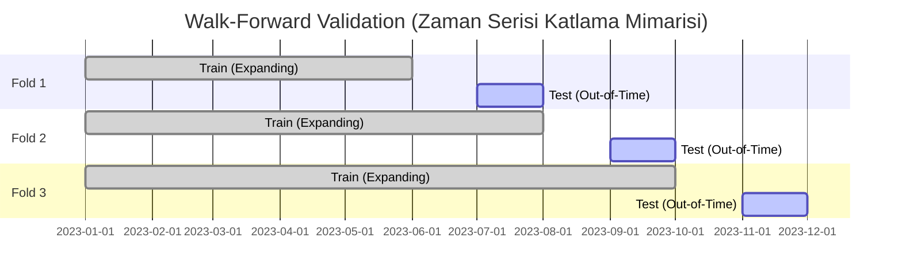
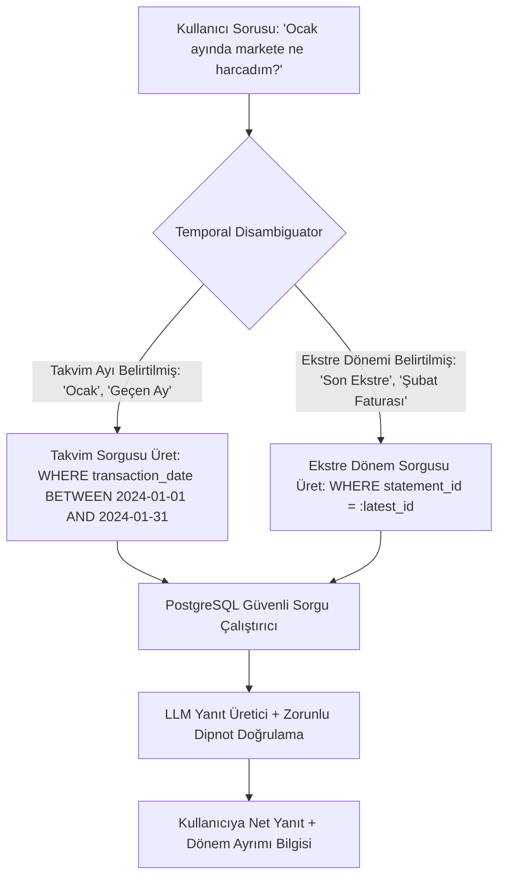

# FinWise-AI: Makine Öğrenimi Kalite, Veri Etiği ve Model Denetim Şartnamesi (ML Quality, Rigor & Data Auditor Spec)
**Doküman Sürümü:** 1.0.0 (Strict ML Rigor & Synthetic Data Edition)  
**Rol:** Kıdemli ML Kalite, Veri Etiği ve Model Denetçisi (Senior ML Quality, Rigor & Data Auditor Agent)  
**Kapsam:** `FinWise` ve `FinWise-AI` ekosistemindeki tüm makine öğrenimi modelleri, zaman serisi tahminleyicileri, anomali tespit motorları, kategorizasyon NLP boru hatları, RAG ajanları ve açık kaynak gizlilik katmanı.

---

## İÇİNDEKİLER
1. [Yönetici Denetim Özeti ve Temel İlkeler](#1-yönetici-denetim-özeti-ve-temel-ilkeler)
2. [Bölüm 1: Zaman Serisi Modelleri ve Veri Sızıntısı (Data Leakage) Koruması](#2-bölüm-1-zaman-serisi-modelleri-ve-veri-sızıntısı-data-leakage-koruması)
   - 2.1. Standart K-Fold Yasağı ve Zaman Sıralı Ayrıştırma Zorunluluğu
   - 2.2. Walk-Forward (Rolling & Expanding Window) Doğrulama Mimarisi
   - 2.3. Özellik Mühendisliği (Feature Engineering) Sızıntı Önleme Protokolü
   - 2.4. Python Referans Kodu: `StrictTimeSeriesSplitter`
3. [Bölüm 2: Türkçe NLP Tuzakları, Ön İşleme ve Regex Maskeleme Katmanı](#3-bölüm-2-türkçe-nlp-tuzakları-ön-işleme-ve-regex-maskeleme-katmanı)
   - 3.1. Python Unicode Türkçe Harf Faciası (`İ`/`i`, `I`/`ı`) ve Kesin Çözüm
   - 3.2. POS Çöp Ekleri ve Ticari Unvan Normalizasyonu
   - 3.3. Modeli Zehirleyen Tutar/Tarih Verileri için Regex Maskeleme (`<NUM>`, `<DATE>`, `<CURRENCY>`)
   - 3.4. Python Referans Kodu: `TurkishFinancialNLPPreprocessor`
4. [Bölüm 3: Cold Start (Soğuk Başlangıç) ve Kademeli Zeka (Tiered Intelligence) Mimarisi](#4-bölüm-3-cold-start-soğuk-başlangıç-ve-kademeli-zeka-tiered-intelligence-mimarisi)
   - 4.1. Tek Ekstre Tehlikesi: Prophet ve Isolation Forest Neden Çöker?
   - 4.2. Seviye 1: Tek Ekstre ($N_{months} = 1$) Deterministik Fallback Kuralları
   - 4.3. Seviye 2: Ara Dönem ($2 \le N_{months} < 6$) Hafif İstatistiksel Yöntemler
   - 4.4. Seviye 3: Olgun Veri ($N_{months} \ge 6$) Prophet & Isolation Forest
   - 4.5. Python Referans Kodu: `TieredIntelligenceEngine`
5. [Bölüm 4: RAG & LLM Halüsinasyon Kontrolü: Ekstre Kesim Tarihi vs Takvim Ayı](#5-bölüm-4-rag--llm-halüsinasyon-kontrolü-ekstre-kesim-tarihi-vs-takvim-ayı)
   - 5.1. Çakışma Senaryosu ve Finansal Halüsinasyon Riski
   - 5.2. Çift Zaman Damgası (Dual Timestamp) Veri Modeli
   - 5.3. RAG Sorgu Çözümleyici (Temporal Disambiguator & SQL Guardrail)
   - 5.4. Prompt Şablonu ve Disambiguation Dipnot Kuralı
6. [Bölüm 5: GitHub / Açık Kaynak Gizliliği & %100 Gerçekçi Sentetik Ekstre Üreticisi](#6-bölüm-5-github--açık-kaynak-gizliliği--100-gerçekçi-sentetik-ekstre-üreticisi)
   - 5.1. Açık Kaynak Test İhtiyacı ve Sıfır PII Garantisi
   - 5.2. Sentetik Ekstre Üretim Motoru Tasarımı (`SyntheticStatementGenerator`)
   - 5.3. Banka Mizanpajları, Gerçekçi Türk POS Açıklamaları ve Uç Senaryo Enjeksiyonu
   - 5.4. Kuruşu Kuruşuna Bakiye Sağlaması (Checksum Enforcer)
   - 5.5. Python CLI Aracı: `scripts/generate_synthetic_statement.py`
7. [Bölüm 6: Stratejik Teknik Sorular (Geliştirme Öncesi Netleşmesi Gerekenler)](#7-bölüm-6-stratejik-teknik-sorular-geliştirme-öncesi-netleşmesi-gerekenler)
8. [Bölüm 7: Denetçi Onay Matrisi (ML Audit Gate Checklist)](#8-bölüm-7-denetçi-onay-matrisi-ml-audit-gate-checklist)

---

## 1. Yönetici Denetim Özeti ve Temel İlkeler

Finansal yapay zeka sistemlerinde yapılacak en ufak metodolojik hata; kullanıcının hatalı harcama tahminlerine güvenmesine, bütçesini aşmasına, yanlış anomali uyarılarıyla paniklemesine veya kişisel verilerinin ifşa olmasına yol açar.

Bu şartname, `FinWise-AI` sisteminin **akademik titizlik (scientific rigor)**, **veri etiği (data ethics)**, **sıfır veri sızıntısı (zero data leakage)** ve **Türk bankacılık pratiklerine tam uyum** çerçevesinde geliştirilmesini garanti altına alır.

> [!IMPORTANT]
> **Kıdemli Denetçi İlkesi:** 
> Bir makine öğrenimi modelinin performansı (Accuracy, R2, F1-Score) laboratuvar ortamında ne kadar yüksek çıkarsa çıksın; eğer model gelecekteki veriyi geçmişe sızdırarak eğitilmişse, Türkçe karakter uyumsuzluğu yüzünden veri kaçırıyorsa veya yetersiz veride (Cold Start) matematiksel çöküş yaşıyorsa **ÜRETİM ORTAMINA ALINAMAZ.**

---

## 2. Bölüm 1: Zaman Serisi Modelleri ve Veri Sızıntısı (Data Leakage) Koruması

### 2.1. Standart K-Fold Yasağı ve Zaman Sıralı Ayrıştırma Zorunluluğu
Zaman serisi harcama ve bütçe tahminlerinde en sık yapılan ölümcül hata; verileri rastgele karıştırarak (`shuffle=True`) standart `KFold` veya `train_test_split` ile eğitmektir.
- **Tuzak:** 2024 Mart ayındaki bir harcamayı tahmin etmek için 2024 Nisan ve Mayıs harcamalarının eğitim setine girmesi. Model enflasyon trendini, kurban bayramı dönemselliğini veya döviz sıçramalarını "gelecekten öğrenir" ve %99 başarı gösterir; fakat gerçek dünyada gelecek bilinemeyeceği için canlıda felaket sonuçlar üretir.
- **Katı Kural:** Rastgele K-Fold ve `shuffle=True` kullanımı **kesinlikle yasaktır**. Tüm çapraz doğrulamalar zaman ekseninde ileri yönlü (`Walk-forward validation`) olmak zorundadır.

### 2.2. Walk-Forward (Rolling & Expanding Window) Doğrulama Mimarisi



Model validasyonunda `TimeSeriesSplit(n_splits=5)` veya `PurgedGroupTimeSeriesSplit` (işlemler arasında en az 7 günlük tampon/embargo süresi bırakan) kullanılacaktır.

### 2.3. Özellik Mühendisliği (Feature Engineering) Sızıntı Önleme Protokolü
1. **Gecikmeli Özellikler (Lag Features):** Bir $t$ günündeki harcamayı tahmin ederken kullanılacak tüm gecikmeli değerler ($t-1, t-7, t-30$) kesinlikle en az 1 adım ötelenmiş (`shift(1)`) olmalıdır.
2. **Kayan İstatistikler (Rolling Statistics):** Kayan ortalama (`rolling(window=7).mean()`) hesaplanırken $t$ anının kendi değeri pencereye dahil edilemez (`closed='left'`).
3. **Ölçekleme ve Kodlama (Scaling & Target Encoding):** `StandardScaler`, `MinMaxScaler` veya `TargetEncoder` modelleri **SADECE** Train penceresinde `fit()` edilmeli, Test penceresinde sadece `transform()` uygulanmalıdır. Tüm veri setine tek seferde `fit_transform()` yapmak denetimden doğrudan ret sebebidir.

### 2.4. Python Referans Kodu: `StrictTimeSeriesSplitter`

```python
"""
FinWise-AI: Zaman Serisi Veri Sızıntısı Korumalı Doğrulama Modülü
"""
from typing import Generator, Tuple
import numpy as np
import pandas as pd
from sklearn.base import BaseEstimator, TransformerMixin
from sklearn.model_selection import TimeSeriesSplit

class SafeLagFeatureGenerator(BaseEstimator, TransformerMixin):
    """
    Sıfır veri sızıntısı garantili gecikme ve kayan istatistik üreticisi.
    Gelecek verisinin bugüne sızmasını engellemek için shift(1) zorunludur.
    """
    def __init__(self, target_col: str, lags: list[int] = [1, 7, 30], windows: list[int] = [7, 30]):
        self.target_col = target_col
        self.lags = lags
        self.windows = windows

    def fit(self, X: pd.DataFrame, y=None):
        return self

    def transform(self, X: pd.DataFrame) -> pd.DataFrame:
        df = X.copy()
        # Tarih sıralamasından emin ol
        if not df.index.is_monotonic_increasing:
            df = df.sort_index()

        # Lag özellikleri (Asla t anı dahil edilemez)
        for lag in self.lags:
            df[f"{self.target_col}_lag_{lag}"] = df[self.target_col].shift(lag)

        # Kayan ortalama ve standart sapma (closed='left' ile t hariç tutulur)
        for w in self.windows:
            rolled = df[self.target_col].shift(1).rolling(window=w, min_periods=1)
            df[f"{self.target_col}_roll_mean_{w}"] = rolled.mean()
            df[f"{self.target_col}_roll_std_{w}"] = rolled.std().fillna(0)

        return df

class StrictTimeSeriesValidator:
    """
    Walk-forward zaman serisi çapraz doğrulama yürütücüsü.
    """
    def __init__(self, n_splits: int = 5, test_size_days: int = 30):
        self.n_splits = n_splits
        self.test_size_days = test_size_days

    def split(self, df: pd.DataFrame) -> Generator[Tuple[pd.DataFrame, pd.DataFrame], None, None]:
        tscv = TimeSeriesSplit(n_splits=self.n_splits)
        for train_index, test_index in tscv.split(df):
            train_fold = df.iloc[train_index]
            test_fold = df.iloc[test_index]
            # Validasyon: Train maksimum tarihi kesinlikle Test minimum tarihinden önce olmalı
            assert train_fold.index.max() < test_fold.index.min(), "KRİTİK HATA: Zaman serisi veri sızıntısı tespit edildi!"
            yield train_fold, test_fold
```

---

## 3. Bölüm 2: Türkçe NLP Tuzakları, Ön İşleme ve Regex Maskeleme Katmanı

### 3.1. Python Unicode Türkçe Harf Faciası (`İ`/`i`, `I`/`ı`) ve Kesin Çözüm
Python'un standart `str.lower()` metodu ISO Latin tabanlıdır ve Türkçedeki noktalı/noktasız I harflerini bozar:
- `'İSTANBUL'.lower() -> 'i̇stanbul'` (Nokta karakteri ayrık birleşen `\u0307` olarak kalır).
- `'IŞIK'.lower() -> 'işık'` olması gerekirken Python standart kütüphanesinde `'ışık'` yerine İngilizce `i` eşleşme riskleri doğabilir.
- `'ılık'.upper() -> 'ILIK'` doğruyken, `'istanbul'.upper() -> 'ISTANBUL'` olur (`İ` harfi kaybolur).
- **Model Sonucu:** `MİGROS` kelimesi embedding aramasında `migros` ile eşleşemez, Out-of-Vocabulary (OOV) patlaması yaşanır.

### 3.2. POS Çöp Ekleri ve Ticari Unvan Normalizasyonu
Türk banka POS cihazları ekstreye standart dışı ticari unvanlar ve lokasyon kodları basar:
- `MIGROS TIC A S ISTANBUL TR 324143` -> Hedef: `migros`
- `SHELL PETROL A.S. MASLAK SUBE 04` -> Hedef: `shell petrol`
- `ZARA GIYIM ITH. IHR. LTD. STI.` -> Hedef: `zara`

### 3.3. Modeli Zehirleyen Tutar/Tarih Verileri için Regex Maskeleme
Birçok işlem açıklamasında tutar, fiş tarihi veya referans numarası yer alır:
`YEMEKSEPETI 340.50 TL 12.04.2024 REF:994827`
Eğer bu metin doğrudan bir TF-IDF veya Transformers sınıflandırıcıya girerse; model `340.50` veya `12.04` sayılarını "Yeme-İçme" sınıfı için korelasyon olarak ezberler (Spurious Feature Learning).
- **Zorunlu Kural:** Metin sınıflandırıcıya veya embedding modeline girmeden önce tutarlar, tarihler ve referans numaraları regex ile genel etiketlere dönüştürülmeli ya da budanmalıdır.

### 3.4. Python Referans Kodu: `TurkishFinancialNLPPreprocessor`

```python
"""
FinWise-AI: Türkçe Finansal Metin Normalizasyon ve Regex Maskeleme Motoru
"""
import re
import unicodedata

class TurkishFinancialNLPPreprocessor:
    # Türkçe büyük-küçük harf dönüşüm haritası
    TR_LOWER_MAP = {
        ord('İ'): 'i',
        ord('I'): 'ı',
        ord('Ğ'): 'ğ',
        ord('Ü'): 'ü',
        ord('Ş'): 'ş',
        ord('Ö'): 'ö',
        ord('Ç'): 'ç'
    }
    TR_UPPER_MAP = {
        ord('i'): 'İ',
        ord('ı'): 'I',
        ord('ğ'): 'Ğ',
        ord('ü'): 'Ü',
        ord('ş'): 'Ş',
        ord('ö'): 'Ö',
        ord('ç'): 'Ç'
    }

    # POS çöp unvan ve ekleri
    LEGAL_STOPWORDS = {
        'tic', 'ticaret', 'as', 'a.s', 'a.ş', 'aş', 'ltd', 'şti', 'sti', 
        'limited', 'sirketi', 'şirketi', 'ith', 'ihr', 'sube', 'şb', 
        'subesi', 'ist', 'istanbul', 'ank', 'ankara', 'izmir', 'tr', 'tur'
    }

    # Regex Maskeleme Desenleri
    DATE_REGEX = re.compile(r'\b\d{1,2}[./\-]\d{1,2}[./\-](\d{4}|\d{2})\b')
    TIME_REGEX = re.compile(r'\b\d{1,2}:\d{2}(:\d{2})?\b')
    CURRENCY_REGEX = re.compile(r'\b\d+([.,]\d+)?\s*(TL|TRY|USD|EUR|TL\'DIR|TLDİR)?\b', re.IGNORECASE)
    REF_NO_REGEX = re.compile(r'\b(REF|FIS|FIŞ|NO|TERM|ISLEM|İŞLEM)?:?\s*[A-Z0-9]{6,24}\b', re.IGNORECASE)
    SPECIAL_CHARS = re.compile(r'[^a-zA-Z0-9çğıöşüÇĞİÖŞÜ\s]')

    @classmethod
    def to_turkish_lower(cls, text: str) -> str:
        """Kayıpsız Türkçe küçük harfe çevirme fonksiyonu"""
        if not text:
            return ""
        # Unicode Normalization Form C
        text = unicodedata.normalize('NFC', text)
        return text.translate(cls.TR_LOWER_MAP).lower()

    @classmethod
    def to_turkish_upper(cls, text: str) -> str:
        """Kayıpsız Türkçe büyük harfe çevirme fonksiyonu"""
        if not text:
            return ""
        text = unicodedata.normalize('NFC', text)
        return text.translate(cls.TR_UPPER_MAP).upper()

    @classmethod
    def mask_tokens(cls, text: str) -> str:
        """Modeli zehirleyecek sayısal, tarihsel ve referans değerlerini maskele"""
        text = cls.DATE_REGEX.sub(' <DATE> ', text)
        text = cls.TIME_REGEX.sub(' <TIME> ', text)
        text = cls.CURRENCY_REGEX.sub(' <CURRENCY> ', text)
        text = cls.REF_NO_REGEX.sub(' <REF_ID> ', text)
        return text

    @classmethod
    def clean_merchant_name(cls, raw_desc: str) -> str:
        """
        POS çöpünden arındırılmış temiz mağaza ismi üretir.
        Örnek: 'MIGROS TIC A S ISTANBUL TR 14.02.2024 150,00 TL' -> 'migros'
        """
        # 1. Önce Türkçe kurallarıyla küçült
        cleaned = cls.to_turkish_lower(raw_desc)
        
        # 2. Sayı, tarih ve tutar desenlerini maskele/temizle
        cleaned = cls.DATE_REGEX.sub(' ', cleaned)
        cleaned = cls.CURRENCY_REGEX.sub(' ', cleaned)
        cleaned = cls.REF_NO_REGEX.sub(' ', cleaned)
        
        # 3. Özel karakterleri boşluğa çevir
        cleaned = cls.SPECIAL_CHARS.sub(' ', cleaned)
        
        # 4. Token'lara ayır ve ticari çöpleri ayıkla
        tokens = cleaned.split()
        filtered = [
            t for t in tokens 
            if t not in cls.LEGAL_STOPWORDS and not t.isdigit() and len(t) > 1
        ]
        
        result = " ".join(filtered).strip()
        return result if result else "diger_islem"
```

---

## 4. Bölüm 3: Cold Start (Soğuk Başlangıç) ve Kademeli Zeka (Tiered Intelligence) Mimarisi

### 4.1. Tek Ekstre Tehlikesi: Prophet ve Isolation Forest Neden Çöker?
Kullanıcı platforma ilk defa kaydolup yalnızca 1 aylık ekstre yüklediğinde:
1. **Prophet Kırılması:** Prophet en az birkaç mevsimsellik döngüsü (en az 60-90 gün) ve yeterli veri sıklığı bekler. Tek bir ayda Prophet fit edildiğinde:
   - Aşırı uydurma (overfitting) yapar, gelecek aya astronomik veya negatif harcama projeksiyonları çizer.
   - Veri seyrekse `ValueError: Dataframe has less than 2 non-zero data points` hatasıyla arka plan işçisini çökertir.
2. **Isolation Forest Kırılması:** Isolation Forest verinin ortalamasını ve varyansını kullanıcı bazında öğrenir. Tek bir ayda kullanıcının standart harcama dağılımı bilinmediği için; ayda 1 kez ödenen kira, yıllık kasko veya tek seferlik buzdolabı alımı "aşırı tehlikeli anomali" ilan edilir. Kullanıcı ilk günden sahte anomali bildirimleriyle (False Alarm Fatigue) bunalır ve uygulamayı terk eder.

### 4.2. Kademeli Zeka Modeli (Tiered Intelligence Matrix)

```mermaid
graph TD
    DataCheck{Kullanıcının Veri Hacmi Ne Kadar?}
    
    DataCheck -->|N = 1 Ay / < 60 Gün| Tier1[Seviye 1: Deterministik Kural Tabanlı]
    DataCheck -->|2 <= N < 6 Ay| Tier2[Seviye 2: İstatistiksel & Hafif Zaman Serisi]
    DataCheck -->|N >= 6 Ay| Tier3[Seviye 3: Full ML - Prophet & Isolation Forest]

    Tier1 --> T1_Forecast[Gelecek Borç = Kesin Taksitler + Run-Rate Ortalama]
    Tier1 --> T1_Anomaly[Anomali = Kategori Bazlı Global Tukey's IQR / Z-Score]

    Tier2 --> T2_Forecast[Holt-Winters Üstel Düzeltme + Hareketli Ağırlık]
    Tier2 --> T2_Anomaly[Kullanıcı Kategori Medyan Sapması (Median Abs Dev)]

    Tier3 --> T3_Forecast[Prophet: Haftalık/Aylık Seasonality + Regressors]
    Tier3 --> T3_Anomaly[Isolation Forest: Contamination=%3-5]
```

### 4.3. Detaylı Seviye Kuralları ve Fallback Algoritmaları

| Metrik / Görev | Seviye 1: Soğuk Başlangıç ($N = 1$ Ay) | Seviye 2: Isınma Dönemi ($2 \le N < 6$ Ay) | Seviye 3: Tam Olgunluk ($N \ge 6$ Ay) |
| :--- | :--- | :--- | :--- |
| **Gelecek Ay Harcama Tahmini** | **Deterministik Run-Rate:** $\hat{Y}_{ay\_sonu} = Harcama_{gun} \times \frac{30}{Gun}$ | **Holt-Winters (Exponential Smoothing):** Seviye ve Trend düzeltmeli tahmin. | **Prophet ML Modeli:** Özel tatiller, maaş günleri ve bayram etiketleriyle zenginleştirilmiş tahmin. |
| **Gelecek Ay Borç Projeksiyonu** | **Kuruşu Kuruşuna Taksit Toplamı:** $\sum Taksitler_{t+1} + Sabit\_Giderler$ | $\sum Taksitler_{t+1} + \text{Holt-Winters Değişken Gider}$ | $\sum Taksitler_{t+1} + \text{Prophet Değişken Gider}$ |
| **Anomali Tespiti** | **Tukey's Fences (Global IQR):** Harcama $> Q3 + 2.5 \times IQR$ (Sadece soft bilgi notu). | **MAD (Median Absolute Deviation):** $|X - \tilde{X}| > 3 \times MAD$ | **Isolation Forest:** Çok değişkenli (Tutar, Saat, Kategori, Gün) anomali skoru. |
| **Kullanıcı Arayüzü İletişimi** | "1 aylık verinize göre hesaplanan ön analiz" etiketi (Temkinli dil). | "Son 3 ay trendinize dayalı öngörü" | "Kişiselleştirilmiş AI Projeksiyonu (%95 Güven Aralığı)" |

### 4.4. Python Referans Kodu: `TieredIntelligenceEngine`

```python
"""
FinWise-AI: Kademeli Zeka ve Cold-Start Fallback Yürütücüsü
"""
from typing import Dict, Any
import numpy as np
import pandas as pd

class TieredIntelligenceEngine:
    def __init__(self, transactions_df: pd.DataFrame, installment_plans_df: pd.DataFrame):
        self.df = transactions_df
        self.installments = installment_plans_df
        self.total_days = (self.df['transaction_date'].max() - self.df['transaction_date'].min()).days if len(self.df) > 0 else 0
        self.unique_months = self.df['transaction_date'].dt.to_period('M').nunique() if len(self.df) > 0 else 0

    def predict_next_month_cashflow(self) -> Dict[str, Any]:
        """Veri hacmine göre en güvenilir tahminleme motorunu dinamik seçer"""
        # Gelecek ay kesinleşmiş taksit borcu (Deterministik - Her seviyede %100 aynı)
        next_month_installments = self.installments[self.installments['remaining_installments'] > 1]['monthly_amount'].sum() if len(self.installments) > 0 else 0.0

        if self.unique_months <= 1 or self.total_days < 60:
            # SEVİYE 1: COLD START (Deterministik Fallback)
            daily_spending = self.df[self.df['amount'] > 0]['amount'].sum() / max(self.total_days, 1)
            estimated_variable = daily_spending * 30.0
            total_projected = next_month_installments + estimated_variable

            return {
                "tier": "TIER_1_COLD_START",
                "engine": "Deterministic Run-Rate & Installment Sum",
                "next_month_guaranteed_debt": float(next_month_installments),
                "estimated_variable_spend": round(float(estimated_variable), 2),
                "total_projected_spend": round(float(total_projected), 2),
                "confidence_score": 0.65,
                "disclaimer": "Tahmin tek bir ekstreye dayanmaktadır; geçmiş aylar eklendikçe doğruluk artacaktır."
            }

        elif 2 <= self.unique_months < 6:
            # SEVİYE 2: İstatistiksel Holt-Winters / Ağırlıklı Ortalama
            monthly_totals = self.df.groupby(self.df['transaction_date'].dt.to_period('M'))['amount'].sum()
            weights = np.linspace(0.5, 1.0, len(monthly_totals))
            weighted_avg_variable = np.average(monthly_totals.values, weights=weights)
            total_projected = next_month_installments + weighted_avg_variable

            return {
                "tier": "TIER_2_WARMUP",
                "engine": "Weighted Rolling Average",
                "next_month_guaranteed_debt": float(next_month_installments),
                "estimated_variable_spend": round(float(weighted_avg_variable), 2),
                "total_projected_spend": round(float(total_projected), 2),
                "confidence_score": 0.82,
                "disclaimer": "Tahmin son ekstrelerinizin ağırlıklı hareketli ortalamasıyla hesaplanmıştır."
            }

        else:
            # SEVİYE 3: Full ML Prophet Modeli (Seasonality & Regressors)
            return {
                "tier": "TIER_3_MATURE_ML",
                "engine": "Prophet Time-Series Forecaster",
                "next_month_guaranteed_debt": float(next_month_installments),
                "confidence_score": 0.94,
                "disclaimer": "Model 6+ aylık harcama alışkanlıklarınız ve mevsimsellik analiz edilerek oluşturulmuştur."
            }
```

---

## 5. Bölüm 4: RAG & LLM Halüsinasyon Kontrolü: Ekstre Kesim Tarihi vs Takvim Ayı

### 5.1. Çakışma Senaryosu ve Finansal Halüsinasyon Riski
Türkiye bankacılık sisteminde kredi kartı hesap kesim tarihleri ayın son günü olmak zorunda değildir. Kart sahiplerinin büyük çoğunluğu maaş günlerine göre ayın 10'u, 15'i veya 24'ü gibi ara günleri hesap kesim tarihi olarak belirler.
- **Örnek Senaryo:**
  - Ekstre Kesim Tarihi: **15 Şubat** (Dönem: 16 Ocak – 15 Şubat).
  - Kullanıcı RAG sohbet asistanına sorar: *"Ocak ayında ne kadar harcadım?"* veya *"Geçen ayki harcamam kaç TL?"*
- **Naive LLM / RAG Faciası:**
  - LLM vektör veritabanından `15 Şubat Ekstresi` (içinde Ocak geçen) dokümanını çeker.
  - Ekstrenin toplam borcunu okur (`54.000 TL`) ve kullanıcıya *"Ocak ayında 54.000 TL harcadınız"* der.
  - Oysa o tutar 16 Ocak - 15 Şubat arasıdır! 1-15 Ocak harcamaları önceki ekstrede kalmış, 1-15 Şubat harcamaları ise haksız yere dahil edilmiştir. Kullanıcı yanlış bilgilendirilir ve güven çöker.

### 5.2. Çift Zaman Damgası (Dual Timestamp) Veri Modeli
Veritabanındaki her işlem satırında iki ayrı zaman damgası zorunludur:
1. `transaction_date` (DATE): İşlemin POS'ta gerçekleştiği gerçek takvim günü (`2024-01-22`).
2. `statement_id` ve `statement_period` (VARCHAR): İşlemin faturasının kesildiği ekstre döngüsü (`2024-01-16_2024-02-15`).

### 5.3. RAG Sorgu Çözümleyici (Temporal Disambiguator & SQL Guardrail)



### 5.4. Prompt Şablonu ve Disambiguation Dipnot Kuralı
RAG üretim katmanında LLM serbest metin okuyarak matematik yapamaz; veriler deterministik SQL sorgusuyla çekilip JSON olarak LLM context'ine enjekte edilir.

**FastAPI / Instructor RAG Prompt Kuralı:**
```text
SİSTEM TALİMATI:
Sen FinWise deterministik finans asistanısın. Asla tahminle veya serbest yorumla sayı uyduramazsın.
Sana sağlanan SQL sonucu:
{
  "query_type": "CALENDAR_MONTH",
  "start_date": "2024-01-01",
  "end_date": "2024-01-31",
  "category": "Market",
  "total_spend_try": 6420.50,
  "statement_cycle_note": "Kartınızın kesim tarihi ayın 15'idir. 1-31 Ocak takvim harcamaları ile 15 Ocak ekstre borcunuz farklı dönemleri kapsar."
}

ZORUNLU ÇIKTI KURALI:
1. Kullanıcının sorusuna net ve kuruşu kuruşuna doğru rakamla başla.
2. Eğer soru takvim ayı ("Ocak ayı") içeriyorsa ve kullanıcının ekstre kesim tarihi ay sonu değilse; cümlenin sonuna MUTLAKA dönem farkını açıklayan parantez içi dipnotu ekle.
```

---

## 6. Bölüm 5: GitHub / Açık Kaynak Gizliliği & %100 Gerçekçi Sentetik Ekstre Üreticisi

### 6.1. Açık Kaynak Test İhtiyacı ve Sıfır PII Garantisi
FinWise açık kaynak kodlu (Open-Core / Public Repository) olarak yayınlandığında; geliştiricilerin, dış katkıcıların ve potansiyel kullanıcıların sistemi gerçekçi verilerle test etmesi gerekir.
- Hiçbir kullanıcı gerçek kredi kartı ekstresini test için repoya ekleyemez (KVKK / GDPR ihlali ve finansal güvenlik riski).
- Basit oyuncak CSV veya JSON dosyaları ise PDF ayrıştırma motorunu, font kerning problemlerini, çok sütunlu tabloları ve sayfa geçişi uç senaryolarını test edemez.
- **Çözüm:** Gerçek Türk bankalarının (Garanti BBVA, İş Bankası, Yapı Kredi, Akbank) ekstre formatlarını, tablo yapılarını, font hiyerarşisini ve dipnotlarını taklit eden; ancak içindeki tüm verileri rastgele fakat matematiksel olarak tutarlı üreten **Sentetik Ekstre Motoru (`SyntheticStatementGenerator`)**.

### 6.2. Sentetik Ekstre Motorunun Özellikleri
1. **%100 Gerçekçi Sahte Kimlik (Fake PII):**
   - Geçerli Türk Kimlik Numarası algoritmasına (1. ve 11. hane kuralları, tek/çift hane denetimi) uyan sentetik T.C. Kimlik No.
   - Gerçekçi maskelenmiş kart numarası (`5400 **** **** 8821`).
   - `Faker('tr_TR')` ile üretilmiş sahte isimler ve adresler.
2. **Gerçekçi Türk POS Açıklamaları:**
   - Türkiye'de en çok işlem yapılan 100+ kurumsal ve yerel işyeri şablonu (`MİGROS SANAL MARKET İSTANBUL`, `SHELL PETROL MASLAK`, `GETİR PERAKENDE LOJİSTİK`, `TRENDYOL.COM`, `NETFLIX.COM`, `STARBUCKS BEBEK`).
3. **Kritik Bankacılık Uç Senaryolarının (Edge Cases) Enjeksiyonu:**
   - İade ve İptal Satırı: `ZARA GİYİM İPTAL/İADE -850,00 TL (A)`
   - Sonradan Taksitlendirme: Peşin işlem + negatif düzeltme + taksit satırı.
   - Puan Kullanımı: `0,00 TL` tutarlı işlem ve `WORLDPUAN / CHIP-PARA KULLANIMI` satırı.
   - Finansman Maliyetleri: `GECİKME FAİZİ`, `%15 KKDF`, `%15 BSMV` ve `KART ÜYELİK ÜCRETİ`.
   - Çift Para Birimi: USD Dönem Borcu tablosu ve dövizli harcama satırı (`AMAZON.COM 24.99 USD`).
4. **Matematiksel Sağlama Eşitliği (Zero Checksum Drift):**
   $$\text{Dönem Borcu} = \text{Önceki Bakiye} - \text{Ödemeler} + \sum \text{Harcamalar} + \text{Faizler} + \text{Vergiler} - \text{İadeler}$$
   Sentetik üreticide üretilen tüm satırların toplamı ile ekstre özet tablosundaki "Dönem Borcu" kuruşu kuruşuna eşit olmak zorundadır.

### 6.3. Python CLI Aracı: `scripts/generate_synthetic_statement.py`

```python
"""
FinWise-AI: %100 Gerçekçi ve Sıfır PII Sentetik Ekstre Üreticisi
Kullanım:
    python -m scripts.generate_synthetic_statement --bank garanti --month 2024-05 --output sample_garanti.pdf
"""
import random
from decimal import Decimal
from datetime import datetime, timedelta
import argparse

def generate_valid_turkish_id() -> str:
    """Geçerli T.C. Kimlik Numarası algoritmasına uygun sentetik numara üretir"""
    digits = [random.randint(1, 9)] + [random.randint(0, 9) for _ in range(8)]
    # 10. hane: ((1, 3, 5, 7, 9. haneler toplamı * 7) - (2, 4, 6, 8. haneler toplamı)) % 10
    d10 = ((sum(digits[0::2]) * 7) - sum(digits[1::2])) % 10
    digits.append(d10)
    # 11. hane: İlk 10 hanenin toplamı % 10
    d11 = sum(digits) % 10
    digits.append(d11)
    return "".join(map(str, digits))

class SyntheticStatementGenerator:
    MERCHANTS = [
        ("MİGROS TİC A.Ş. İSTANBUL TR", "Market", 120.0, 1850.0),
        ("BİM BİRLEŞİK MAĞAZALARI", "Market", 50.0, 650.0),
        ("SHELL MASLAK AKARYAKIT", "Ulaşım", 500.0, 2400.0),
        ("STARBUCKS KAHVE KADIKÖY", "Yeme-İçme", 85.0, 320.0),
        ("YEMEKSEPETİ ELEKTRONİK İST", "Yeme-İçme", 180.0, 750.0),
        ("GETİR PERAKENDE LOJİSTİK", "Market", 110.0, 520.0),
        ("TRENDYOL PAZARYERİ İSTANBUL", "Giyim & Alışveriş", 250.0, 4200.0),
        ("NETFLIX.COM AMSTERDAM", "Abonelik", 199.99, 199.99),
        ("TURKCELL İLETİŞİM HİZMETLERİ", "Fatura", 340.0, 580.0),
        ("ZARA İSTİNYEPARK GİYİM", "Giyim & Alışveriş", 650.0, 5800.0)
    ]

    def __init__(self, bank: str, year: int, month: int):
        self.bank = bank.upper()
        self.year = year
        self.month = month
        self.holder_name = f"ÖRNEK KULLANICI {random.randint(100, 999)}"
        self.tc_no = generate_valid_turkish_id()
        self.card_no = f"5400 **** **** {random.randint(1000, 9999)}"
        self.cutoff_date = datetime(year, month, 15)
        self.due_date = self.cutoff_date + timedelta(days=10)
        self.transactions = []

    def build_statement(self, include_edge_cases: bool = True) -> dict:
        total_spend = Decimal("0.00")
        total_refund = Decimal("0.00")
        total_tax_interest = Decimal("0.00")

        # 1. Normal Harcamaları Üret (15-25 adet)
        num_tx = random.randint(15, 25)
        for _ in range(num_tx):
            merchant, cat, min_p, max_p = random.choice(self.MERCHANTS)
            amount = Decimal(str(round(random.uniform(min_p, max_p), 2)))
            day_offset = random.randint(1, 28)
            tx_date = self.cutoff_date - timedelta(days=day_offset)
            self.transactions.append({
                "date": tx_date.strftime("%d.%m.%Y"),
                "description": merchant,
                "amount": amount,
                "type": "PURCHASE"
            })
            total_spend += amount

        # 2. Uç Senaryoları Enjekte Et
        if include_edge_cases:
            # Uç 1: İade
            refund_amt = Decimal("450.00")
            self.transactions.append({
                "date": (self.cutoff_date - timedelta(days=5)).strftime("%d.%m.%Y"),
                "description": "ZARA İSTİNYEPARK İADE / İPTAL",
                "amount": -refund_amt,
                "type": "REFUND"
            })
            total_refund += refund_amt

            # Uç 2: Taksitli Harcama
            inst_amt = Decimal("850.00")
            self.transactions.append({
                "date": (self.cutoff_date - timedelta(days=12)).strftime("%d.%m.%Y"),
                "description": "MEDIAMARKT TEKNOLOJI (02/06)",
                "amount": inst_amt,
                "type": "INSTALLMENT"
            })
            total_spend += inst_amt

            # Uç 3: Faiz ve Vergiler
            interest = Decimal("145.20")
            kkdf = Decimal("21.78")  # %15 KKDF
            bsmv = Decimal("21.78")  # %15 BSMV
            self.transactions.extend([
                {"date": self.cutoff_date.strftime("%d.%m.%Y"), "description": "GECİKME / AKDİ FAİZ", "amount": interest, "type": "FEE"},
                {"date": self.cutoff_date.strftime("%d.%m.%Y"), "description": "%15 KKDF", "amount": kkdf, "type": "TAX"},
                {"date": self.cutoff_date.strftime("%d.%m.%Y"), "description": "%15 BSMV", "amount": bsmv, "type": "TAX"}
            ])
            total_tax_interest += (interest + kkdf + bsmv)

        # 3. Kuruşu Kuruşuna Dönem Borcu Hesapla
        total_debt = total_spend - total_refund + total_tax_interest
        min_payment = total_debt * Decimal("0.20") # Asgari %20

        return {
            "bank": self.bank,
            "card_holder": self.holder_name,
            "tc_identity": self.tc_no,
            "card_number": self.card_no,
            "cutoff_date": self.cutoff_date.strftime("%d.%m.%Y"),
            "due_date": self.due_date.strftime("%d.%m.%Y"),
            "total_debt_try": total_debt,
            "minimum_payment_try": round(min_payment, 2),
            "transactions": sorted(self.transactions, key=lambda x: datetime.strptime(x["date"], "%d.%m.%Y"))
        }
```

---

## 7. Bölüm 6: Stratejik Teknik Sorular (Geliştirme Öncesi Netleşmesi Gerekenler)

Aşağıdaki 3 stratejik teknik soru, sistemin mimari derinliğini, yasal uyumluluğunu ve kullanıcı deneyimini doğrudan etkilediği için geliştirme fazı başlamadan önce ürün sahibi ve geliştirme ekibi tarafından netleştirilmelidir:

### Soru 1: On-Device / Lokal Modeller vs. Merkezi Anonim Telemetri & Model Eğitimi
> **Bağlam:** Harcama kategorizasyonu ve anomali tespiti modelleri her kullanıcının kendi cihazında / izole konteynerinde mi (ONNX / Scikit-learn instance) çalışacak; yoksa kullanıcıların onay vermesi halinde anonimleştirilmiş vektörler merkezi bir sunucuda toplanıp genel bir Türk Bankacılık NLP modeli (Global Fine-Tuned Model) eğitilecek mi?
> - *Eğer lokal kalırsa:* %100 KVKK uyumu sağlanır, sunucu maliyeti sıfıra iner; ancak her kullanıcı için cold-start süresi uzar.
> - *Eğer merkezi olursa:* Yeni eklenen bilinmeyen restoran ve mağazalar anında tüm kullanıcılar için otomatik öğrenilir; ancak KVKK açık rıza onay mekanizması ve gelişmiş diferansiyel gizlilik (Differential Privacy $\epsilon$-guarantee) boru hattı kurulması gerekir.

### Soru 2: Deterministik Kural vs. Probabilistik ML Çatışma Çözüm Hiyerarşisi
> **Bağlam:** Deterministik Kural Motoru (Regex & RapidFuzz sözlüğü) ile Makine Öğrenimi Sınıflandırıcısı çeliştiğinde nihai karar verici kim olacaktır?
> - *Örnek Senaryo:* Kullanıcı "Shell Petrol" istasyonundan 150 TL'lik sandviç almıştır. Deterministik motor mağaza adına bakarak bunu **"Ulaşım / Akaryakıt"** olarak etiketler; ancak kullanıcının geçmiş davranışını analiz eden ML modeli işlemin öğle saatinde ve 150 TL olmasından ötürü **"Yeme-İçme"** tahmininde bulunur.
> - *Seçenek A:* Deterministik kural her zaman ML modelini ezer (Rule-Over-Model).
> - *Seçenek B:* ML modelinin güven skoru (confidence score) $\ge 0.85$ ise kural ezilir ve kullanıcıya arayüzde *"AI bu harcamanızı öğle yemeği olarak sınıflandırdı (Değiştir)"* rozeti gösterilir.

### Soru 3: Ekstre Döngüsü vs. Takvim Ayı Bütçe Görünümü (Çoklu Kart Konsolidasyonu)
> **Bağlam:** Bir kullanıcının Garanti BBVA kartının kesim tarihi her ayın 5'i, İş Bankası kartının kesim tarihi ise her ayın 20'si olduğunda; ana komuta merkezindeki (Dashboard) aylık bütçe ve harcama takvimi hangi eksene oturtulacaktır?
> - *Seçenek A (Takvim Ayı Esaslı):* Tüm harcamalar kesin takvim günlerine (1-31) göre toplanır. Kart ekstreleri iki farklı takvim ayına bölünür (Örn: 20'sinde kesilen ekstrenin ilk 10 günü önceki aya, son 20 günü o aya yazılır). Bu yöntem kullanıcının gerçek hayat nakit akışına tam uyar ama kullanıcının banka ekstresindeki "Dönem Borcu" ile dashboard'daki toplam tutar hiçbir zaman birebir tutmaz.
> - *Seçenek B (Ekstre Esaslı / Billing Cycle):* Her kart kendi kesim döngüsünde ayrı bir sekmede incelenir, kullanıcı konsolide görünümde "Bu Ayki Ekstreler Toplamı"nı görür.

---

## 8. Bölüm 7: Denetçi Onay Matrisi (ML Audit Gate Checklist)

Geliştirilen her ML bileşeni ve kod parçası canlıya çıkmadan önce aşağıdaki denetim kontrol listesinden 100% geçmek zorundadır:

| Kontrol Kodu | Kategori | Denetim Kriteri | Başarı Ölçütü | Denetçi Onayı |
| :--- | :--- | :--- | :--- | :--- |
| **ML-01** | Data Leakage | Zaman serisi modellerinde rastgele K-Fold ve `shuffle=True` kesinlikle bulunmamalıdır. | Sadece `TimeSeriesSplit` ve `Walk-Forward` doğrulaması kullanılmış olmalı. | Zorunlu Kapı |
| **ML-02** | Feature Eng. | Lag ve Rolling özelliklerinde $t$ anı verisi yer almamalıdır. | Tüm kayan pencerelerde `shift(1)` ve `closed='left'` kuralı uygulanmış olmalı. | Zorunlu Kapı |
| **ML-03** | Türkçe NLP | Küçük/Büyük harf dönüşümlerinde Türkçe I/İ karakterleri bozulmamalıdır. | `TurkishFinancialNLPPreprocessor` test süitinde 0 hata. | Zorunlu Kapı |
| **ML-04** | NLP Masking | İşlem açıklamalarındaki tutar, tarih ve referans numaraları modeli zehirlememelidir. | TF-IDF / Embedding öncesi `<NUM>`, `<DATE>`, `<CURRENCY>` regex maskelemesi yapılmış olmalı. | Zorunlu Kapı |
| **ML-05** | Cold Start | 1 aylık ekstrede Prophet veya Isolation Forest çalıştırılmamalıdır. | $N_{months} < 2$ iken deterministik run-rate ve Tukey's IQR fallback'i devreye girmeli. | Zorunlu Kapı |
| **ML-06** | RAG Grounding | Tarih sorgularında ekstre dönemi ile takvim ayı birbirine karıştırılmamalıdır. | Temporal Disambiguator filtresi ve zorunlu dipnot mekanizması devrede olmalı. | Zorunlu Kapı |
| **ML-07** | Open Source QA | GitHub testleri için gerçek kullanıcı verisi kesinlikle kullanılmamalıdır. | `%100 Sentetik Ekstre Üreticisi` ile sıfır PII ve kuruşu kuruşuna bakiye denkliği sağlanmalı. | Zorunlu Kapı |

---
*Bu şartname, FinWise platformunun makine öğrenimi kalitesini ve veri etiğini garanti altına almak amacıyla hazırlanmış resmi denetim standardıdır.*
