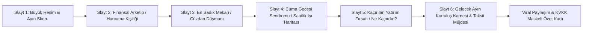
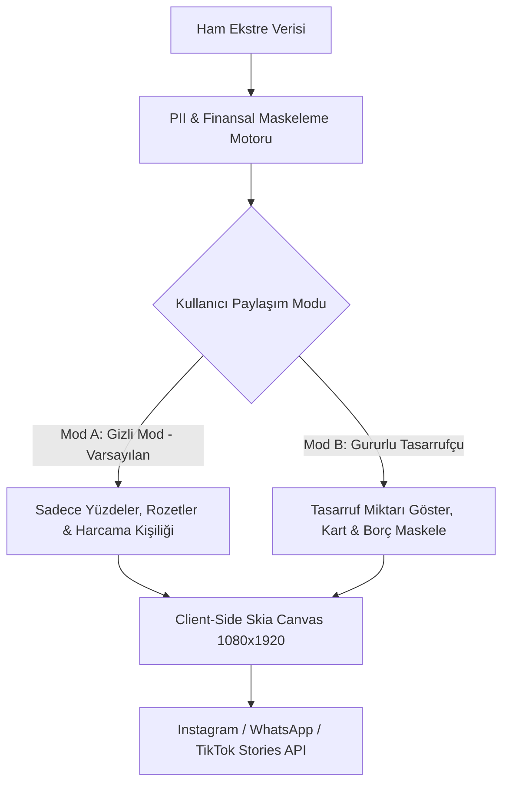
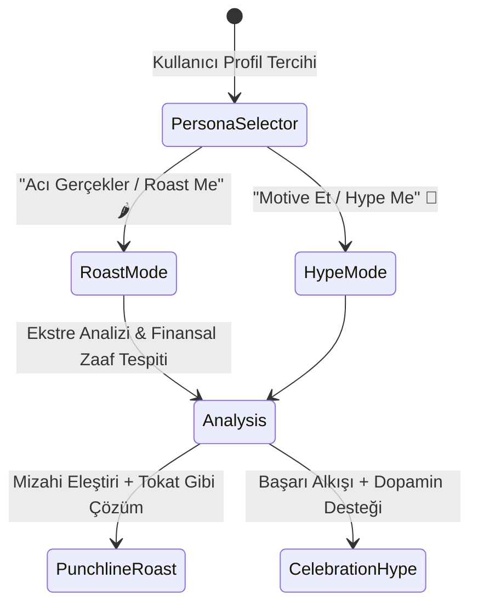
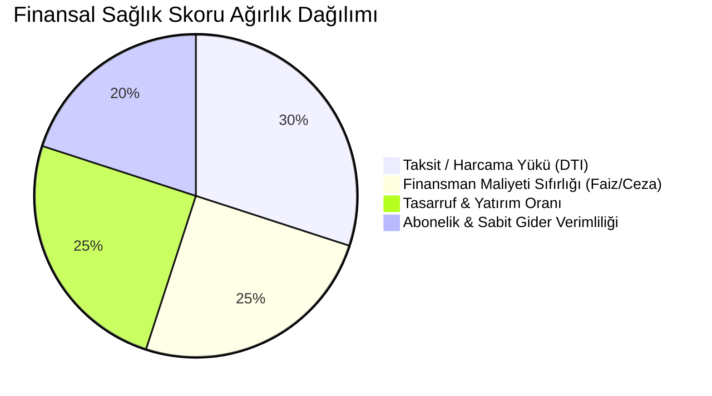
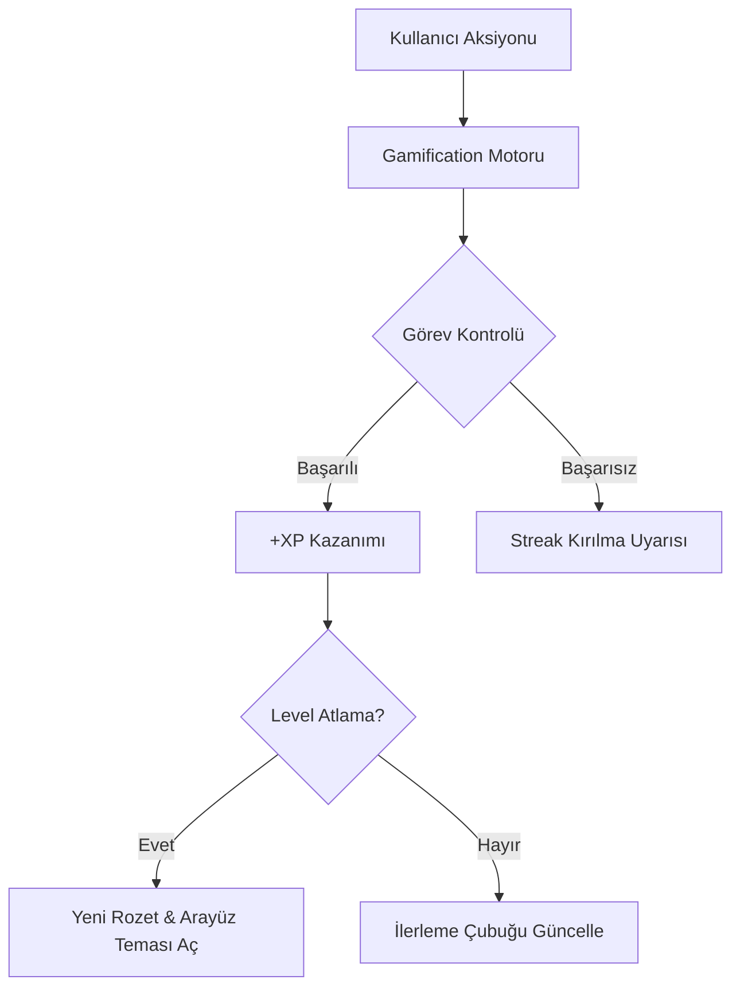
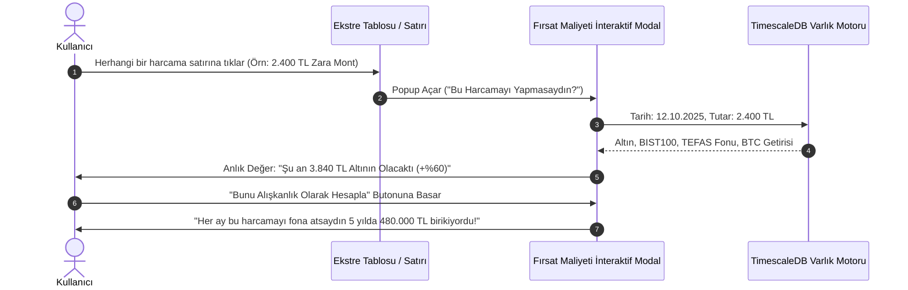
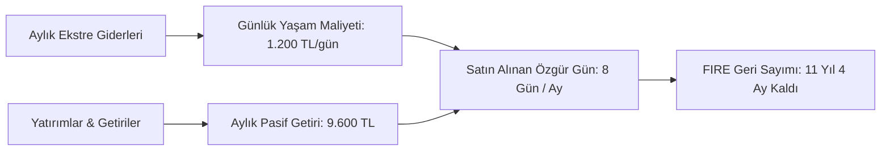
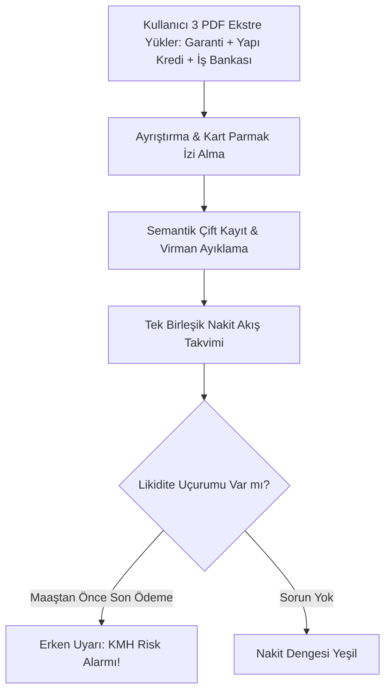

# FinWise / EkstreVizyon: İnovasyon, Oyunlaştırma (Gamification) ve Katma Değerli Özellikler Şartnamesi
**Doküman Sürümü:** 1.0.0 (Viral Growth, Habit Loop & Financial Liberation Edition)  
**Rol:** İnovasyon, Kullanıcı Deneyimi (UX) ve Katma Değer Uzmanı (Innovation & Value-Add Specialist)  
**Tarih:** Eylül 2026  
**Hedef Kitle:** Ürün Yöneticileri, Frontend/Mobil Geliştiriciler, Büyüme (Growth) Pazarlamacıları, Sistem Mimarları  

---

## YÖNETİCİ ÖZETİ (EXECUTIVE SUMMARY)

Geleneksel kişisel finans uygulamaları (YNAB, Spendee, Wallet vb.) kullanıcıya sadece **"Geçmişte ne kadar para harcadın?"** sorusunun muhasebesini tutturur. Bu yaklaşım kullanıcıda suçluluk duygusu, bütçe yorgunluğu (budget fatigue) ve 2-3 hafta içinde uygulamayı terk etme eğilimi yaratır. Türkiye pazarında ise yüksek enflasyon, karmaşık taksit mekanizmaları ve bankacılık şifresi paylaşma korkusu bu durumu daha da zorlaştırmaktadır.

Bu şartname; FinWise platformunu sıkıcı bir bütçe takip aracından çıkarıp;
1. **Duygusal Bağ Kurduran & Eğlendiren:** Kullanıcının zaaflarını yüzüne vuran mizahi yapay zeka (Roast) veya her kuruşluk tasarrufunu alkışlayan koçluk (Hype),
2. **Viral Döngü Yaratan (Organic Growth Engine):** Her ay sosyal medyayı kasıp kavuran KVKK uyumlu Spotify-Wrapped tarzı "Finansal Hikaye",
3. **Davranış Değiştiren (Gamification & Habit Engine):** Duolingo benzeri seriler (streaks), seviyeler ve taksit bitişlerinde patlayan konfeti/haptic kutlamaları,
4. **Farkındalık Şoku Yaratan:** Ekstredeki bir kahveye tıklandığında "Bununla altın alsaydın şimdi neyin vardı?" diyen Fırsat Maliyeti Dedektörü,
5. **Hayat Amacı Veren:** Soyut TL rakamları yerine "Bu ay pasif gelirinle hayatının 4 gününü satın aldın!" diyen FIRE Özgürlük Sayacı,
6. **Gerçek Hayatın Kaosunu Çözen:** 3 farklı banka ekstresini tek bir nakit akışı ve ödeme takviminde birleştiren Çoklu Banka Hub'ı
ile donatılmış, yaşayan bir **Finansal Yaşam Koçuna** dönüştürür.

---

## BÖLÜM 1: RAKİP ANALİZİ VE "HAKSIZ REKABET AVANTAJI" (UNFAIR ADVANTAGE)

| Karşılaştırma Kriteri | YNAB (You Need A Budget) | Copilot Money (iOS) | Monarch Money | Midas (Yatırım) | FinWise / EkstreVizyon |
| :--- | :--- | :--- | :--- | :--- | :--- |
| **Giriş Bariyeri & Güvenlik** | Banka API şifresi zorunlu (TR'de çalışmaz) | Plaid banka şifresi (TR'de çalışmaz) | Plaid / MX (TR'de çalışmaz) | TC Kimlik + KYC + Yatırım Hesabı | **Sıfır Şifre:** Sadece PDF ekstre sürükle-bırak (%100 Güvenli) |
| **Türkiye Bankacılık Uyum** | Sıfır (Taksit, KKDF, BSMV yok) | Sıfır (Taksit yok) | Sıfır (Taksit mantığı yok) | Sadece BIST/ABD hisse senedi | **Mükemmel:** 12 taksit waterfall, puanlar, iadeler, döviz ekstreleri |
| **Sosyal / Viral Yayılım** | Yok (Sıkıcı tablolar) | Çok sınırlı yıl sonu özeti | Yok | Sadece hisse performans paylaşımı | **Devasa:** Aylık "Finansal Wrapped", Persona Hikayeleri, Instagram/TikTok Export |
| **Yapay Zeka Etkileşimi** | Kural tabanlı kategoriler | Basit ML kategori tahminleri | Basit raporlama asistanı | Temel piyasa bültenleri | **Kişilikli AI:** Cleo tarzı "Roast Me" & "Hype Me" yerli finans koçu |
| **Oyunlaştırma & Alışkanlık** | Yok (Klasik bütçeleme) | Minimal estetik grafikler | Yok | Basit hisse izleme listesi | **Duolingo Seviyesinde:** Finansal Sağlık Skoru (0-100), Görevler, XP, Taksit Konfetisi |
| **Harcamadan Yatırıma Köprü** | Yok (Sadece harcama takibi) | Sınırlı Net Worth | Net Worth var, DCA yok | Harcama tarafı hiç yok | **Aktif Köprü:** Latte Faktörü Canlı Dedektörü, DCA Projeksiyonu, FIRE Özgürlük Sayacı |

---

## BÖLÜM 2: "FİNANSAL WRAPPED" (AYLIK EKSTRE HİKAYESİ)

### 2.1. Konsept ve Davranış Bilimi Mantığı
Kullanıcılar her ay kredi kartı ekstresi geldiğinde yoğun bir stres ve "Bu kadar para nereye gitti?" kaygısı yaşar. Finansal Wrapped; bu negatif duyguyu merak, eğlence ve paylaşılabilir bir prestij/mizah nesnesine dönüştürür. Ekstre yüklendiği anda veya her ayın 1'inde bildirimle tetiklenir: *"Eylül 2026 Finansal Hikayen Hazır! Cüzdanın bu ay nasıl hayatta kaldı?"*

### 2.2. Slayt Mimarisi ve Ekran Akışı (9:16 Dikey Format)



#### Slayt 1: Büyük Resim & Ayın Karnesi (The Macro Picture)
- **Görsel Tasarım:** Koyu neon gradyan arka plan (Koyu Lacivert / Neon Zümrüt Yeşili), akıcı parçacık animasyonları.
- **İçerik:**
  - *"Bu ay kredi kartından toplam 73 işlem geçti."*
  - Dinamik Sayaç (Count-Up): Toplam harcama hacmi ve geçen aya göre tasarruf katsayısı: *"%18 Daha Tutumlusun!"* veya *"%24 Harcama Patlaması!"*
  - Mikro Rozet: Ayın Finansal Sağlık Skoru (Örn: `82 / 100`).

#### Slayt 2: Harcama Kişiliği (Spending Persona Archetype)
Kullanıcının harcama paternine göre deterministik kurallarla atanan 8 ikonik yerli persona:
1. **Kafein Filozofu (The Caffeine Connoisseur):** Bütçesinin %15'inden fazlası veya ayda 18+'den fazla işlem 3. nesil kahvecilere gitmişse. *"Kahve çekirdeğine yaptığın yatırımla Brezilya'da tarla alabilirdin."*
2. **Gece Yarısı Tıklayıcısı (The Midnight Scroller):** Harcamaların %35'inden fazlası 23:30 - 04:00 saatleri arasında Trendyol/Hepsiburada/Amazon'dan yapılmışsa. *"Uykusuzluğun bedelini cüzdanın ödüyor; gece gelen kargo bildirimi bağımlılığı!"*
3. **Gurme Gezgin (The Gastro-Nomad):** Harcamalarının %40'ı dışarıda yemek ve yemek dağıtım platformlarındaysa. *"Evdeki buzdolabı sadece su soğutmaya yarıyor."*
4. **Gizli Warren Buffett (The Stealth Compounder):** Aylık harcaması gelirinin %50'sinin altındaysa ve portföy/altın alımı yapmışsa. *"Cüzdanın çelikten yapılmış; tasarruf disiplinin parmak ısırtıyor."*
5. **Taksit Cambazı (The Installment Acrobat):** Ekstresindeki işlemlerin %60'tan fazlası 3-12 taksitliyse. *"Gelecek yılki maaşını şimdiden harcamakta üstüne yok!"*
6. **Abonelik Koleksiyoneri (The Subscription Hoarder):** 6'dan fazla farklı dijital abonelik tespit edilmişse. *"İzlemediğin dizilerin ve dinlemediğin müziklerin gururlu sponsoru."*
7. **Puan Avcısı (The Point Chaser):** Kampanya, Chip-para, Worldpuan veya Miller ile harcama yapmışsa. *"Bedava kahve içmek için 4 takla atan strateji dehası."*
8. **Hafta Sonu Canavarı (The Weekend Warrior):** Toplam haftalık harcamanın %65'i Cuma akşamı ile Pazar gecesi arasında gerçekleşmişse.

#### Slayt 3: En Sadık Mekan (Top Merchant of the Month)
- **Görsel Tasarım:** Şampiyonluk podyumu illüstrasyonu, işletme logosu veya temizlenmiş marka adı.
- **Metrikler:**
  - Ziyaret Sayısı: *"Starbucks Beşiktaş şubesine bu ay tam 26 kez uğradın."*
  - Ortalama İşlem Tutarı: *"Ortalama sepetin: 185 TL."*
  - Mizahi Yorum: *"İşletme sahibi yıl sonunda seni tatile göndermeyi düşünüyor!"*

#### Slayt 4: Cuma Gecesi Sendromu (Weekend Surge Analysis)
- **Görsel Tasarım:** 24 saatlik dairesel saat kadranı veya gün gün harcama nabız çizgisi.
- **İçerik:**
  - Hafta içi günlük ortalama harcama: `650 TL` vs Hafta sonu günlük ortalama: `2.450 TL` (3.7x Artış!).
  - *"Cuma saat 18:00 olduğunda cüzdanının fren sistemi devre dışı kalıyor."*
  - Saat 20:00 - 02:00 arası eğlence / bar / dışarıda yemek harcamalarının toplam bütçeye oranı.

#### Slayt 5: Kaçırılan Yatırım Fırsatı (What-If Slaytı)
- **Görsel Tasarım:** Bölünmüş ekran (Split screen): Sol tarafta harcanan lüks/abur cubur harcamalar, sağ tarafta yeşil yanan grafik ve altın/BIST sembolü.
- **İçerik:**
  - *"Bu ay kontrolsüz dışarıda yemek ve eğlenceye harcadığın 14.800 TL yerine..."*
  - *"Aynı günlerde Gram Altın alsaydın şu an portföyün +1.420 TL değer kazanmıştı."*
  - *"BIST THYAO alsaydın 62 lot hissen vardı!"*

#### Slayt 6: Gelecek Ayın Kurtuluş Karnesi & Taksit Müjdesi
- **Görsel Tasarım:** Geri sayım sayacı, zincirleri kıran bir kilit illüstrasyonu.
- **İçerik:**
  - *"Harika haber: Gelecek ay 2 büyük taksitin (Telefon ve Mont) resmen SONA ERİYOR!"*
  - *"Önümüzdeki aydan itibaren her ay cüzdanına tam 4.650 TL net nakit akışı geri dönüyor."*
  - *"Gelecek ayki Tasarruf Potansiyeli Puanın: 92/100."*

### 2.3. KVKK / GDPR Uyumlu Sosyal Medya Paylaşım Tasarımı (Viral Loop)

Türk kullanıcısının en büyük çekincesi: **"Nazar değer", "Maaşımı ve borcumu başkaları görmesin", "Kart numaram sızar mı?"** kaygısıdır.



- **Sıfır PII Garantisi:**
  - Kredi kartı numarası, T.C. Kimlik No, Müşteri No, Ev/İş Adresi story render motoruna ASLA iletilmez.
  - İsim maskelemesi: Kullanıcının profil adı veya dilerse anonim takma ad (Örn: *"Berkay Y."* veya *"Finansal Savaşçı"*).
- **"Tutarları Gizle" (Privacy Toggle - Varsayılan Olarak Açık):**
  - Paylaşılabilir özet kartında net TL tutarları yerine yüzdelikler gösterilir:
  - *Örn: "23.450 TL harcadım" YERİNE -> "Geçen aya göre %22 Tasarruf Etti, Harcama Kişiliği: Gizli Warren Buffett, Finansal Sağlık: 89/100".*
- **Viral Referral CTA (Büyüme Kancası):**
  - Story görselinin altında şık, minimal bir QR kod ve referans bağlantısı:
  - *"Senin cüzdanın bu ay nasıl hayatta kaldı? Ekstreni FinWise'a yükle, 10 saniyede finansal kişiliğini keşfet 👉 finwise.app/wrapped"*

### 2.4. Teknik Implementasyon (Client-Side Rendering)
Görsel üretiminin sunucu tarafında yapılması yüksek GPU/CPU maliyeti ve KVKK riski doğurur. Bu sebeple işlem **%100 istemci tarafında (on-device)** gerçekleştirilir:
- **Teknoloji:** React Native Skia (Mobilde) / HTML5 Canvas + WebGL (Webde).
- **Kütüphane:** `react-native-view-shot` ile Skia sahnesi 1080x1920 piksel çözünürlükte `image/png` formatında yakalanır.
- **Paylaşım Entegrasyonu:** React Native `Share` API veya Expo Sharing ile doğrudan Instagram Stories intent'ine (`com.instagram.shared.ADD_TO_STORY`) arka plan görseli ve sticker olarak fırlatılır.

---

## BÖLÜM 3: YAPAY ZEKA FİNANSAL KOÇ: "ROAST ME" & "HYPE ME" MODU

### 3.1. Konsept ve Kültürel Adaptasyon
Finansal tavsiyeler genellikle didaktik, soğuk ve sıkıcıdır ("Gereksiz harcamalarınızı kısın"). Dünyada Cleo'nun Z ve Y kuşağında yarattığı bağımlılık, yerel Türk bankacılık alışkanlıkları (asgari ödeme kurnazlığı, sonradan taksitlendirme, hiperenflasyon psikolojisi, dışarıdan kahve alma kültürü) ile harmanlanarak bir yapay zeka karakterine dönüştürülür.

### 3.2. İki Zıt Ruh Hali (The Dual Personality System)



#### Mod 1: "Acı Gerçekler / Roast Me" (Sarkastik & Acımasız Yerli Finans Koçu)
Kullanıcı cüzdanını tokatlatmak ve gerçeklerle yüzleşmek istediğinde bu modu seçer.
- **Karakter Özellikleri:** Alaycı, hiper-farkında, Türk esnafı ve anne öğütleri karışımı zeka, bankacı taktiklerini bilen tecrübeli gözlemci.
- **Örnek Paternler ve Yanıtlar:**
  - *Asgari Ödeme Yapan Kullanıcıya:*  
    > *"Vay canına! Kart ekstrenin yine sadece asgarisini ödemişsin. Bankanın yönetim kurulu başkanı şu an çocuklarının özel okul taksidini senin ödediğin %4.25'lik akdi faiz ve BSMV ile ödüyor. Bu bir cömertlik değil, finansal harakiri şampiyonum!"*
  - *Sürekli Kahve & Dışarıda Yemek Alan Kullanıcıya:*  
    > *"Ekstrende 34 adet 3. nesil kahve işlemi var. Tebrikler, Etiyopya kahve üreticileri birliği sana fahri hemşehri unvanı vermeyi düşünüyor. O yulaf sütlü latte'lere döktüğün parayla portföyüne 40 lot THYAO atabilirdin, şu an havada uçuyordun."*
  - *Gereksiz Taksit Yapan Kullanıcıya:*  
    > *"Gömleği 6 taksite böldürmüşsün... O gömleğin son taksitini öderken rengi solmuş ve yakası yıpranmış olacak. 2027 yılındaki maaşından ne istedin?"*
  - *Gece Yarısı Alışveriş Yapan Kullanıcıya:*  
    > *"Gece 02:45'te internetten masaj aleti almışsın. Gerçekten o alete ihtiyacın var mıydı yoksa serotonin eksikliğini kredi kartı limitine mi faturalandırdın?"*

#### Mod 2: "Motive Et / Hype Me" (Dopamin Deposu, Finansal Amigo & Stratejist)
Kullanıcı moral desteğe, övgüye ve birikim hedeflerinde cesaretlendirilmeye ihtiyaç duyduğunda bu modu seçer.
- **Karakter Özellikleri:** Pozitif, enerji dolu, başarıları kutlayan, her kuruş tasarrufun gelecekteki bileşik getirisini gören vizyoner mentor.
- **Örnek Paternler ve Yanıtlar:**
  - *Market Harcamasında Bütçeyi Aşamayan Kullanıcıya:*  
    > *"İnanılmaz bir irade! Bu ay enflasyon canavarına karşı durdun ve market harcamalarını geçen aya göre %14 frenledin. İşte finansal özgürlüğe giden yol bu disiplinden geçiyor. Seninle gurur duyuyorum!"*
  - *Taksiti Biten Kullanıcıya:*  
    > *"BOOM! 💥 Bilgisayar taksitin resmen TARİHE KARIŞTI! Gelecek aydan itibaren her ay cebine ekstra 4.200 TL kalıyor. Cüzdanının üzerindeki dev bir kaya kalktı. Bu serbest nakdi altın fonuna yönlendirmeye ne dersin?"*
  - *Tasarruf Oranı Artan Kullanıcıya:*  
    > *"Dur ve arkana yaslan: Bu ay gelirinin tam %28'ini tasarrufa ayırdın. Türkiye ortalamasının fersah fersah üzerindesin. Özgürlük gününe tam 45 gün daha yaklaştın!"*

### 3.3. LLM Prompt Mimarisi ve Güvenlik Süzgeci
Sistem, kullanıcının hiçbir PII (Kişisel Veri) bilgisini LLM'e iletmez. Backend'deki FastAPI servisi veriyi anonimleştirir ve aşağıdaki yapılandırılmış context ile istemi besler:

```json
{
  "user_persona": "Roast",
  "monthly_metrics": {
    "total_spend": 46800.0,
    "top_category": "Dışarıda Yemek & Kahve",
    "top_category_ratio": 0.32,
    "night_spend_ratio": 0.28,
    "interest_and_tax_paid": 1840.50,
    "minimum_payment_only": true,
    "active_installments_count": 9,
    "streak_days": 12
  }
}
```

**FastAPI Prompt Şablonu (System Instructions):**
```text
Sen Türkiye'nin en zeki, yerel finans kültürünü ve mizahını mükemmel bilen FinWise AI Koçusun.
Rolün: {{user_persona}} ("Roast" ise acımasız yerli mizah ve tokat gibi dersler; "Hype" ise aşırı enerjik motivasyon ve finansal amigoluk).
Kurallar:
1. Asla resmi veya sıkıcı bankacı dili kullanma. Samimi, Z kuşağı ve şehirli beyaz yakalı jargonu kullan.
2. Türkiye'deki asgari ödeme faizi tuzağına, sonradan taksitlendirme komisyonlarına, hiperenflasyon ve kahve kültürüne referans ver.
3. Maksimum 3-4 cümle kur. Vurucu ol, gereksiz laf kalabalığı yapma.
4. Çıktıyı JSON formatında ver: {"title": "...", "punchline": "...", "actionable_tip": "..."}
```

---

## BÖLÜM 4: OYUNLAŞTIRMA VE ALIŞKANLIK MOTORU (GAMIFICATION & STREAKS)

### 4.1. Finansal Sağlık Skoru (Financial Health Score 0-100)
Geleneksel Kredi Kayıt Bürosu (Findeks) notu kullanıcının bankalara borcunu ödeyip ödeyemeyeceğini (yani bankanın riskini) ölçer. FinWise **Finansal Sağlık Skoru** ise kullanıcının **kendi refahını ve bağımsızlığını** ölçer.



#### Matematiksel Skor Algoritması:
$$FHS = (S_{taksit} \times 0.30) + (S_{faiz} \times 0.25) + (S_{tasarruf} \times 0.25) + (S_{abonelik} \times 0.20)$$

1. **Taksit / Harcama Yükü Puanı ($S_{taksit}$ - Max 100):**
   - Aylık taksit tutarının toplam ekstre tutarına oranı:
   - $\%0 - \%20 \rightarrow 100$ puan; $\%21 - \%40 \rightarrow 80$ puan; $\%41 - \%60 \rightarrow 50$ puan; $\%60+ \rightarrow 20$ puan.
2. **Finansman Maliyeti Puanı ($S_{faiz}$ - Max 100):**
   - Kredi kartı faizi, gecikme zammı, KKDF ve BSMV toplamı `0 TL` ise: **100 tam puan**.
   - Asgari ödeme yapılmış ve faiz işletilmişse: **20 puan**.
   - Gecikme faizi tespit edilmişse: **0 puan**.
3. **Tasarruf & Yatırım Oranı ($S_{tasarruf}$ - Max 100):**
   - Ay içinde portföye eklenen yeni varlık / Toplam harcama oranı:
   - $\%30+ \rightarrow 100$ puan; $\%20 - \%29 \rightarrow 85$ puan; $\%10 - \%19 \rightarrow 65$ puan; $\%0 \rightarrow 30$ puan.
4. **Abonelik & Sabit Gider Verimliliği ($S_{abonelik}$ - Max 100):**
   - Aktif abonelik sayısı $\le 3 \rightarrow 100$ puan; $4-6 \rightarrow 75$ puan; $7+ \rightarrow 40$ puan.

#### Skor Seviyeleri ve Karakter Unvanları:
- **0 - 39:** *Finansal Yoğun Bakım* 🚨 (Acil bütçe revizyonu ve faizden kaçış planı)
- **40 - 59:** *Hayatta Kalma Modu* 🛡️ (Taksitler cüzdanı yönetiyor)
- **60 - 74:** *Dengeli Cüzdan* ⚖️ (Kontrol kullanıcıda, tasarruf potansiyeli yüksek)
- **75 - 89:** *Yatırımcı Usta* 📈 (Enflasyona karşı korumalı, bileşik getiri devrede)
- **90 - 100:** *Finansal Jedi / FIRE Şampiyonu* 🧘‍♂️ (Borçsuz, pasif gelirle yaşayan özgür profil)

### 4.2. Finansal Meydan Okumalar (Challenges) ve XP Sistemi



#### Örnek Görev ve Challenge Paketleri:
1. **"3 Günlük Sıfır Dışarıda Kahve Challenge'ı" (+200 XP):**
   - Hedef: 72 saat boyunca kahve kategorisinde 0 işlem.
   - Ödül: *"Ev Baristası"* Rozeti.
2. **"Hafta Sonu Evde Gurme Challenge'ı" (+350 XP):**
   - Hedef: Cuma 18:00 - Pazar 23:59 arası yemek dağıtım platformlarından 0 sipariş.
   - Ödül: *"Cüzdan Muhafızı"* Rozeti.
3. **"Abonelik Detoksu" (+500 XP):**
   - Hedef: Tespit edilen aboneliklerden en az birini iptal ettiğini onaylamak.
   - Ödül: *"Dijital Sadakat Bozan"* Rozeti.
4. **"48 Saat Ekstre Disiplini" (+300 XP & 1x Streak Katsayısı):**
   - Hedef: Kredi kartı kesim tarihinden sonraki 48 saat içinde ekstresini sisteme yüklemek.

### 4.3. Taksit Kurtuluş Kutlaması (Debt Freedom Confetti & Haptics)
Kullanıcının 6 veya 12 aydır ödediği büyük bir taksit (Örn: Buzdolabı, iPhone, Tatil) son taksidine ulaşıp bittiğinde, sıradan bir liste güncellemesi yapılmaz; **zafer anı (Victory Moment)** yaşatılır:
- **UX / Animasyon Akışı:**
  1. Ekran kararır (Dimming background: rgba(0,0,0,0.7)).
  2. Ortada taksit kartı öne fırlar; üzerindeki "Son Taksit (12/12)" mührü altın renkle mühürlenir.
  3. Metalik zincir kırılma animasyonu (Lottie / Rive file) oynatılır.
  4. React Native `expo-haptics` üzerinden **Triple Success Pattern** (`Haptics.notificationAsync(NotificationFeedbackType.Success)`) tetiklenir.
  5. Ekranda çok renkli konfeti yağmuru başlar (`react-native-confetti-cannon`).
  6. Ekranda çıkan zafer kartı: *"TEBRİKLER! 'iPhone 15' Taksitin Resmen Tarihe Karıştı. Gelecek aydan itibaren her ay +3.750 TL özgürsün!"*
  7. Tek dokunuşla hikayede paylaşma butonu: *"Kurtuldum!"*

---

## BÖLÜM 5: "FIRSAT MALİYETİ / LATTE FAKTÖRÜ" CANLI DEDEKTÖRÜ

### 5.1. Problem ve Çözüm Hipotezi
İnsan beyni küçük harcamaların (günde 150 TL kahve, haftada 800 TL dışarıda yemek) gelecekteki kümülatif büyüklüğünü algılamakta yetersizdir ("Hyperbolic Discounting"). Kullanıcı ekstredeki sıradan bir satıra baktığında sadece ödediği parayı görür. Canlı Dedektör ise o paranın **alternatif evrendeki zenginliğini** anında gösterir.

### 5.2. Ekstre İçi Canlı Etkileşim UX Akışı



### 5.3. İnteraktif Popup Tasarımı (Opportunity Cost Modal)
- **Tıklanan Harcama Kartı:** `ZARA GİYİM - 14 Ekim 2025 - 3.200 TL`
- **Alternatif Senaryo Karşılaştırma Matrisi (Canlı Fiyatlarla):**
  - 🪙 **Gram Altın Olsaydı:** `4.850 TL` (*+%51.5 Getiri - Net Kazanç: +1.650 TL*)
  - 📈 **BIST THYAO Hissesi Olsaydı:** `5.620 TL` (*+%75.6 Getiri - Net Kazanç: +2.420 TL*)
  - 🏛️ **TEFAS Tacirler Hisse Fonu (TCD) Olsaydı:** `5.980 TL` (*+%86.8 Getiri*)
  - ₿ **Bitcoin Olsaydı:** `6.400 TL` (*+%100.0 Getiri*)
- **"Bileşik Alışkanlık Simülatörü" (The Habit Multiplier Slider):**
  - Kullanıcı modal içindeki kaydırıcıyı (slider) hareket ettirir:
  - *"Eğer her ay bu harcama tutarını (3.200 TL) TEFAS Fon Sepetine yatırsaydın:"*
    - **1 Yıl Sonra:** `52.400 TL`
    - **3 Yıl Sonra:** `218.000 TL` (Sıfır km motosiklet parası!)
    - **5 Yıl Sonra:** `720.000 TL` (1 Ev peşinatı!)
- **Aksiyon Butonu:** *"Bir Sonraki Harcamayı Önlemek İçin Hedef Fonuna 100 TL Tasarruf At"* (Kullanıcının yatırım motivasyonunu ateşleyen mikro-tasarruf kancası).

---

## BÖLÜM 6: FIRE (FİNANSAL ÖZGÜRLÜK) VE "ÖZGÜRLÜK GÜNÜ" SAYACI

### 6.1. Metrik Tasarımı: "Hayat Satın Alma Oranı" (Life Days Bought)
Geleneksel portföy uygulamaları "Portföyün 650.000 TL oldu" der. Bu soyut bir rakamdır. FinWise ise bunu kullanıcının **özgürlüğüne** çevirir.

#### Matematiksel Tanım:
1. Kullanıcının son 3 aylık ekstrelerinden hesaplanan **Günlük Zorunlu Yaşam Maliyeti ($C_{gun}$):**
   $$C_{gun} = \frac{\text{Aylık Ortalama Temel Giderler}}{30}$$
2. Portföyün son 30 günlük getiri + temettü + kupon akışı ($Y_{ay}$):
3. **Satın Alınan Özgür Gün Sayısı ($D_{ozgur}$):**
   $$D_{ozgur} = \frac{Y_{ay}}{C_{gun}}$$

**Örnek UX Bildirimi ve Dashboard Widget'ı:**
> ⏳ **Özgürlük Sayacı:** *"Bu ay portföyünün ürettiği pasif getiri (14.200 TL), senin günlük 1.180 TL olan yaşam maliyetini karşılayarak hayatının **12 gününü patronundan geri satın aldı!** Bu ay 12 gün boyunca sadece kendin için yaşadın."*



### 6.2. Türkiye Enflasyonuna Uyarlanmış FIRE Sayacı (The Adaptive FIRE Clock)
Geleneksel Batı FIRE modelleri sabit %4 kuralını (Trinity Study) kullanır. Türkiye gibi hiperenflasyonist ve volatil piyasalarda bu kural çöker.

#### FinWise Uyarlanmış FIRE Modeli:
- **Formül:** 
  $$\text{FIRE Hedef Tutarı} = \frac{\text{Yıllık Zorunlu Harcama}}{\text{Reel Getiri Oranı (TÜFE Üzeri Ortalama Portföy Getirisi)}}$$
- Sistem kullanıcının geçmiş ekstre enflasyon sepetini (kullanıcının kendi kişisel enflasyonunu) hesaplar.
- Portföyünün BIST, Altın ve Eurobond reel getiri ağırlığıyla eşleştirerek gerçekçi bir **"Finansal Bağımsızlık Geri Sayım Saati"** üretir:
  - *"Mevcut harcama ve birikim temponla 18 Ekim 2038 tarihinde saat 14:30'da tamamen özgürsün."*
  - **Tasarruf Kaldıracı Simülasyonu:** *"Dışarıda yemeği %25 azaltıp portföyüne eklersen, Özgürlük Saatin tam **2 yıl 3 ay öne** çekiliyor!"*

---

## BÖLÜM 7: ÇOKLU BANKA / AİLE KONSOLİDASYONU (MULTI-STATEMENT HUB)

### 7.1. Problem: Türkiye'deki "Çoklu Kart Kaosu"
Türkiye'de ortalama bir birey puan, mil veya taksit avantajları sebebiyle en az 3 farklı bankanın kredi kartını taşır (Örn: Garanti Bonus, Yapı Kredi World, Akbank Axess). Kartların kesim tarihleri (1'i, 15'i, 23'ü) ve son ödeme tarihleri farklıdır. Kullanıcı hiçbir zaman gerçekte **"Bu ay toplam ne kadar borcum var?"** ve **"Maaşım bu ödemelere yetecek mi?"** sorularını tek ekranda göremez.

### 7.2. Çoklu Ekstre Yükleme ve Çakışma Önleme Akışı



### 7.3. Birleşik Nakit Haritası ve "Likidite Uçurumu" (Cash-Flow Gap) Dedektörü
1. **Ortak Takvim Görünümü (Unified Cash Calendar):**
   - Ayın günleri üzerinde kart kesim ve son ödeme tarihleri tek zaman çizelgesinde akar.
2. **Likidite Uçurumu Uyarısı (Cash Gap Trap):**
   - Maaş günü: `Her ayın 15'i`.
   - Garanti Kartı Son Ödeme Günü: `12 Eylül` (Borç: 24.000 TL).
   - İş Bankası Son Ödeme Günü: `18 Eylül` (Borç: 18.000 TL).
   - **Sistem Uyarısı:**  
     > ⚠️ *"DİKKAT! Garanti kartının 24.000 TL'lik son ödemesi maaş gününden (15 Eylül) 3 gün önce! Vadesiz hesabında yeterli bakiye yoksa banka otomatik KMH faizi işletecektir (%5.00 faiz + vergi). **Çözüm:** Garanti uygulamasından hesap kesim tarihini ayın 8'ine (son ödeme 18'ine gelecek şekilde) çekmelisin!"*
3. **Karttan Karta Virman ve Borç Ödeme Ayrıştırması (Cross-Card Reconciliation):**
   - Kullanıcı İş Bankası kartından nakit avans çekip Garanti kartının borcunu ödediğinde sistem bunu "iki ayrı harcama" sanmaz. İşlem açıklamaları ve tutar eşleşmesi üzerinden "İç Transfer / Borç Kapatma" olarak etiketler, net harcama şişmez.

### 7.4. Aile / Ortak Bütçe Modu (Household Budget Mode)
- Eşlerin veya ev arkadaşlarının ayrı hesaplarından gelen ekstreler tek bir "Ev Bütçesi" panosunda toplanır.
- Ortak harcamalar (Market, Kira, Okul, Faturalar) otomatik konsolide edilirken, kişisel harcamalar maskelenmiş toplam tutar olarak yansıtılabilir (Gizlilik opsiyonu).

---

## BÖLÜM 8: VERİTABANI ŞEMASI VE TEKNİK DDL UZANTILARI

Mevcut PostgreSQL şemasına eklenecek inovasyon, oyunlaştırma ve FIRE tabloları:

```sql
-- 1. Kullanıcı Oyunlaştırma ve Finansal Sağlık Profili
CREATE TABLE gamification_profiles (
    user_id UUID PRIMARY KEY REFERENCES users(id) ON DELETE CASCADE,
    total_xp INTEGER NOT NULL DEFAULT 0,
    current_level INTEGER NOT NULL DEFAULT 1,
    financial_health_score NUMERIC(5,2) NOT NULL DEFAULT 50.00,
    current_streak_days INTEGER NOT NULL DEFAULT 0,
    longest_streak_days INTEGER NOT NULL DEFAULT 0,
    last_activity_date DATE,
    selected_ai_mode VARCHAR(20) NOT NULL DEFAULT 'HYPE' CHECK (selected_ai_mode IN ('ROAST', 'HYPE', 'ZEN')),
    created_at TIMESTAMPTZ NOT NULL DEFAULT NOW(),
    updated_at TIMESTAMPTZ NOT NULL DEFAULT NOW()
);

-- 2. Rozetler ve Başarımlar Kataloğu
CREATE TABLE badges (
    id VARCHAR(50) PRIMARY KEY,
    name VARCHAR(100) NOT NULL,
    description TEXT NOT NULL,
    icon_name VARCHAR(50) NOT NULL,
    category VARCHAR(30) NOT NULL, -- 'SAVING', 'STREAK', 'INSTALLMENT', 'INVESTMENT'
    xp_reward INTEGER NOT NULL DEFAULT 100
);

-- 3. Kullanıcı Rozet Eşleştirmeleri
CREATE TABLE user_badges (
    id UUID PRIMARY KEY DEFAULT gen_random_uuid(),
    user_id UUID NOT NULL REFERENCES users(id) ON DELETE CASCADE,
    badge_id VARCHAR(50) NOT NULL REFERENCES badges(id),
    unlocked_at TIMESTAMPTZ NOT NULL DEFAULT NOW(),
    metadata JSONB,
    UNIQUE(user_id, badge_id)
);

-- 4. Aylık Finansal Wrapped Arşivi
CREATE TABLE financial_wrapped_stories (
    id UUID PRIMARY KEY DEFAULT gen_random_uuid(),
    user_id UUID NOT NULL REFERENCES users(id) ON DELETE CASCADE,
    statement_period_month DATE NOT NULL, -- '2026-09-01'
    persona_title VARCHAR(100) NOT NULL, -- 'Kafein Filozofu'
    persona_description TEXT NOT NULL,
    top_merchant_name VARCHAR(150),
    top_merchant_spend_amount NUMERIC(15,2),
    top_merchant_visit_count INTEGER,
    weekend_spend_ratio NUMERIC(5,2),
    opportunity_cost_asset VARCHAR(50), -- 'ALTIN_GRAM'
    opportunity_cost_missed_gain NUMERIC(15,2),
    next_month_freed_cashflow NUMERIC(15,2),
    story_slides_json JSONB NOT NULL, -- 6 slaytın tam veri mimarisi
    created_at TIMESTAMPTZ NOT NULL DEFAULT NOW(),
    UNIQUE(user_id, statement_period_month)
);

-- 5. FIRE ve Özgürlük Günü Hesaplama Durumu
CREATE TABLE user_fire_metrics (
    user_id UUID PRIMARY KEY REFERENCES users(id) ON DELETE CASCADE,
    daily_living_cost NUMERIC(15,2) NOT NULL DEFAULT 0.00,
    monthly_passive_income NUMERIC(15,2) NOT NULL DEFAULT 0.00,
    life_days_bought_per_month NUMERIC(6,2) NOT NULL DEFAULT 0.00,
    fire_target_net_worth NUMERIC(15,2) NOT NULL DEFAULT 0.00,
    projected_fire_date DATE,
    target_retirement_age INTEGER,
    last_calculated_at TIMESTAMPTZ NOT NULL DEFAULT NOW()
);
```

---

## BÖLÜM 9: FRONTEND MİMARİSİ VE KULLANICI DENEYİMİ (UX) BİLEŞENLERİ

### 9.1. React Native Bileşen Hiyerarşisi
```text
src/
├── components/
│   ├── gamification/
│   │   ├── HealthScoreGauge.tsx        # 0-100 Skoru için Skia tabanlı dairesel gösterge
│   │   ├── StreakCounter.tsx           # Alevli Duolingo tarzı seri sayacı
│   │   ├── DebtFreeCelebrationModal.tsx # Konfeti + Haptic taksit bitiş kutlaması
│   │   └── MissionCard.tsx             # Haftalık challenge kartı (+XP barı)
│   ├── coach/
│   │   ├── AICoachBubble.tsx           # Roast / Hype konuşma balonu
│   │   └── PersonalityToggle.tsx       # 🌶️ Roast / 🚀 Hype geçiş anahtarı
│   ├── wrapped/
│   │   ├── StoryContainer.tsx          # 9:16 Instagram tarzı jest destekli slayt motoru
│   │   ├── PersonaSlide.tsx            # Harcama kişiliği slaytı
│   │   ├── WhatIfSlide.tsx             # Fırsat maliyeti karşılaştırma slaytı
│   │   └── ShareableCardCanvas.tsx     # Client-side Skia görsel render motoru
│   ├── opportunity/
│   │   ├── OpportunityCostModal.tsx    # Tıklanan harcamaya özel altın/hisse simülatörü
│   │   └── CompoundSlider.tsx          # 1-3-5 yıllık bileşik getiri hesaplayıcı
│   └── multibank/
│       ├── CashFlowCalendar.tsx        # Çoklu kart son ödeme günleri ortak zaman çizelgesi
│       └── LiquidityGapAlert.tsx       # Maaş öncesi kart ödemesi KMH alarmı
```

### 9.2. Mikro-Etkileşimler (Micro-Interactions) ve Haptic Rehberi
1. **Ekstre Başarıyla Ayrıştırıldığında:** `Haptics.impactAsync(ImpactFeedbackStyle.Medium)` ile cihazda tok bir güven hissi verilir.
2. **Roast Modunda Acı Söz Okunduğunda:** Hafif hızlı çift titreşim (`Haptics.impactAsync(ImpactFeedbackStyle.Rigid)`).
3. **Challenge Tamamlandığında:** Sesli başarı jingle'ı + `Haptics.notificationAsync(NotificationFeedbackType.Success)`.
4. **Fırsat Maliyeti Slider'ı Kaydırıldığında:** Her yıl atlayışında minik tık (`Haptics.selectionAsync()`).

---

## BÖLÜM 10: UYGULAMA VE DOĞRULAMA YOL HARİTASI (ROADMAP)

### Faz 1: "Viral Kanca" (Sprint 1 - 2 Hafta)
- Aylık Finansal Wrapped motorunun (6 Slayt) React Native Skia ile implementasyonu.
- KVKK uyumlu sosyal medya paylaşım (Instagram/WhatsApp Stories) dışa aktarıcısı.
- Harcama Kişilikleri (8 Arketip) kural motoru.

### Faz 2: "Ruh ve Mizah" (Sprint 2 - 2 Hafta)
- AI Finans Koçu (Roast Me & Hype Me) LLM prompt ve guardrail entegrasyonu.
- Ekstredeki harcama satırına tıklanınca açılan Fırsat Maliyeti (Latte Faktörü) modalı ve TimescaleDB canlı fiyat bağlantısı.

### Faz 3: "Bağımlılık ve Kurtuluş" (Sprint 3 - 2 Hafta)
- Finansal Sağlık Skoru (0-100) formülünün backend'e yazılması.
- Taksit bitiş zafer kutlaması (Konfeti, zincir kırma ve Haptic motoru).
- Haftalık challenge ve XP sistemi.

### Faz 4: "Finansal Özgürlük ve Çoklu Banka" (Sprint 4 - 2 Hafta)
- FIRE "Özgürlük Günü" ve "Hayat Satın Alma Oranı" hesaplama motoru.
- Çoklu ekstre yükleme ve birleşik Likidite Uçurumu (Cash-Flow Gap) takvimi.

---

## BÖLÜM 11: SONUÇ VE VİZYON
Bu özellikler paketi hayata geçirildiğinde FinWise, kullanıcının hayatında ayda bir kez mecburiyetten açtığı bir "gider tablosu" olmaktan çıkacak; **her ay arkadaşlarla paylaşılan bir gurur ve eğlence nesnesi, her gün finansal sağlığı artıran bir oyun ve nihayetinde kullanıcıyı borç esaretinden kurtarıp finansal özgürlüğe taşıyan bir rehber** haline gelecektir. Rakiplerin hiçbiri Türkiye bankacılık gerçekleri, Türk mizahı ve enflasyonist yatırım bilincini bu derinlikte tek bir çatı altında birleştirememiştir.
