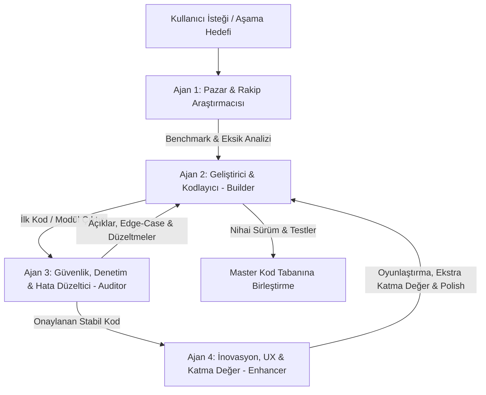

# 🚀 FinWise (EkstreVizyon) - Master Proje ve Kodlama İş Planı
**Proje:** Akıllı PDF Kredi Kartı Ekstre Analizi, Eğlenceli Harcama Takibi, Portföy Yönetimi ve Bileşik Getiri/DCA Simülatörü  
**Platformlar:** Web Platformu (Next.js 15) & Mobil Uygulama (React Native Expo SDK 52)  
**Tarih:** Eylül 2026  
**Versiyon:** 1.0.0 (Master Execution Blueprint)  
**Doküman Tipi:** Çoklu Ajan (Multi-Agent) Destekli Uçtan Uca İş ve Kodlama Şartnamesi  

---

## BÖLÜM 1: YÖNETİCİ ÖZETİ VE PROJE VİZYONU

### 1.1. Projenin Amacı
FinWise (EkstreVizyon); kullanıcıların e-posta veya bankacılık uygulamalarından indirdikleri karmaşık kredi kartı PDF ekstrelerini **sıfır banka şifresiyle** sürükleyip bıraktıkları, harcamalarını gün gün, kategori kategori (Yeme-İçme, Market, Giyim, Teknoloji vb.) dinamik ve eğlenceli grafiklerle inceleyebildikleri, geçmiş ayların ekstrelerini saklayarak aylar arası trendleri kıyaslayabildikleri modern bir finansal asistan platformudur.

Platform yalnızca "nerede ne kadar harcadım?" sorusunu yanıtlamakla kalmaz;
1. **Taksit Sihirbazı:** Gelecek 12 ayın taksit yükünü ve tam borçsuzluk tarihini hesaplar.
2. **Aktif Portföy Takibi:** Kullanıcının mevcut altın, hisse senedi (BIST/ABD), fon (TEFAS) ve kripto varlıklarını tek noktadan izlemesini sağlar.
3. **Bileşik Getiri ve Tasarruf Simülatörü (DCA Engine):** "Eğer bu ay dışarıda yemeyi %20 kıssaydım ve artırdığım parayla düzenli altın/fon alsaydım 3 yıl sonra param ne olurdu?" sorusunu enflasyondan arındırılmış reel getiriyle canlı simüle eder.
4. **Eğlenceli ve Viral Deneyim (Finansal Wrapped):** Harcamaları sıkıcı tablolardan çıkarıp Spotify Wrapped havasında eğlenceli kişiliklere ("Gece Yarısı Gurmesi", "Abonelik Canavarı"), rozetlere ve Instagram/TikTok uyumlu hikayelere dönüştürür.

---

## BÖLÜM 2: ÇOKLU AJAN (MULTI-AGENT) ÇALIŞMA VE DENETİM SİSTEMİ

Proje, tek bir geliştirici veya tek bir modelin kör noktalarına takılmamak adına **4 Uzman Ajanın** organize çalıştığı iteratif bir üretim döngüsüyle kodlanacaktır.



### 2.1. Ajan Rolleri ve Sorumluluk Matrisi

| Ajan No | Ajan Adı / Rolü | Sorumluluk Alanı | Çalışma Zamanı | Çıktı / Hedef |
| :--- | :--- | :--- | :--- | :--- |
| **Agent 1** | **Market Research & Benchmark Agent** *(Pazar Araştırmacısı)* | Rakipleri (Copilot, Monarch, YNAB, Cleo, Midas, banka app'leri) inceler; onların eksiklerini, kullanıcı şikayetlerini ve pazar fırsatlarını belirler. | Her fazın başında | Rakip eksikleri listesi, USP (Fark Yaratan Özellik) brifingi |
| **Agent 2** | **Full-Stack Software Architect & Builder** *(Kodlayıcı Ajan)* | Backend API, Veritabanı, PDF ayrıştırıcı algoritma, Web ve Mobil ekran bileşenlerinin çekirdek kodlarını üretir. | Geliştirme safhasında | Çalışır vaziyette kaynak kodlar, API servisleri, DB modelleri |
| **Agent 3** | **Quality Assurance, Security & Auditor Agent** *(Denetçi & Düzeltici Ajan)* | Yazılan kodu satır satır denetler; güvenlik açıklarını (PII sızıntısı, PDF bomb), bankacılık istisnalarını (iade, kur farkı, puan harcaması, faiz/vergi) tespit eder ve kodu bizzat düzeltir. | Her kod üretiminden hemen sonra | Düzeltilmiş (hardened) kod, test senaryoları, güvenlik yamaları |
| **Agent 4** | **Innovation, UX & Gamification Agent** *(İnovasyon & Geliştirici Ajan)* | "Bu özelliğe ne eklersek kullanıcı 'vay be' der?", "Burayı nasıl daha eğlenceli yaparız?" sorularıyla viral mekanikler, animasyonlar ve finansal zeka araçları enjekte eder. | Denetim onayından sonra | Finansal Wrapped hikayeleri, AI Roast/Hype koçu, mikro etkileşimler |

---

## BÖLÜM 3: RAKİP ANALİZİ VE BİZİM FARKIMIZ (BENCHMARK & USP)

Piyasadaki önde gelen küresel ve yerel finans uygulamaları detaylıca analiz edilmiş ve ürünümüzün pazarı fethedeceği **5 Temel Fark** tescillenmiştir:

### 3.1. Rakipler Neyi Eksik Yapıyor?
1. **Copilot Money / Monarch Money:** Plaid altyapısına bağımlıdır; Türk bankalarıyla API entegrasyonu yoktur. PDF ekstre yükleme özelliği ya hiç yoktur ya da Türk banka şablonlarına tamamen kördür. Yalnızca Apple cihazlarda çalışır (Copilot) ve çok pahalıdır ($95-$99/yıl).
2. **YNAB (You Need A Budget):** "Sıfır tabanlı bütçeleme" felsefesiyle aşırı kuralcı ve cezalandırıcıdır. Kullanıcıda sürekli suçluluk psikolojisi yaratır; arayüzü 90'ların sıkıcı Excel tablolarını andırır.
3. **Cleo:** Eğlenceli "Roast Me" modu başarılıdır ancak derinlemesine analitikten, taksit takip mimarisinden ve yatırım projeksiyonlarından tamamen yoksundur.
4. **Türk Banka Uygulamaları (Garanti, İş, Yapı Kredi vb.):** Yalnızca kendi kartlarının harcamasını gösterir; birden fazla kartı konsolide edemez. Taksitlerin ne zaman biteceğini tek birleşik nakit akış takviminde sunmaz. E-posta ile gelen PDF ekstreleri son kullanıcı için okunması imkansız muhasebe metinleridir.
5. **Yatırım Uygulamaları (Midas, Finfree):** Harcama ile yatırımı birbirine bağlamaz. Kullanıcının gereksiz harcamalarını kısarak nasıl fon yaratacağını göstermez.

### 3.2. FinWise'ın 5 Ölümcül Avantajı (Unique Selling Propositions - USP)
1. **Sıfır Banka Şifresi & Sürükle-Bırak Kolaylığı:** Kullanıcıdan banka parolası veya SMS onayı asla istenmez. PDF doğrudan istemcide veya şifreli geçici bellekte çözümlenir (%100 KVKK & BDDK dostu).
2. **Türk Banka Ekstreleri ve Taksit Radarı:** `(02/06)` gibi taksit ibarelerini kusursuz ayrıştırır. Gelecek 12 ayın kesinleşmiş taksit yükünü ve borç bitiş tarihini şeffaf bir takvimde sunar.
3. **Aylık Finansal Wrapped (Spotify Wrapped Deneyimi):** Ay sonunda ekstre yüklendiğinde kullanıcının önüne eğlenceli hikaye kartları ("Gece Yarısı Gurmesi", "Abonelik Canavarı", "Starbucks Hissedarı") çıkarır. Instagram ve TikTok'ta sıfır hassas veriyle paylaşılabilir görseller üretir.
4. **Harcama -> Yatırım/Bileşik Getiri (DCA) Köprüsü:** Kullanıcı harcama grafiğindeki kaydırıcıyı (slider) çekerek: *"Restoran harcamamı %25 kıssaydım ve bu parayla BIST/Altın/Fon alsaydım 3 yıl sonra neyim olurdu?"* simülasyonunu anında çalıştırır.
5. **Enflasyondan Arındırılmış Reel Getiri & FIRE Ölçümü:** Türk lirasının enflasyonist ortamında sadece nominal rakamları değil, TÜİK TÜFE verileriyle reel satın alma gücünü ve *"Bu ay pasif gelirle hayatının 4 gününü satın aldın"* şeklindeki özgürlük gününü hesaplar.

---

## BÖLÜM 4: PLATFORM VE MODÜL KAPSAMI (WEB VE MOBİL UYGULAMA)

Platform iki vitrinden oluşur:
- **Web Portalı (Next.js 15 App Router):** Geniş ekranlarda derinlemesine veri analitiği, PDF sürükle-bırak merkezi, gelişmiş portföy ve bileşik getiri simülatörü.
- **Mobil Uygulama (React Native Expo SDK 52):** Günlük hızlı harcama kontrolü, haptic titreşimlerle taksit kutlamaları, Instagram Story tarzı "Finansal Wrapped" paylaşımı ve anlık AI Finans Koçu.

```
+------------------------------------------------------------------------------------+
|                         F I N W I S E   P L A T F O R M                            |
+------------------------------------------------------------------------------------+
| [1. AUTH & SECURITY]       -> JWT, 2FA, Cihaz Yönetimi, Crypto-Shredding          |
| [2. EKSTRE DROPZONE]       -> Çoklu PDF Yükleme, 5 Aşamalı Canlı Ayrıştırma       |
| [3. DASHBOARD & ANALİTİK]  -> Gün Gün Harcama, Kategori Donut, Trend Kıyaslama    |
| [4. TAKSİT SİHİRBAZI]      -> Gelecek 12 Ay Şelale Grafiği, Borçsuzluk Geri Sayımı|
| [5. FİNANSAL WRAPPED]      -> 6 Slaytlık Story Deneyimi, 8 Harcama Arketipi       |
| [6. AI FİNANS KOÇU]        -> "Roast Me 🌶️" & "Hype Me 🚀", Harcama Dedektifi     |
| [7. PORTFÖY MERKEZİ]       -> Canlı Varlık Takibi (Hisse, TEFAS Fon, Altın, Kripto)|
| [8. BİLEŞİK GETİRİ / DCA]  -> Enflasyon Ayarlı Fırsat Maliyeti & FIRE Sayacı      |
| [9. ÇOKLU KART KONSOLİDE]  -> Farklı Bankaları Birleştirme, Likidite Uçurumu     |
+------------------------------------------------------------------------------------+
```

### 4.1. Modül Detayları ve Ekran Mimarisi

#### Modül 1: Kimlik Doğrulama ve Profil Yönetimi (Auth & Profile)
- **Özellikler:** E-posta/Şifre, Google OAuth ve Apple Sign-In.
- **Güvenlik:** JWT Access + Refresh Token rotasyonu, Opsiyonel TOTP 2FA.
- **Cihaz & Veri Yönetimi:** Aktif oturumları sonlandırma, KVKK gereği "Hesabımı ve Tüm Finansal Verilerimi Kalıcı Olarak Sil" (Crypto-Shredding) butonu.

#### Modül 2: Ekstre Yükleme Merkezi (Smart Statement Dropzone)
- **Özellikler:** Birden fazla PDF ekstresini aynı anda sürükleyip bırakabilme.
- **Canlı İlerleme Çubuğu:**
  1. *Dosya Güvenlik & Pikepdf Taraması*
  2. *Görsel ve Metin PII Maskeleme (T.C., Kart No, Adres Karartma)*
  3. *Banka ve Kart Tespiti (Garanti, İş, Yapı Kredi, Akbank vb.)*
  4. *Tablo Ayrıştırma & Taksit Algılama*
  5. *Bakiye Doğrulama (Checksum Validation)*
- **Doğrulama Ekranı (Manual Review Modal):** Güven skoru %95'in altında kalan veya bakiye sağlaması kuruş farkıyla uyuşmayan işlemler için hızlı düzeltme modalı.

#### Modül 3: Dashboard ve Gün Gün Harcama Analitiği (Analytics Hub)
- **KPI Kartları:** Toplam Dönem Harcaması, Asgari Borç Yükü, Ödenen Faiz/Vergi, Aktif Taksit Tutarı.
- **İnteraktif Grafikler:**
  - *Günlük Harcama Çubuk Grafiği (Daily Burn Rate):* Ayın 1'inden sonuna kadar gün gün hangi gün ne harcandı.
  - *Kategori Dağılım Donutu (Interactive Donut):* Yeme-İçme, Market, Giyim vb. Tıklanınca alt harcamalara iner.
  - *Hafta İçi vs. Hafta Sonu Analizi:* "Cuma-Pazar arası harcamaların toplamın %64'ünü oluşturuyor."
  - *Aylar Arası Trend Kıyaslaması:* Geçmiş ayların harcama eğrileriyle mevcut ayın karşılaştırması.

#### Modül 4: Taksit Sihirbazı & Gelecek Nakit Akışı Radarı (Cashflow Radar)
- **Taksit Tablosu:** Devam eden tüm taksitlerin satıcı adı, toplam vadesi, mevcut taksit no (`03/06`) ve aylık taksit tutarı.
- **12 Aylık Şelale Grafiği (Waterfall Chart):** Önümüzdeki 12 ay boyunca kesinleşmiş kart borçlarının aydan aya nasıl azaldığını gösteren görsel çubuklar.
- **Borçsuzluk Ufku (Debt-Free Horizon):** *"Mevcut taksitlerin sonuncusu 14 Mart 2027'de bitiyor. O tarihten sonra her ay serbest nakit akışın 7.400 TL artacak."*
- **Zafer Anı:** Son taksiti ödenen ürünler için konfeti ve haptic kutlama.

#### Modül 5: Finansal Wrapped (Spotify Wrapped Havasında Sosyal Deneyim)
- Her ekstre yüklendiğinde açılan 6 slaytlık dikey hikaye:
  - *Slayt 1:* Büyük Resim & Ayın Finans Karnesi (Finansal Sağlık Skoru 0-100).
  - *Slayt 2:* Harcama Kişiliği (Kafein Filozofu, Gece Yarısı Tıklayıcısı, Gurme Gezgin, Gizli Warren Buffett vb.).
  - *Slayt 3:* En Sadık Mekan (En çok ziyaret edilen mağaza ve toplam harcanan tutar).
  - *Slayt 4:* Cuma Gecesi Sendromu (Hafta içi vs. hafta sonu harcama patlaması).
  - *Slayt 5:* Fırsat Maliyeti Slaytı ("Bu harcamalar yerine Altın alsaydın +1.420 TL kârdaydın").
  - *Slayt 6:* Gelecek Ayın Kurtuluş Müjdesi (Biten taksitlerin listesi).
- **Sosyal Paylaşım Butonu:** Tüm kart ve PII bilgileri gizlenerek tek tıkla Instagram/TikTok hikayesinde paylaşılabilir 1080x1920 görsel ihracı.

#### Modül 6: Yapay Zeka Finans Koçu ("Roast Me 🌶️" & "Hype Me 🚀")
- **Roast Me Modu:** Kullanıcının gereksiz harcamalarını ve asgari ödeme gafletini esprili, acımasız ve sarkastik bir dille yüzüne vuran mizahi bot ("Kartın asgarisini ödeyerek banka müdürünün kızının mezuniyet törenini finanse ettin").
- **Hype Me Modu:** Kullanıcı bütçe hedefine uyduğunda, taksit kapattığında veya market harcamasını kıstığında dopamin salgılatan coşkulu finansal mentor.

#### Modül 7: Aktif Portföy Takip Merkezi (Real Asset Portfolio)
- **Varlık Türleri:** Borsa İstanbul Hisseleri (BIST), TEFAS Yatırım Fonları, Altın (Gram Altın / ALTIN.S1), Kripto Paralar, Döviz Hesapları.
- **Otomatik Fiyat Güncellemesi:** TEFAS API'si, BIST/Yahoo Finance ve TCMB kurları üzerinden günlük anlık değerleme.
- **Portföy Metrikleri:** Toplam Portföy Değeri, Ağırlıklı Ortalama Maliyet (WAC), Toplam Realize / Gerçekleşmemiş Kâr-Zarar.
- **Net Servet (Net Worth) Sayacı:** `Toplam Portföy Değeri - Kredi Kartı Borçları = Net Finansal Değer`.

#### Modül 8: Yatırım ve Bileşik Getiri / DCA Simülatörü (Wealth Engine)
- **Harcamadan Tasarruf Slider'ı:** Harcama kategorilerinden seçilen tutarı (Örn: Ayda 3.000 TL tasarruf) simülasyon motoruna besleme.
- **Gelecek Değer Projeksiyonu:**
  $$FV = PMT \times \frac{(1+r)^n - 1}{r}$$
- **Geçmiş Verili Backtest (Kanıtlanmış Kazanç):** "Son 3 yıl boyunca her ay 3.000 TL ile altın alsaydın bugün paran 284.000 TL olacaktı."
- **Enflasyondan Arındırılmış Reel Getiri (Fisher Denklemi):** Enflasyon canavarının erittiği alım gücünü düzelterek gerçek zenginleşmeyi gösterme.
- **FIRE & Özgürlük Günü Sayacı:** "Portföyünün getirdiği pasif gelirle hayatının kaç gününü satın aldın?"

#### Modül 9: Çoklu Ekstre Konsolidasyonu & Nakit Akışı Uçurumu
- Birden fazla bankanın (Garanti + Yapı Kredi + İş Bankası) ekstrelerini tek birleşik haritada görme.
- **Likidite Uçurumu Uyarısı:** Maaş günü ile kart son ödeme günleri arasındaki tersliği tespit edip kullanıcının faize düşmesini engelleyen hesap kesim günü optimizasyonu.

---

## BÖLÜM 5: PDF AYRIŞTIRMA VE VERİ İŞLEME BORU HATTI (PIPELINE)

Ekstreler son derece karmaşık, bazen taranmış bazen bozuk tablolara sahip belgelerdir. Bu sebeple **Kademeli Hibrit Motor (Tiered Engine)** uygulanacaktır:

```
[Kullanıcı PDF Yükler]
        │
        ▼
[1. Aşama: Dosya Güvenlik & pikepdf Sanitization]
   - libmagic ile MIME kontrolü (application/pdf)
   - pikepdf ile zararlı /JavaScript, /Launch nesnelerini budama
   - Maks 15MB, maks 30 sayfa kontrolü
        │
        ▼
[2. Aşama: Görsel & Metin PII Maskeleme (KVKK)]
   - PyMuPDF ile üst %22 Y-koordinatı (Ad-Soyad, TC, IBAN) siyah dikdörtgenle kaplama
   - Unicode NFKC normalizasyonu & regex maskelemesi
        │
        ▼
[3. Aşama: Banka Şablon Fingerprinting]
   - Garanti BBVA, İş Bankası, Yapı Kredi, Akbank, QNB, Ziraat vb. şablon tespiti
        │
        ├──> [Kademe 1: Deterministik Regex & pdfplumber Parser (%90 dosya)] (~100ms)
        │         │ (Checksum tuttu mu?)
        │         ├──> EVET ──> [Veri Tabanına Kayıt]
        │         └──> HAYIR ──┐
        │                      ▼
        ├──> [Kademe 2: OCR Katmanı - Tesseract / PaddleOCR (Taranmış PDF'ler %5)]
        │                      │
        │                      ▼
        └──> [Kademe 3: AI Vision Fallback - Gemini Flash / Local Vision %5]
                  │
                  ▼
[4. Aşama: İşyeri Temizleme (Merchant Normalization) & Kategori Eşleme]
   - "MIGROS TIC AS IST 042" -> "Migros" (Süpermarket)
   - "NETFLIX COM IZMIR" -> "Netflix" (Abonelik)
        │
        ▼
[5. Aşama: Taksit, İade ve Faiz Ayrıştırma (Reconciliation Engine)]
   - (02/06) -> Taksit Planı tablosuna yazma
   - İadeleri (REFUND) mutlak değerle harcamadan düşme
   - Faiz, KKDF ve BSMV'yi "Finansman Maliyeti" olarak etiketleme
```

---

## BÖLÜM 6: AŞAMA AŞAMA KODLAMA İŞ PLANI (PHASED SPRINT ROADMAP)

Her aşamada **Agent 2 (Builder)** kodu yazacak, **Agent 3 (Auditor)** güvenlik ve uç senaryoları denetleyip düzeltecek, **Agent 4 (Enhancer)** ise UX ve katma değerli yenilikleri ekleyecektir.

---

### FAZ 0: PROJE KURULUMU, MONOREPO VE ALTYAPI HAZIRLIĞI
* **Hedef:** Backend, Frontend, Mobil ve Ortak Tiplerin kusursuz haberleşeceği monorepo yapısının kurulması.
* **Adımlar:**
  1. **Monorepo Yapısı:** Turborepo veya Nx ile `apps/web`, `apps/mobile`, `services/backend`, `packages/shared-types` klasör yapısının oluşturulması.
  2. **Backend Başlangıcı:** Python 3.12, FastAPI, SQLAlchemy 2.0 (async), Alembic, Pydantic v2 kurulumu.
  3. **Veritabanı & Cache:** PostgreSQL 16 + TimescaleDB eklentisi + Redis 7 Docker Compose ortamının hazırlanması.
  4. **Web & Mobil İskeleti:** Next.js 15 (Tailwind CSS, Shadcn UI) ve React Native (Expo SDK 52, NativeWind v4) projelerinin başlatılması.
* **Ajan Kontrol Kapısı (Agent Gate):**
  - *Agent 3 (Auditor):* Docker konfigürasyonunu, DB port güvenliğini, environment secrets yönetimini ve CORS ayarlarını denetler.

---

### FAZ 1: KİMLİK DOĞRULAMA, KULLANICI HESAPLARI VE VERİ GÜVENLİĞİ
* **Hedef:** Güvenli, şifreli ve KVKK uyumlu kullanıcı üyelik mimarisinin kodlanması.
* **Adımlar:**
  1. `users`, `user_profiles`, `user_security_settings` tablolarının Alembic migrasyonlarının yazılması.
  2. Argon2id ile şifre hashleme, JWT access token (15 dk) + secure HTTP-only refresh token (30 gün) servislerinin yazılması.
  3. **Uygulama Seviyesi Zarf Şifreleme (Envelope Encryption):** Kullanıcının finansal açıklamalarını AES-256-GCM ile veritabanına şifreli yazan (`BYTEA`) servis katmanının kodlanması.
  4. Web ve Mobilde Giriş Yap, Kayıt Ol, Şifremi Unuttum ve Hesap Ayarları ekranlarının tamamlanması.
* **Ajan Kontrol Kapısı:**
  - *Agent 3 (Auditor):* Token sızıntı risklerini, Brute-force rate limiting'i (Redis üzerinden IP/User bazlı) ve Crypto-Shredding (Hesap silindiğinde anahtar yok etme) testlerini yapar.

---

### FAZ 2: EKSTRE PDF AYRIŞTIRMA VE NORMALİZASYON ÇEKİRDEĞİ
* **Hedef:** Türk bankalarının ekstrelerini %98+ doğrulukla, güvenli şekilde ayrıştıran motorun kodlanması.
* **Adımlar:**
  1. **Dosya Güvenlik Servisi:** `pikepdf` ile PDF nesnelerinin budanması, dosya boyutu (15 MB) ve sayfa sayısı (30) sınırlarının çekilmesi.
  2. **Görsel & Metin PII Redactor:** `PyMuPDF` ile sayfa üst koordinatlarının karartılması, Regex ile T.C./Kart numaralarının maskelenmesi.
  3. **Banka Ayrıştırıcı Şablonları (Bank Parsers):**
     - Garanti BBVA parser'ı (Tarih, Açıklama, Tutar, Sektör sütunları).
     - Türkiye İş Bankası parser'ı (İşlem tarihi, Valör, Hareket detayı).
     - Yapı Kredi parser'ı (Worldpuan, Taksit formatları).
     - Ziraat Bankası parser modülü (Hesap özeti, kart hareketleri, taksitler).
     - Vakıfbank parser modülü (Dönem içi harcamalar, World taksitleri).
     - Akbank, QNB ve Enpara parser modülleri.
  4. **Taksit Çıkarıcı (Installment Regex):** `(02/06)`, `(5.Taksit)`, `3/12` kalıplarını yakalayan ve vade planı oluşturan modül.
  5. **Bakiye Sağlaması (Checksum Validator):** Toplam harcama + faiz - iade = Ekstre dönem borcu matematiksel denetleyicisi.
   6. **İşyeri Normalizasyonu ve Türkçe NLP Çekirdeği:** 
      - POS ve unvan temizliği (`MIGROS TIC AS 021 IST` -> `migros`).
      - Python Unicode Türkçe Harf (`İ`/`i`, `I`/`ı`) bozulmalarını önleyen `TurkishFinancialNLPPreprocessor`.
      - Modeli zehirleyen sayı, tarih ve fiş numaraları için Regex Maskeleme (`<NUM>`, `<DATE>`, `<CURRENCY>`, `<REF_ID>`).
   7. **%100 Gerçekçi Sentetik Ekstre Üreticisi (`scripts/generate_synthetic_statement.py`):**
      - GitHub açık kaynak geliştiricilerinin ve CI/CD hatlarının gerçek PII olmadan test yapabilmesi için kuruşu kuruşuna bakiye sağlayan ve tüm bankacılık uç senaryolarını içeren PDF üreteci.
* **Ajan Kontrol Kapısı:**
  - *Agent 3 (Auditor):* İadeleri (REFUND), sonradan taksitlendirme ters kayıtlarını, 0 TL'lik puan kullanımlarını, dövizli harcamaları ve sentetik ekstre sağlama denkliğini test eder.

---

### FAZ 3: VERİTABANI VE FİNANSAL İŞLEMLER SERVİSİ
* **Hedef:** Ayrıştırılan verilerin tutarlı, ilişkisel ve hızlı sorgulanabilir şekilde veritabanına kaydedilmesi.
* **Adımlar:**
  1. `accounts_cards`, `statements`, `transactions`, `installment_plans` ve `categories` tablolarının oluşturulması.
  2. **Semantik Ekstre İmzası (Semantic Fingerprint):** Aynı ekstre tekrar yüklendiğinde çift kayıt oluşmasını engelleyen `sha256(bank + card_last4 + dates + total_debt)` hash kontrolü.
  3. **İşlem Deduplication:** Aynı kartta mükerrer harcama yazılmasını önleyen kompozit anahtar kontrolü.
  4. Kategori yönetim servisi: Sistem kategorileri (Gıda, Fatura, Ulaşım, Eğlence vb.) ve kullanıcının kendi tanımlayabileceği özel kategoriler.
  5. Asgari ödeme faizi, gecikme faizi, KKDF ve BSMV vergilerini ayrı bir `FINANCIAL_COST` olarak etiketleyen servis mantığı.
* **Ajan Kontrol Kapısı:**
  - *Agent 3 (Auditor):* Çoklu ay yüklemelerinde taksitlerin aylar arası birbirine bağlanmasını (linking) ve kalan vadenin doğru eksilmesini doğrular.

---

### FAZ 4: WEB UYGULAMASI GELİŞTİRME (NEXT.JS 15 APP ROUTER)
* **Hedef:** Zengin, ferah, modern ve kullanımı son derece keyifli web arayüzünün kodlanması.
* **Adımlar:**
  1. **Dashboard Ekranı:** Bento Grid düzeni; toplam borç kartı, asgari ödeme uyarısı, kategori dağılım donutu ve en çok harcanan ilk 5 mağaza.
  2. **Ekstre Dropzone:** Sürükle-bırak alanı, dosya yükleme animasyonu, 5 adımlı canlı ilerleme çubuğu ve ayrıştırma özeti.
  3. **Gün Gün Harcama Takvimi & Tablolar:**
     - Ayın takvimi üzerinde her güne ait harcama ısı haritası (Heatmap).
     - Filtrelenebilir, sıralanabilir ve aranabilir harcama veri tablosu (TanStack Table).
     - Harcama kategorisini tek tıkla değiştirebilme.
  4. **Taksit Sihirbazı Ekranı:** 12 aylık borç düşüş şelalesi (Waterfall Chart), taksit kartları ve "Borçsuzluk Ufku" geri sayımı.
  5. **Geçmiş Ayları Kıyaslama:** Seçilen 2 veya 3 ayın harcamalarını kategori bazında yan yana gösteren karşılaştırma grafiği.
* **Ajan Kontrol Kapısı:**
  - *Agent 4 (Enhancer):* Mikro etkileşimleri, boş durum (Empty State) illüstrasyonlarını ve Copilot Money kalitesinde modern dark/light tema geçişlerini ekler.

---

### FAZ 5: MOBİL UYGULAMA GELİŞTİRME (REACT NATIVE EXPO SDK 52)
* **Hedef:** Cebinde finans asistanı taşıyan, akıcı animasyonlu, haptic titreşimli mobil deneyimin kodlanması.
* **Adımlar:**
  1. Navigasyon yapısı: `expo-router` tabanlı alt sekmeler (Dashboard, Ekstreler, Taksitler, Portföy, Profil).
  2. Ekstre yükleme: Mobil cihazdan dosya seçme (`expo-document-picker`) veya e-posta uygulamasından "FinWise ile Aç" (Share Intent) entegrasyonu.
  3. Mobil Grafikler: Victory Native veya React Native Skia ile GPU hızlandırmalı interaktif harcama eğrileri.
  4. Haptic & Ses Geri Bildirimleri: `expo-haptics` ile taksit kapatıldığında veya hedef tutturulduğunda başarı titreşimleri.
  5. Çevrimdışı (Offline) Destek: MMKV ile son ekstre verilerinin cihazda önbelleğe alınması ve anında açılış.
* **Ajan Kontrol Kapısı:**
  - *Agent 3 (Auditor):* iOS ve Android bellek sızıntılarını, ekran döndürme ve küçük ekran (iPhone SE vb.) uyumluluklarını denetler.

---

### FAZ 6: AKTİF PORTFÖY TAKİBİ VE BİLEŞİK GETİRİ / DCA SİMÜLATÖRÜ
* **Hedef:** Kullanıcının mevcut yatırımlarını izlemesi ve harcama tasarruflarını canlı bileşik getiriye dönüştürmesi.
* **Adımlar:**
  1. **Veritabanı & Servis:** `user_portfolios`, `portfolio_assets`, `portfolio_transactions` ve TimescaleDB hypertable `asset_price_history`.
  2. **Piyasa Veri Motoru (Market Data Feed):**
     - TEFAS crawler'ı: Türkiye'deki tüm fonların günlük pay değerleri.
     - Borsa İstanbul (BIST) & Yahoo Finance API entegrasyonu.
     - Kapalıçarşı / Darphane Gram Altın ve ALTIN.S1 fiyat beslemesi.
     - CoinGecko / Binance kripto para kurları.
  3. **Portföy Yönetim Ekranı (Web & Mobil):**
     - Varlık ekleme modalı (Hisse kodu veya TEFAS fonu arama / autosuggest).
     - Alış tarihi, lot adedi, maliyet girişi.
     - Portföy kâr/zarar kartları ve varlık dağılım pastası.
  4. **Bileşik Getiri & DCA Simülatör Motoru:**
     - Harcama kategorisinden tasarruf kaydırıcısı (Örn: Ayda 2.500 TL).
     - Gelecek değer hesaplayıcı: $FV = PMT \times \frac{(1+r)^n - 1}{r}$.
     - Geçmiş veriyle backtest: "3 yıl önce başlasaydın portföyün şu an ne kadardı?"
     - Enflasyon düzeltmesi (Fisher Formülü): TÜFE ile arındırılmış reel satın alma gücü grafiği.
  5. **"Fırsat Maliyeti / Latte Faktörü" Popupları:** Ekstredeki bir harcamaya tıklandığında *"Bu parayla o gün X hissesi alsaydın bugün ne kadardı?"* penceresi.
* **Ajan Kontrol Kapısı:**
  - *Agent 3 (Auditor):* Hafta sonu borsa tatillerinde eksik veri interpolasyonunu ve ağırlıklı ortalama maliyet (WAC) matematiksel doğruluğunu test eder.

---

### FAZ 7: OYUNLAŞTIRMA VE FİNANSAL WRAPPED MOTORU
* **Hedef:** Uygulamayı viral kılan, kullanıcının her ay heyecanla bekleyeceği eğlenceli katmanın kodlanması.
* **Adımlar:**
  1. **Aylık Finansal Wrapped Hikaye Motoru:**
     - 6 slaytlık mobil ve web hikaye arayüzü (React Native Skia / Canvas render).
     - 8 Harcama Arketipi algoritması (Kafein Filozofu, Gece Yarısı Tıklayıcısı, Gurme Gezgin vb.).
     - Sosyal Medya İhracı: Kart no, IBAN ve isim olmadan, tek tıkla Instagram/TikTok formatında 1080x1920 PNG çıktısı.
  2. **Yapay Zeka Finans Koçu Servisi:**
     - PII'dan arındırılmış harcama metriklerini alan FastAPI servisi.
     - "Roast Me 🌶️" modu: Kullanıcının harcama gaflarını esprili şekilde eleştiren prompt mimarisi.
     - "Hype Me 🚀" modu: Kullanıcıyı motive eden, tasarrufunu öven coşkulu asistan.
  3. **Finansal Sağlık Skoru (0-100) & Görevler (Challenges):**
     - Taksit oranı, tasarruf eğilimi ve faiz ödemelerini puanlayan skor motoru.
     - "3 Gün Dışarıda Kahve İçmeme Challenge'ı", "Abonelik Temizliği" görevleri ve rozetler.
  4. **FIRE & Özgürlük Günü Göstergesi:** "Bu ay portföyünün ürettiği pasif gelirle hayatının 4 gününü geri satın aldın!" sayacı.
  5. **FinWise-AI Makine Öğrenimi, Zaman Serisi ve RAG Boru Hattı:**
     - **Zaman Serisi Sızıntı Koruması:** Standart K-Fold yasağı; `TimeSeriesSplit` ve Walk-Forward Validation zorunluluğu.
     - **Cold Start Kademeli Zeka:** $N_{months} < 2$ iken Prophet ve Isolation Forest yerine Deterministik Taksit Toplamı ve Tukey's IQR fallback'i.
     - **RAG Halüsinasyon Kontrolü:** `Temporal Disambiguator` ile takvim ayı (1-31) ve ekstre döngüsü çakışma çözümleyicisi.
* **Ajan Kontrol Kapısı:**
  - *Agent 4 (Enhancer):* Mizahi dilin kalitesini, hikaye geçiş animasyonlarını ve kullanıcıyı rencide etmeden güldüren espri dengesini inceler.
  - *Agent 3 (Senior ML Quality & Rigor Auditor):* [FINWISE_AI_ML_SPEC.md](FINWISE_AI_ML_SPEC.md) kapsamındaki ML-01 ile ML-07 arasındaki tüm denetim maddelerinin sağlandığını onaylar.

---

### FAZ 8: ÇOKLU BANKA KONSOLİDASYONU VE GELİŞMİŞ RAPORLAR
* **Hedef:** Kullanıcının farklı bankalardaki tüm kartlarını tek merkezden yönetebilmesi.
* **Adımlar:**
  1. Aynı döneme ait 3 farklı bankanın ekstresini tek bir zaman çizelgesinde birleştirme.
  2. **Likidite Uçurumu (Cash-Flow Gap) Uyarısı:** Maaş tarihi ile kart son ödeme tarihleri arasındaki faiz riskini önceden haber veren ve hesap kesim günü optimizasyonu öneren motor.
  3. Dışa Aktarma (Export Engine): Temizlenmiş ve kategorilenmiş harcamaları Excel (.xlsx), CSV ve PDF formatında rapor olarak indirebilme.
* **Ajan Kontrol Kapısı:**
  - *Agent 3 (Auditor):* Bankalar arası nakit avans ve borç transferlerinin çift harcama sayılmasını önleyen uzlaştırma mantığını denetler.

---

### FAZ 9: GÜVENLİK DENETİMİ, STRES TESTLERİ VE CANLIYA ALMA
* **Hedef:** Sistemin prodüksiyon standartlarında, yüksek performanslı ve sızdırmaz şekilde yayına alınması.
* **Adımlar:**
  1. **Uçtan Uca Testler (E2E):** Playwright ile Web, Detox ile Mobil uçtan uca akış testleri.
  2. **Yük ve Stres Testi:** Locust ile aynı anda 500 kullanıcının PDF ekstre yüklediği senaryonun simülasyonu; Celery/Redis işleme sürelerinin optimizasyonu.
  3. **Güvenlik Penetrasyon Taraması:** OWASP Top 10 açıkları, PDF injection, token hijacking ve SQL injection kontrolleri.
  4. **Canlı Ortam Kurulumu (Deployment):**
     - Backend: Docker container'ları ile AWS / Hetzner / DigitalOcean Kubernetes veya Docker Swarm.
     - Web: Vercel veya Cloudflare Pages.
     - Mobil: Expo EAS Build ile iOS App Store (.ipa) ve Google Play Store (.aab) paketlerinin derlenmesi.
* **Nihai Ajan Onayı:** Tüm 4 ajanın ortak "Prodüksiyona Hazır" konsensüsü.

---

## BÖLÜM 7: TEKNİK MİMARİ VE VERİTABANI ŞEMASI REFERANSI

Tüm veritabanı tabloları, DDL kodları, TimescaleDB hypertable konfigürasyonları, AES-256 şifreleme fonksiyonları ve sistem mimarisi detayları için projedeki teknik şartname dosyasını inceleyebilirsiniz:
🔗 [SYSTEM_ARCHITECTURE.md](SYSTEM_ARCHITECTURE.md)

Oyunlaştırma formülleri, 8 Harcama Arketipi, AI Roast/Hype promptları ve Finansal Wrapped hikaye akışları için inovasyon şartnamesini inceleyebilirsiniz:
🔗 [INNOVATION_AND_GAMIFICATION_SPEC.md](INNOVATION_AND_GAMIFICATION_SPEC.md)

---

## BÖLÜM 8: ÖZET VE EYLEM PLANI

Bu iş planı; kullanıcının hayalindeki **kolay, eğlenceli, güvenli ve zengin özellikli** finans platformunu hayata geçirmek üzere hiçbir detayı atlamadan, sektörün en iyi uygulamalarından fersah fersah önde olacak şekilde hazırlanmıştır.

Kullanıcı onayı alındıktan hemen sonra **FAZ 0 (Monorepo ve Temel Altyapı)** kodlama adımlarına başlanacaktır!
