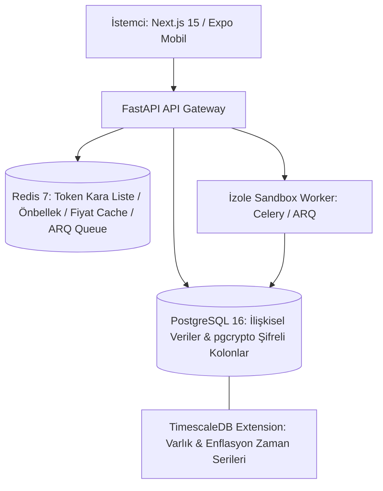
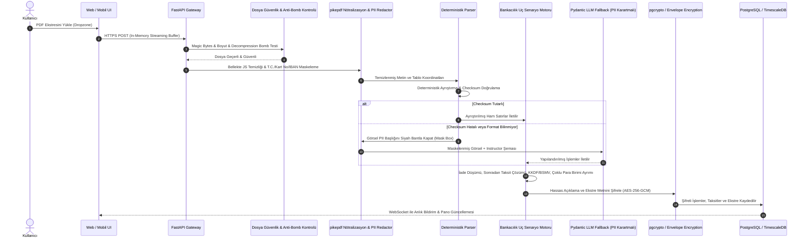
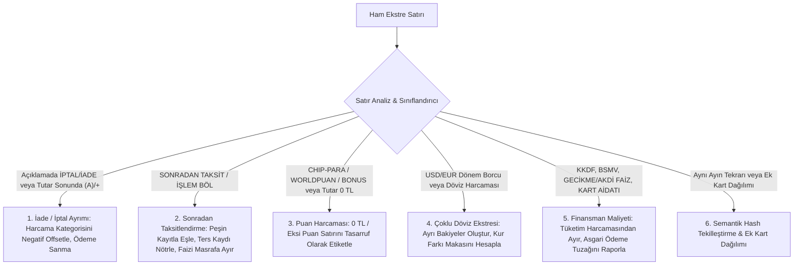
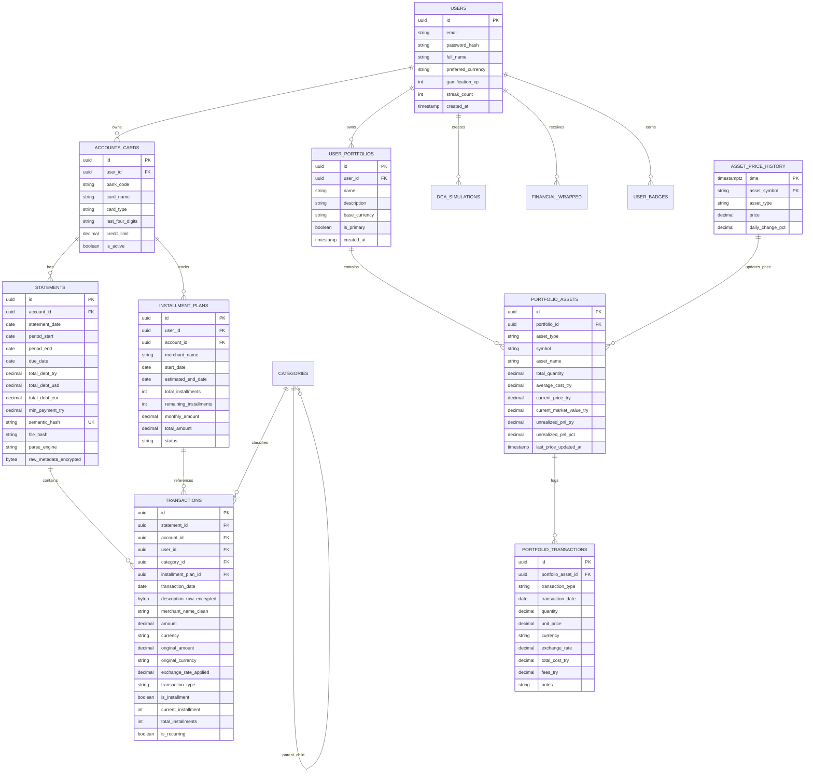
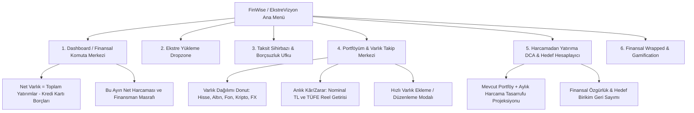
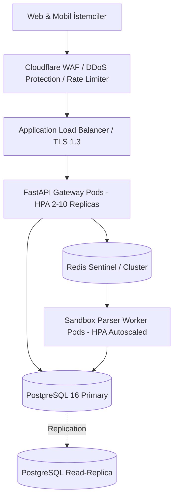

# FinWise / EkstreVizyon: Proje & Sistem Mimarisi Şartnamesi
**Doküman Sürümü:** 1.1.0 (Enterprise Security, Banking Edge-Cases & Active Portfolio Tracking Edition)  
**Rol:** Sistem Mimarisi, Kıdemli Güvenlik & Denetim Ekibi (Architecture & Security Audit Group)  
**Hedef:** Banka şifresi gerektirmeyen, PDF ekstre analizi, akıllı taksit takibi, gerçek portföy/varlık yönetimi, gamification ve harcamadan yatırıma DCA dönüşüm platformunun uçtan uca teknik mimarisi.

---

## İÇİNDEKİLER
1. [Yönetici Özeti ve Temel Mimari Prensipler](#1-yönetici-özeti-ve-temel-mimari-prensipler)
2. [Bölüm 1: Sistem ve Teknoloji Yığını (Tech Stack)](#2-bölüm-1-sistem-ve-teknoloji-yığını-tech-stack)
   - 2.1. Backend Tercihi ve Karşılaştırma Matrisi (FastAPI vs NestJS vs Go)
   - 2.2. Veritabanı Mimarisi (PostgreSQL + TimescaleDB + Redis + pgcrypto)
   - 2.3. Hibrit PDF Ayrıştırma Motoru (pdfplumber + pikepdf + LayoutLM / Vision Fallback)
   - 2.4. Mobil ve Web İstemci Mimarisi (Next.js 15 & React Native Expo)
   - 2.5. Güvenlik, Kriptografi ve Veri Doğrulama Katmanı
3. [Bölüm 2: PDF Analiz, Güvenlik & Ayrıştırma Boru Hattı (Pipeline)](#3-bölüm-2-pdf-analiz-güvenlik--ayrıştırma-boru-hattı-pipeline)
   - 3.1. Uçtan Uca Veri Akış Şeması (Security-Hardened Data Flow)
   - 3.2. Dosya Doğrulama ve Kötü Niyetli PDF Koruması (Anti-PDF Bomb / Malicious Content Stripping)
   - 3.3. Derinlemesine PII Maskeleme & Görsel Sansürleme (Visual & Text Redaction)
   - 3.4. Deterministik Banka Tanıma (Bank Fingerprinting)
   - 3.5. Tablo, Metin Çıkarma ve Taksit Çıkarım Mantığı
   - 3.6. LLM Tabanlı Kendi Kendini Onaran (Self-Healing) Fallback Motoru
   - 3.7. Türk Bankacılık Sistemi & Ekstre Uç Senaryoları (Edge-Cases) Çözüm Motoru
     - 3.7.1. İadeler ve İptaller (Refunds & Reversals vs Debt Payments)
     - 3.7.2. Sonradan Taksitlendirme Uzlaştırma (Post-Purchase Installment Reconciliation)
     - 3.7.3. Puan, Chip-para ve Bonus Harcamaları (Point Redemptions & 0 TL Netting)
     - 3.7.4. Yurtdışı / Çift Ekstre Yönetimi (Multi-Currency & Dual USD/EUR Statement Processing)
     - 3.7.5. Finansman Maliyetleri: Faiz, KKDF, BSMV, Kart Aidatı ve Asgari Ödeme Tuzağı Modeli
     - 3.7.6. Semantik Çift Yükleme ve Çakışma Yönetimi (Semantic Fingerprinting & Deduplication)
   - 3.8. İşyeri İsmi Normalizasyonu (Merchant Cleaning) ve Akıllı Kategorizasyon
   - 3.9. FinWise-AI Makine Öğrenimi Kalite, Zaman Serisi Sızıntı Önleme, Cold Start & Sentetik Veri Standartları (ML Rigor Spec)
4. [Bölüm 3: Kapsamlı Veritabanı Şeması ve ERD Tasarımı](#4-bölüm-3-kapsamlı-veritabanı-şeması-ve-erd-tasarımı)
   - 4.1. Varlık İlişki Diyagramı (Mermaid ERD - Ekstre + Portföy + Yatırım)
   - 4.2. Detaylı Tablo Şemaları ve Veri Tipleri (DDL Düzeyinde)
   - 4.3. Veri Güvenliği: At-Rest Encryption & PII Şifreleme Stratejisi
   - 4.4. İndeksleme ve Performans Stratejisi
5. [Bölüm 4: Web ve Mobil Arayüz Ekran & Modül Mimarisi](#5-bölüm-4-web-ve-mobil-arayüz-ekran--modül-mimarisi)
   - 5.1. Bilgi Mimarisi ve Ekran Hiyerarşisi
   - 5.2. Temel Ekranlar, Bileşenler ve Görselleştirme Kütüphaneleri
   - 5.3. Portföy ve Canlı Varlık Takip Merkezi (Yeni Modül)
   - 5.4. Durum Yönetimi (State Management) ve Çevrimdışı Yetenekler
6. [Bölüm 5: Yatırım, Portföy Değerleme ve DCA Hesaplama Motoru](#6-bölüm-5-yatırım-portföy-değerleme-ve-dca-hesaplama-motoru)
   - 6.1. Aktif Portföy Değerleme ve Ağırlıklı Ortalama Maliyet (WAC) Modeli
   - 6.2. Dolar Maliyet Ortalaması (DCA) ve Nominal Bileşik Getiri Modeli
   - 6.3. Reel Getiri ve Enflasyon Düzeltmesi (Fisher Denklemi)
   - 6.4. Harcama Fırsat Maliyeti (Opportunity Cost Engine)
   - 6.5. Portföy Destekli Gelecek Varlık Projeksiyonu (Hybrid Goal Calculator)
   - 6.6. Tarihsel ve Canlı Piyasa Veri Entegrasyonları (TEFAS, BIST, Altın, Kripto)
7. [Bölüm 6: Güvenlik, KVKK/GDPR Uyumluluğu ve Dağıtım (DevOps) Mimarisi](#7-bölüm-6-güvenlik-kvkkgdpr-uyumluluğu-ve-dağıtım-devops-mimarisi)
   - 7.1. Worker Sandbox İzolasyonu ve Anti-DoS Mimarisi
   - 7.2. Zarf Şifreleme (Envelope Encryption) ve Anahtar Yönetimi (KMS)
   - 7.3. KVKK / GDPR Uyum ve Kriptografik Silme (Crypto-Shredding)
   - 7.4. Dağıtım, Yüksek Erişilebilirlik ve CI/CD Mimarisi

---

## 1. Yönetici Özeti ve Temel Mimari Prensipler

Proje, Türkiye finans ekosistemindeki en kritik tüketici çekincelerinden birini (açık bankacılık veya üçüncü parti uygulamalara bankacılık şifresi verme korkusu) ortadan kaldırarak; sadece kullanıcının indirdiği kredi kartı/hesap ekstresi PDF'lerini **sürükle-bırak** yöntemiyle işleyen; aynı zamanda kullanıcının **mevcut yatırımlarını (BIST, Altın, Fon, Kripto, Döviz)** anlık takip etmesini ve tasarruflarını geleceğe dönüştürmesini sağlayan entegre bir finansal zeka platformudur.

### Temel Mimari Prensipler:
1. **Sıfır Banka Kimlik Bilgisi (Zero-Credential Security):** Hiçbir API anahtarı, SMS OTP'si veya banka şifresi istenmez.
2. **Uçtan Uca PII İzolasyonu & Görsel Sansür (Visual & Text Redaction):** PDF içeriğindeki T.C. Kimlik No, kredi kartının ilk 12 hanesi, IBAN, müşteri no ve ev adresi gibi kişisel veriler hafızada (RAM) maskelenir; görsel modalara geçişte koordinat bazlı piksel karartma uygulanır.
3. **Savunma Odaklı Güvenli Dosya İşleme (Defensive File Processing):** PDF bombası, bellek tüketme saldırıları, zararlı gömülü JavaScript ve mime-spoofing girişimleri çok katmanlı sandbox boru hattında elenir.
4. **Türk Bankacılık Gerçeklerine Tam Uyum (Battle-Tested Edge-Case Engine):** İadeler, sonradan mobilden taksitlendirmeler, Chip-para/Worldpuan kullanımları, KKDF/BSMV vergileri, kur farkları ve çift yüklemeler hatasız ayrıştırılır.
5. **Entegre Varlık ve Portföy Yönetimi (Active Wealth & Portfolio Tracking):** Sadece teorik simülasyon değil; kullanıcının gerçek mevcut yatırımlarını (Hisse, TEFAS Fonu, Altın, Kripto, Döviz) portföyünde tutabilmesi, anlık kâr/zararını görmesi ve harcamalarından artan tasarruflarla portföyünü büyütme projeksiyonu yapabilmesi.
6. **Maliyet-Etkin Hibrit Ayrıştırma (Deterministic-First, AI-Fallback):** Ekstrelerin %90'dan fazlası deterministik motorla sıfır token maliyetiyle ~100 milisaniyede çözülür; yalnızca bozulmuş ekstreler Pydantic kısıtlamalı LLM fallback katmanına gider.
7. **Veritabanında At-Rest Şifreleme (Envelope Encryption & pgcrypto):** Hassas finansal işlem detayları ve ekstre metinleri veritabanında şifreli saklanır.

---

## 2. Bölüm 1: Sistem ve Teknoloji Yığını (Tech Stack)

### 2.1. Backend Tercihi ve Karşılaştırma Matrisi

| Kriter | Python FastAPI | Node.js (NestJS) | Go (Golang) | Kazanan & Gerekçe |
| :--- | :--- | :--- | :--- | :--- |
| **PDF Güvenliği, Manipülasyonu & Tablo Çıkarımı** | **Mükemmel** (`pdfplumber`, `PyMuPDF/fitz`, `pikepdf`, `python-magic`) | Sınırlı (`pdf-parse`, `pdf2json`, C++ binding'leri zayıf) | Çok sınırlı (Tablo çıkarımı ilkel) | **Python FastAPI:** `pikepdf` (qpdf C++ çekirdeği) ile zararlı JS temizleme ve `pdfplumber` ile koordinat tabanlı analiz açık ara Python'dadır. |
| **Finansal Matematik, Portföy & Veri Analitiği** | **Mükemmel** (`numpy`, `pandas`, `scipy`, `tefas-crawler`) | Orta (`simple-statistics`, TEFAS kütüphanesi yok) | Yüksek hız, kütüphane desteği düşük | **Python FastAPI:** TEFAS fon verileri, BIST zaman serileri, Fisher reel getiri modelleri ve DCA simülasyonları mikro-saniyelerde çalışır. |
| **LLM & AI Entegrasyonu** | **Mükemmel** (`Instructor`, `Pydantic v2`, Google GenAI SDK) | İyi (`@langchain/core`, Zod validation) | Orta | **Python FastAPI:** Pydantic v2 C-hızında validasyon sunar; `instructor` ile şemalı JSON çıktısı %100 tip güvenliği sağlar. |
| **Asenkron I/O ve Görev Yönetimi** | **Mükemmel** (Asyncio, Celery / ARQ / Redis) | **Mükemmel** (Event loop, BullMQ) | **Olağanüstü** (Goroutines) | **Python FastAPI:** Redis destekli asenkron worker mimarisi, izole PDF işleme işlerini HTTP döngüsünden ayırır. |
| **Kriptografi & Güvenlik Desteği** | **Mükemmel** (`cryptography` AES-GCM, `hashlib`) | **Mükemmel** (`crypto` built-in) | **Mükemmel** (`crypto` standard lib) | **Python FastAPI:** Endüstri standardı `cryptography` modülü ile uygulama seviyesi Zarf Şifreleme (Envelope Encryption). |

**Kesin Karar:** **Python 3.12+ FastAPI**

---

### 2.2. Veritabanı Mimarisi



1. **PostgreSQL 16 (pgcrypto destekli):**
   - Kullanıcı profilleri, hesaplar, kartlar, kategoriler, taksit planları, portföy varlıkları ve şifrelenmiş finansal işlemler (`pgcrypto` ile kolon bazlı şifreleme).
2. **TimescaleDB Uzantısı (Hypertables):**
   - Enflasyon serileri (TÜİK TÜFE), TCMB gösterge kurları, BIST100 endeksi, BIST hisseleri, TEFAS fon pay fiyatları, Gram Altın ve Kripto fiyatları için optimize edilmiş hypertable'lar.
3. **Redis 7:**
   - Canlı piyasa fiyatları önbelleği (TTL: 60 saniye).
   - İşyeri eşleştirme (Merchant Normalization) sözlüğü.
   - Brute-force ve DoS engelleme (Rate Limiting).
   - Asenkron görev kuyruğu (Task Broker).

---

### 2.3. Hibrit PDF Ayrıştırma Motoru

1. **Ön Güvenlik ve Nötralizasyon Katmanı:**
   - `python-magic`: Dosya imzası (Magic Bytes) kontrolü (`application/pdf`).
   - `pikepdf`: PDF nesne analizi, gömülü JavaScript, Form Action ve zararlı stream temizliği; sıkıştırma bombası (Decompression Bomb) sınır denetimi.
2. **Kademe 1 - Deterministik Çıkarıcı (%90 Başarı Oranı - ~100ms - $0 Maliyet):**
   - `pdfplumber` + `PyMuPDF (fitz)`: Banka şablon tanıma, tablo koordinat matrisi ve taksit/tutar regex motoru.
3. **Kademe 2 - OCR Destekli Çıkarıcı (%5 Başarı Oranı - Taranmış Ekstreler):**
   - Taranmış veya fotoğraf ekstrelerde koordinatlı metin çıkarımı (`PaddleOCR` / `Tesseract`). Öncesinde üst PII alanı fiziksel karartılır.
4. **Kademe 3 - LLM / Vision Fallback (%5 Başarı Oranı - Bozuk veya Yeni Formatlar):**
   - `Instructor` + Google Gemini 1.5 Flash veya yerel Qwen2-VL. Görsel gönderilecekse PII başlığı siyah bantla kapatılmış görsel gönderilir.

---

### 2.4. Mobil ve Web İstemci Mimarisi

- **Web İstemcisi:** Next.js 15 (App Router, React 19), Tailwind CSS, Shadcn UI, Tremor KPI kartları, Recharts.
- **Mobil İstemci:** React Native (Expo SDK 52), NativeWind, React Native Reanimated 3, Skia tabanlı `victory-native` / `wagmi-charts`.
- **Durum ve Veri Çekme:** `@tanstack/react-query v5` + `zustand` (offline state cache).

---

## 3. Bölüm 2: PDF Analiz, Güvenlik & Ayrıştırma Boru Hattı (Pipeline)

### 3.1. Uçtan Uca Veri Akış Şeması



---

### 3.2. Dosya Doğrulama ve Kötü Niyetli PDF Koruması (Anti-PDF Bomb / Malicious Content Stripping)

Sunucuya gelen hiçbir dosyaya körü körüne güvenilmez. Aşağıdaki güvenlik süzgeci zorunludur:

```python
# file_guard.py - Çok Katmanlı PDF Güvenlik ve Nötralizasyon Motoru
import io
import magic
import pikepdf
from fastapi import HTTPException, status

MAX_FILE_SIZE = 15 * 1024 * 1024       # Maksimum 15 MB
MAX_PAGE_COUNT = 30                     # Kredi kartı ekstreleri nadiren 20 sayfayı geçer
MAX_UNCOMPRESSED_RATIO = 100            # Sıkıştırma bombası koruma katsayısı

def validate_and_neutralize_pdf(stream_bytes: bytes) -> bytes:
    # 1. Boyut Denetimi
    if len(stream_bytes) > MAX_FILE_SIZE:
        raise HTTPException(status_code=status.HTTP_413_REQUEST_ENTITY_TOO_LARGE, detail="Dosya boyutu 15MB sınırını aşıyor.")

    # 2. Magic Bytes / MIME Kontrolü (Spoofing Engelleme)
    mime_type = magic.from_buffer(stream_bytes, mime=True)
    if mime_type != "application/pdf":
        raise HTTPException(status_code=status.HTTP_400_BAD_REQUEST, detail="Geçersiz dosya formatı. Gerçek bir PDF dosyası yükleyiniz.")

    # 3. pikepdf ile Nesne Analizi, Decompression Bomb ve Zararlı JS Temizliği
    try:
        with pikepdf.open(io.BytesIO(stream_bytes)) as pdf:
            # Sayfa sayısı kontrolü (DoS engelleme)
            page_count = len(pdf.pages)
            if page_count > MAX_PAGE_COUNT:
                raise HTTPException(status_code=status.HTTP_400_BAD_REQUEST, detail=f"Sayfa sayısı çok yüksek ({page_count}). Maksimum {MAX_PAGE_COUNT} sayfa desteklenir.")

            # PDF içindeki zararlı olabilecek JavaScript, Action ve Launch nesnelerini budama (Stripping)
            # Root (/Root) ve Names (/Names) altındaki JavaScript sözlüklerini temizle
            if "/Names" in pdf.Root:
                names = pdf.Root.Names
                for dangerous_key in ["/JavaScript", "/JS", "/Launch", "/SubmitForm", "/EmbeddedFiles"]:
                    if dangerous_key in names:
                        del names[dangerous_key]

            if "/OpenAction" in pdf.Root:
                del pdf.Root["/OpenAction"]

            if "/AA" in pdf.Root:  # Additional Actions
                del pdf.Root["/AA"]

            # Her sayfanın interaktif form ve zararlı annotasyonlarını temizle
            for page in pdf.pages:
                if "/Annots" in page:
                    # Yalnızca güvenli annotasyonları tut, Launch/Action içerenleri sil
                    annots = page["/Annots"]
                    safe_annots = []
                    for annot in annots:
                        annot_obj = annot.resolve()
                        if "/A" in annot_obj or "/AA" in annot_obj:
                            continue  # Zararlı aksiyon içeren annotasyon elenir
                        safe_annots.append(annot)
                    page["/Annots"] = safe_annots

            # Nötralize edilmiş güvenli PDF baytlarını dışa aktar
            output_io = io.BytesIO()
            pdf.save(output_io, compress_streams=True, linearize=False)
            neutralized_bytes = output_io.getvalue()
            return neutralized_bytes

    except pikepdf.PdfError as e:
        raise HTTPException(status_code=status.HTTP_400_BAD_REQUEST, detail="Bozuk veya şifreli PDF belgesi.")
```

---

### 3.3. Derinlemesine PII Maskeleme & Görsel Sansürleme (Visual & Text Redaction)

Geleneksel metin regex'i tek başına yetersizdir:
1. **Unicode Boşlukları ve Soft-Hyphen Karakterleri:** `1 9 9 1 2 3` veya `199\u00ad123` şeklinde araya giren gizli karakterler regex'i yanıltabilir. Öncesinde NFKC normalizasyonu şarttır.
2. **Görsel / LLM Vision Sızıntısı:** LLM'e taranmış sayfa gönderilirken ekstre üstündeki T.C. Kimlik No, İsim ve Adres görsel olarak da karartılmalıdır.

```python
# pii_deep_scrubber.py
import re
import unicodedata
import fitz  # PyMuPDF
from typing import List, Tuple

def normalize_text(raw_text: str) -> str:
    """Unicode NFKC normalizasyonu uygular, sıfır genişlikli karakterleri temizler."""
    normalized = unicodedata.normalize('NFKC', raw_text)
    # Zero-width spaces, soft hyphens, byte order marks temizliği
    normalized = re.sub(r'[\u200B-\u200D\uFEFF\u00AD]', '', normalized)
    return normalized

def scrub_text_pii(text: str) -> str:
    """Metin tabanlı derinlemesine PII maskeleme."""
    text = normalize_text(text)
    
    # 1. T.C. Kimlik No (11 haneli, aralarında nokta/boşluk/tire olabilecek varyasyonlar)
    tc_pattern = r'\b([1-9]\d{2})[\s\.\-]?(\d{3})[\s\.\-]?(\d{3})[\s\.\-]?(\d{2})\b'
    text = re.sub(tc_pattern, r'\1******\4', text)
    
    # 2. Kredi Kartı PAN (13-16 haneli, 4'lü gruplu veya bitişik)
    card_pattern = r'\b(?:\d{4}[\s\.\-]?){3}(\d{4})\b'
    text = re.sub(card_pattern, r'**** **** **** \1', text)
    
    # 3. IBAN (TR ile başlayan 26 karakter)
    iban_pattern = r'\b(TR\d{2})[\s]?(\d{4})[\s]?(\d{4})[\s]?(\d{4})[\s]?(\d{4})[\s]?(\d{4})[\s]?(\d{2})\b'
    text = re.sub(iban_pattern, r'\1******************\7', text)
    
    # 4. Telefon Numarası
    phone_pattern = r'(?:\+90|0)?[\s\-]?(5\d{2})[\s\-]?(\d{3})[\s\-]?(\d{2})[\s\-]?(\d{2})'
    text = re.sub(phone_pattern, r'0\1 *** ** \4', text)
    
    return text

def apply_visual_redaction(pdf_bytes: bytes) -> bytes:
    """
    LLM Vision veya OCR katmanına gönderilecek PDF sayfalarında
    kişisel bilgilerin bulunduğu ekstre üst başlık bölgesini (%0-22 Y-ekseni)
    fiziksel olarak siyah piksellerle kaplar.
    """
    doc = fitz.open(stream=pdf_bytes, filetype="pdf")
    for page in doc:
        rect = page.rect
        # Ekstrenin en üst %22'lik kısmını (Ad-soyad, adres, TC, Müşteri No alanı) karart
        header_redact_zone = fitz.Rect(0, 0, rect.width, rect.height * 0.22)
        page.draw_rect(header_redact_zone, color=(0, 0, 0), fill=(0, 0, 0))
    
    output_stream = doc.tobytes()
    doc.close()
    return output_stream
```

---

### 3.4. Deterministik Banka Tanıma (Bank Fingerprinting)
İlk sayfa metninde bankaya özel terimler taranır (`GARANTİ BBVA`, `HESAP ÖZETİ`, `Worldcard`, `Maximum Kart`, `Axess`, `CardFinans`, `Bankkart`, `Enpara.com`).

---

### 3.5. Tablo, Metin Çıkarma ve Taksit Çıkarım Mantığı
- Taksit regex deseni: `(?P<curr>\d{1,2})\s*[/]\s*(?P<total>\d{1,2})` veya `\((?P<curr>\d{1,2})\s*[/]\s*(?P<total>\d{1,2})\)`.
- Türkçe para birimi normalizasyonu: `14.850,75 TL` -> `Decimal("14850.75")`.

---

### 3.6. LLM Tabanlı Kendi Kendini Onaran (Self-Healing) Fallback Motoru
Deterministik toplam kontrolü (`Toplam Borç == Hesaplanan Satırlar`) tutmazsa, PII başlığı karartılmış görsel/metin dilimi `Instructor` kütüphanesi üzerinden Pydantic şemasıyla Gemini 1.5 Flash'a gönderilir.

---

### 3.7. Türk Bankacılık Sistemi & Ekstre Uç Senaryoları (Edge-Cases) Çözüm Motoru

Türk kredi kartı ekstreleri dünyadaki en karmaşık finansal belgeler arasındadır. Sistem aşağıdaki 6 uç senaryoyu matematiksel ve kuramsal olarak çözer:



#### 3.7.1. İadeler ve İptaller (Refunds & Reversals)
- **Sorun:** Kullanıcı 1.200 TL'ye aldığı ceketi iade ettiğinde ekstrede `1.200,00 TL (A)` veya `-1.200,00 TL` yazar. Naive parser'lar bunu kullanıcının borç ödemesi (`PAYMENT`) sanır veya harcamaları toplarken mutlak değer alıp harcamayı 2.400 TL gösterir!
- **Kural:**
  - `transaction_type = 'REFUND'` olarak etiketlenir.
  - Açıklamadaki mağaza ismi normalleştirilir (Örn: `ZARA`).
  - İade tutarı, ilgili kategorinin (Giyim) o ayki toplam harcamasından kuruşu kuruşuna düşülür (`Net Harcama = Brüt Harcamalar - İadeler`).
  - Borç ödemesi (`PAYMENT`) ile asla karıştırılmaz; `PAYMENT` sadece ekstre dönem borcunu kapatan varlık transferidir.

#### 3.7.2. Sonradan Taksitlendirme Uzlaştırma (Post-Purchase Installments)
- **Sorun:** Kullanıcı POS'ta 9.000 TL peşin harcama yapar. Mobil bankacılıktan "3 Taksite Böl" der. Ekstrede:
  - 1. Satır: `MEDIAMARKT 9.000,00 TL` (Peşin)
  - 2. Satır: `MEDIAMARKT İPTAL/TAKSİT DÜZELTME -9.000,00 TL (A)`
  - 3. Satır: `MEDIAMARKT SONRADAN TAKSİT 1/3 3.120,00 TL`
  - Bu üç satır düz toplandığında harcama 12.120 TL görünür.
- **Kural:**
  - `Reconciliation Engine`: Aynı ekstre dönemi içerisinde peşin tutar (`9.000,00 TL`) ile ters kayıt (`-9.000,00 TL`) tespit edildiğinde birbirini nötrler (`net_effect = 0`).
  - Asıl işlem 3. satırdaki taksit kaydına bağlanır (`installment_plans` tablosuna aktarılır).
  - Taksit toplamı ile peşin tutar arasındaki fark `(3 * 3.120) - 9.000 = 360 TL` hesaplanır ve `FINANCING_FEE` (Sonradan Taksitlendirme Komisyon ve Faizi) olarak etiketlenir.

#### 3.7.3. Puan, Chip-para ve Bonus Harcamaları (Point Redemptions)
- **Sorun:** Kullanıcı markette 800 TL harcarken 200 TL Worldpuan kullanır. Ekstrede kimi banka `Net: 600 TL` yazar ve dipnotta `200 TL Puan` belirtir; kimi banka ise `800 TL` harcama ve alt satırda `-200 TL CHIP-PARA KULLANIMI` yazar. Tamamı puanla ödenen işlemler ise `0,00 TL` yansır.
- **Kural:**
  - `0,00 TL` tutarlı satırlar parser tarafından asla "hata" olarak elenmez; `POINT_REDEMPTION` işlem tipi olarak kaydedilir.
  - Eksi bakiye puan indirimleri harcama kategorisini netleştirir.
  - Kullanıcıya "Bu Ay Puanla Tasarruf Edilen Tutar: 200 TL" KPI metriği üretilir.

#### 3.7.4. Yurtdışı / Çift Ekstre Yönetimi (Multi-Currency & Dual USD/EUR Statements)
- **Sorun:** Kart sahibi döviz ekstresi talimatı vermişse, ekstrede hem "TL Hesap Özeti" hem de "USD Hesap Özeti" yer alır. Döviz harcamaları TL ekstresine dahil edilmez, ayrı dolar borcu oluşur. Tek para birimli sistemler dolar borcunu TL ile toplayarak toplam borcu iflas seviyesinde yanlış gösterir.
- **Kural:**
  - Ekstre modelinde `total_debt_try`, `total_debt_usd`, `total_debt_eur` ayrı ayrı saklanır.
  - Her işlem kendi orijinal dövizi (`original_currency`, `original_amount`) ile kaydedilir.
  - Eğer döviz işlemi TL'ye çevrilerek yansıtılmışsa, bankanın uyguladığı kur ile o günkü TCMB gösterge kuru karşılaştırılır: `Kur Makası Kaybı = Tutar_TL - (Tutar_USD * TCMB_Alis_Kuru)`. Bu fark kullanıcıya "Banka Kur Farkı Masrafı" olarak raporlanır.

#### 3.7.5. Finansman Maliyetleri: Faiz, KKDF, BSMV ve Asgari Ödeme Tuzağı Modeli
- **Sorun:** Kredi kartı ekstrelerindeki `Gecikme Faizi`, `Akdi Faiz`, `%15 KKDF`, `%15 BSMV` ve `Yıllık Kart Üyelik Ücreti` genel alışveriş sanılırsa kullanıcının harcama analizi bozulur.
- **Kural:**
  - Bu kalemler doğrudan `FINANCIAL_COST` (Finansman Maliyeti) ve `TAX_LEVY` (Vergi & Fon) üst kategorisine atanır.
  - `Yıllık Kart Aidatı` tespit edildiğinde kullanıcıya arayüzde: **"Uyarı: Kartınızdan 750 TL üyelik ücreti kesilmiş. Tüketici Kanunu kapsamında bankanızı arayarak iade talep edebilirsiniz."** aksiyon butonu çıkarılır.
  - **Asgari Ödeme Tuzağı (Minimum Payment Trap Simulator):** Kullanıcı yalnızca asgari tutarı öderse, kalan borca aylık TCMB azami akdi faizi + %15 KKDF + %15 BSMV eklendiğinde borcun kaç ayda kapanacağı ve ödenecek toplam faiz hesaplanır.

#### 3.7.6. Semantik Çift Yükleme ve Çakışma Yönetimi (Semantic Deduplication)
- **Sorun:** Kullanıcı aynı PDF'i tekrar indirdiğinde PDF oluşturulma tarihi (`CreationDate`) değiştiği için SHA256 dosya hash'i farklı çıkar. Ya da kullanıcı önce ay ortasında geçici ekstre, ay sonunda kesinleşmiş ekstre yükler.
- **Kural:**
  - Sadece dosya hash'ine (`file_hash`) güvenilmez.
  - **Semantik Ekstre İmzası (Semantic Statement Fingerprint):**
    ```python
    semantic_id = sha256(f"{bank_code}_{card_last_four}_{period_start}_{period_end}_{total_debt_try}".encode()).hexdigest()
    ```
  - Veritabanında aynı `semantic_id` mevcutsa ekstre tekrar kaydedilmez; kullanıcıya "Bu ekstre daha önce sisteme işlenmişti (Son Güncelleme: ...)" bilgisi verilir.
  - **İşlem Düzeyinde Tekilleştirme (Transaction-Level Deduplication):** Geçici ekstreden kesin ekstreye geçişte işlemler `(card_id, transaction_date, amount, clean_merchant)` kompozit anahtarıyla `ON CONFLICT DO NOTHING` kuralıyla güncellenir.
  - **Asıl / Ek Kart Ayrımı:** Ekstrede birden fazla kart numarası varsa (`Asıl Kart: 1234`, `Ek Kart 1: 5678`), harcamalar ait oldukları kartın `card_id`'sine bağlanır.

---

### 3.8. İşyeri İsmi Normalizasyonu (Merchant Cleaning) ve Akıllı Kategorizasyon
- POS çöpleri temizlenir (`MIGROS TIC A S ISTANBUL TR 324143` -> `Migros`, Kategori: Market).
- **Türkçe NLP Ön İşleme:** Python Unicode `İ`/`i` ve `I`/`ı` bozulmalarını önleyen `TurkishFinancialNLPPreprocessor` devrededir.
- **Regex Maskeleme Katmanı:** Model eğitimi ve kategorizasyonda aşırı uydurmayı (spurious correlation) önlemek için tutarlar, tarihler ve işlem referansları `<NUM>`, `<DATE>`, `<CURRENCY>`, `<REF_ID>` olarak maskelenir.
- Redis üzerindeki 10.000+ bilinen marka sözlüğü ve Levenshtein benzerliği (`RapidFuzz`) ile mikro-saniyelerde eşleştirilir.
- Düzenli yinelenen sabit ödemeler (Netflix, Spotify, Turkcell, Kira) `is_recurring = True` olarak işaretlenir.

---

### 3.9. FinWise-AI Makine Öğrenimi Kalite, Zaman Serisi Sızıntı Önleme, Cold Start & Sentetik Veri Standartları (ML Rigor Spec)

Sistemdeki tüm yapay zeka, zaman serisi projeksiyonu ve RAG bileşenleri [FINWISE_AI_ML_SPEC.md](FINWISE_AI_ML_SPEC.md) denetim şartnamesine %100 uymakla yükümlüdür:

1. **Zaman Serisi Veri Sızıntısı (Data Leakage) Koruması:**
   - Standart rastgele K-Fold ve `shuffle=True` **kesinlikle yasaktır**.
   - Zaman sıralı `TimeSeriesSplit` ve Walk-Forward Validation zorunludur.
   - Tüm Lag ve Rolling hesaplamalarında `shift(1)` zorunludur ($t$ anı pencere dışı tutulur).
2. **Cold Start (Soğuk Başlangıç) ve Kademeli Zeka (Tiered Intelligence):**
   - **1 Aylık Ekstre ($N_{months} = 1$):** Prophet ve Isolation Forest çalıştırılmaz! Deterministik Taksit Toplamı ($\sum Taksitler_{t+1}$), Run-Rate ortalaması ve Tukey's IQR ($Q3 + 2.5 \times IQR$) fallback devrededir.
   - **2-5 Aylık Ekstre ($2 \le N_{months} < 6$):** Holt-Winters üstel düzeltme ve Median Absolute Deviation (MAD).
   - **6+ Aylık Ekstre ($N_{months} \ge 6$):** Prophet (haftalık/aylık mevsimsellik) ve Isolation Forest (kontaminasyon: %3-5).
3. **RAG & LLM Halüsinasyon Önleme (Ekstre Dönemi vs. Takvim Ayı):**
   - Türkiye'de ayın 15'i gibi ara günlerde kesilen ekstreler ile takvim ayları (1-31) arasındaki çakışma için `Temporal Disambiguator` devrededir.
   - Kullanıcı "Ocak ayı harcamam" dediğinde SQL takvim sorgusu (`2024-01-01` - `2024-01-31`) çalıştırılır ve yanıta zorunlu dönem farkı dipnotu eklenir.
4. **%100 Gerçekçi Sentetik Ekstre Üreticisi (`SyntheticStatementGenerator`):**
   - GitHub açık kaynak testlerinde sıfır gerçek PII ve sıfır veri ihlali garantisi için; Türk bankalarının mizanpajını, geçerli Luhn/T.C. algoritmasını, uç senaryoları (iade, sonradan taksit, 0 TL puan, döviz, faiz/vergi) ve kuruşu kuruşuna bakiye denkliğini sağlayan sentetik PDF üreteci (`scripts/generate_synthetic_statement.py`) kullanılır.

---

## 4. Bölüm 3: Kapsamlı Veritabanı Şeması ve ERD Tasarımı

### 4.1. Varlık İlişki Diyagramı (Mermaid ERD)

Aşağıdaki diyagram hem **Ekstre Analizi & Taksit Takibini** hem de kullanıcının **Aktif Portföy / Canlı Varlık Takibini** ve **DCA Yatırım Simülasyonunu** kapsar:



---

### 4.2. Detaylı Tablo Şemaları ve Veri Tipleri (DDL)

```sql
-- Gerekli eklentiler
CREATE EXTENSION IF NOT EXISTS "uuid-ossp";
CREATE EXTENSION IF NOT EXISTS "pgcrypto";

-- 1. KULLANICILAR TABLOSU
CREATE TABLE users (
    id UUID PRIMARY KEY DEFAULT gen_random_uuid(),
    email VARCHAR(255) UNIQUE NOT NULL,
    password_hash VARCHAR(255) NOT NULL,
    full_name VARCHAR(100),
    preferred_currency VARCHAR(3) DEFAULT 'TRY',
    gamification_xp INTEGER DEFAULT 0,
    streak_count INTEGER DEFAULT 0,
    last_login_at TIMESTAMPTZ,
    created_at TIMESTAMPTZ DEFAULT NOW(),
    updated_at TIMESTAMPTZ DEFAULT NOW()
);

-- 2. HESAPLAR VE KARTLAR
CREATE TABLE accounts_cards (
    id UUID PRIMARY KEY DEFAULT gen_random_uuid(),
    user_id UUID NOT NULL REFERENCES users(id) ON DELETE CASCADE,
    bank_code VARCHAR(30) NOT NULL,
    card_name VARCHAR(100) NOT NULL,
    card_type VARCHAR(20) DEFAULT 'CREDIT', -- 'CREDIT', 'DEBIT'
    last_four_digits VARCHAR(4) NOT NULL,
    credit_limit NUMERIC(14, 2),
    cut_off_day SMALLINT CHECK (cut_off_day BETWEEN 1 AND 31),
    is_active BOOLEAN DEFAULT TRUE,
    created_at TIMESTAMPTZ DEFAULT NOW()
);

-- 3. EKSTRELER (STATEMENTS) TABLOSU (Çoklu Para Birimi ve Semantik Hash Desteği)
CREATE TABLE statements (
    id UUID PRIMARY KEY DEFAULT gen_random_uuid(),
    account_id UUID NOT NULL REFERENCES accounts_cards(id) ON DELETE CASCADE,
    statement_date DATE NOT NULL,
    period_start DATE NOT NULL,
    period_end DATE NOT NULL,
    due_date DATE NOT NULL,
    total_debt_try NUMERIC(14, 2) NOT NULL DEFAULT 0.00,
    total_debt_usd NUMERIC(14, 2) DEFAULT 0.00,
    total_debt_eur NUMERIC(14, 2) DEFAULT 0.00,
    min_payment_try NUMERIC(14, 2) NOT NULL DEFAULT 0.00,
    total_spending_try NUMERIC(14, 2) NOT NULL DEFAULT 0.00,
    total_payments_try NUMERIC(14, 2) DEFAULT 0.00,
    semantic_hash VARCHAR(64) NOT NULL UNIQUE, -- Çift yüklemeyi kesin önleyen içeriksel hash
    file_hash VARCHAR(64) NOT NULL,
    parse_engine VARCHAR(30) NOT NULL, -- 'DETERMINISTIC', 'OCR', 'LLM_FALLBACK'
    raw_metadata_encrypted BYTEA,      -- pgcrypto ile şifrelenmiş ham banka metaverisi
    created_at TIMESTAMPTZ DEFAULT NOW(),
    CONSTRAINT unique_account_statement UNIQUE (account_id, statement_date)
);

-- 4. KATEGORİLER TABLOSU
CREATE TABLE categories (
    id UUID PRIMARY KEY DEFAULT gen_random_uuid(),
    parent_id UUID REFERENCES categories(id) ON DELETE SET NULL,
    user_id UUID REFERENCES users(id) ON DELETE CASCADE,
    name VARCHAR(100) NOT NULL,
    slug VARCHAR(100) NOT NULL,
    icon VARCHAR(50),
    color_hex VARCHAR(7),
    is_system BOOLEAN DEFAULT TRUE,
    created_at TIMESTAMPTZ DEFAULT NOW()
);

-- 5. TAKSİT PLANLARI TABLOSU
CREATE TABLE installment_plans (
    id UUID PRIMARY KEY DEFAULT gen_random_uuid(),
    user_id UUID NOT NULL REFERENCES users(id) ON DELETE CASCADE,
    account_id UUID NOT NULL REFERENCES accounts_cards(id) ON DELETE CASCADE,
    merchant_name VARCHAR(150) NOT NULL,
    start_date DATE NOT NULL,
    estimated_end_date DATE NOT NULL,
    total_installments SMALLINT NOT NULL,
    remaining_installments SMALLINT NOT NULL,
    monthly_amount NUMERIC(14, 2) NOT NULL,
    total_amount NUMERIC(14, 2) NOT NULL,
    status VARCHAR(20) DEFAULT 'ACTIVE', -- 'ACTIVE', 'COMPLETED', 'CANCELLED'
    created_at TIMESTAMPTZ DEFAULT NOW()
);

-- 6. İŞLEMLER / HARCAMALAR TABLOSU (Şifrelenmiş Açıklama ve Bankacılık Uç Senaryo Tipleri)
CREATE TABLE transactions (
    id UUID PRIMARY KEY DEFAULT gen_random_uuid(),
    statement_id UUID NOT NULL REFERENCES statements(id) ON DELETE CASCADE,
    account_id UUID NOT NULL REFERENCES accounts_cards(id) ON DELETE CASCADE,
    user_id UUID NOT NULL REFERENCES users(id) ON DELETE CASCADE,
    category_id UUID REFERENCES categories(id) ON DELETE SET NULL,
    installment_plan_id UUID REFERENCES installment_plans(id) ON DELETE SET NULL,
    transaction_date DATE NOT NULL,
    description_raw_encrypted BYTEA NOT NULL, -- pgcrypto veya AES-GCM ile şifrelenmiş ham açıklama
    merchant_name_clean VARCHAR(150),
    amount NUMERIC(14, 2) NOT NULL,           -- Ekstre para birimindeki tutar
    currency VARCHAR(3) DEFAULT 'TRY',
    original_amount NUMERIC(14, 2),          -- Yurtdışı harcamalarda orijinal tutar (Örn: $45.00)
    original_currency VARCHAR(3),            -- Örn: 'USD', 'EUR'
    exchange_rate_applied NUMERIC(12, 6),    -- Bankanın uyguladığı döviz kuru
    transaction_type VARCHAR(30) NOT NULL DEFAULT 'PURCHASE', 
    -- Tipler: 'PURCHASE', 'REFUND', 'PAYMENT', 'POINT_REDEMPTION', 'CASH_ADVANCE', 'FINANCIAL_COST', 'TAX_LEVY'
    is_installment BOOLEAN DEFAULT FALSE,
    current_installment SMALLINT,
    total_installments SMALLINT,
    is_recurring BOOLEAN DEFAULT FALSE,
    created_at TIMESTAMPTZ DEFAULT NOW()
);

-- 7. KULLANICI PORTFÖYLERİ (Portfolio Management Module)
CREATE TABLE user_portfolios (
    id UUID PRIMARY KEY DEFAULT gen_random_uuid(),
    user_id UUID NOT NULL REFERENCES users(id) ON DELETE CASCADE,
    name VARCHAR(100) NOT NULL DEFAULT 'Ana Portföyüm',
    description TEXT,
    base_currency VARCHAR(3) DEFAULT 'TRY',
    is_primary BOOLEAN DEFAULT TRUE,
    created_at TIMESTAMPTZ DEFAULT NOW(),
    updated_at TIMESTAMPTZ DEFAULT NOW()
);

-- 8. PORTFÖY VARLIKLARI (Altın, BIST Hisseleri, TEFAS Fonları, Kripto, Döviz)
CREATE TABLE portfolio_assets (
    id UUID PRIMARY KEY DEFAULT gen_random_uuid(),
    portfolio_id UUID NOT NULL REFERENCES user_portfolios(id) ON DELETE CASCADE,
    asset_type VARCHAR(30) NOT NULL, -- 'BIST_STOCK', 'TEFAS_FUND', 'GOLD', 'CRYPTO', 'FX', 'EUROBOND'
    symbol VARCHAR(30) NOT NULL,     -- 'THYAO', 'TI2', 'GRAM_ALTIN', 'BTC', 'USD'
    asset_name VARCHAR(150) NOT NULL,
    total_quantity NUMERIC(18, 6) NOT NULL DEFAULT 0.000000,
    average_cost_try NUMERIC(18, 6) NOT NULL DEFAULT 0.000000, -- Ağırlıklı Ortalama Maliyet (WAC)
    current_price_try NUMERIC(18, 6) NOT NULL DEFAULT 0.000000,
    current_market_value_try NUMERIC(18, 2) GENERATED ALWAYS AS (total_quantity * current_price_try) STORED,
    unrealized_pnl_try NUMERIC(18, 2) GENERATED ALWAYS AS ((total_quantity * current_price_try) - (total_quantity * average_cost_try)) STORED,
    unrealized_pnl_pct NUMERIC(8, 4) DEFAULT 0.0000,
    last_price_updated_at TIMESTAMPTZ DEFAULT NOW(),
    created_at TIMESTAMPTZ DEFAULT NOW(),
    CONSTRAINT unique_asset_in_portfolio UNIQUE (portfolio_id, symbol)
);

-- 9. PORTFÖY İŞLEM GEÇMİŞİ (Alış, Satış, Temettü)
CREATE TABLE portfolio_transactions (
    id UUID PRIMARY KEY DEFAULT gen_random_uuid(),
    portfolio_asset_id UUID NOT NULL REFERENCES portfolio_assets(id) ON DELETE CASCADE,
    transaction_type VARCHAR(20) NOT NULL, -- 'BUY', 'SELL', 'DIVIDEND'
    transaction_date DATE NOT NULL,
    quantity NUMERIC(18, 6) NOT NULL,
    unit_price NUMERIC(18, 6) NOT NULL,
    currency VARCHAR(3) DEFAULT 'TRY',
    exchange_rate NUMERIC(12, 6) DEFAULT 1.000000,
    total_cost_try NUMERIC(18, 2) NOT NULL,
    fees_try NUMERIC(10, 2) DEFAULT 0.00,
    notes TEXT,
    created_at TIMESTAMPTZ DEFAULT NOW()
);

-- 10. ZAMAN SERİSİ PİYASA VERİLERİ (TimescaleDB Hypertable)
CREATE TABLE asset_price_history (
    time TIMESTAMPTZ NOT NULL,
    asset_symbol VARCHAR(30) NOT NULL,
    asset_type VARCHAR(30) NOT NULL,
    price NUMERIC(18, 6) NOT NULL,
    daily_change_pct NUMERIC(8, 4)
);
SELECT create_hypertable('asset_price_history', 'time', if_not_exists => TRUE);
```

---

### 4.3. Veri Güvenliği: At-Rest Encryption & PII Şifreleme Stratejisi

Veritabanı çalınsa veya disk imajı sızsa dahi kullanıcıların finansal açıklamaları ele geçirilemez.

#### Yöntem: Zarf Şifreleme (Envelope Encryption - AES-256-GCM) ve pgcrypto
- Sunucu tarafında `cryptography.hazmat.primitives.ciphers.aead.AESGCM` kullanılır.
- Her kullanıcıya özgü bir **Veri Şifreleme Anahtarı (DEK - Data Encryption Key)** atanır.
- DEK anahtarları, HSM veya Cloud KMS'te saklanan **Anahtar Şifreleme Anahtarı (KEK - Key Encryption Key)** ile şifrelenir.
- `description_raw` gibi kritik sütunlar veritabanına sadece şifreli `bytea` bayt dizisi olarak yazılır.

```python
# crypto_vault.py - Uygulama Seviyesi Zarf Şifreleme Modülü
import os
from cryptography.hazmat.primitives.ciphers.aead import AESGCM

# HSM veya Ortam Değişkeninden okunan 256-bit KEK
MASTER_KEY = os.environ.get("FINWISE_ENCRYPTION_MASTER_KEY").encode()[:32]

def encrypt_financial_text(plain_text: str, user_salt: bytes) -> bytes:
    """AES-256-GCM ile kimliği doğrulanmış şifreleme yapar."""
    # 96-bit benzersiz nonce
    nonce = os.urandom(12)
    aesgcm = AESGCM(MASTER_KEY)
    encrypted_bytes = aesgcm.encrypt(nonce, plain_text.encode('utf-8'), user_salt)
    # Nonce + Şifreli Metin birleşik döndürülür
    return nonce + encrypted_bytes

def decrypt_financial_text(payload: bytes, user_salt: bytes) -> str:
    """AES-256-GCM ile şifre çözer."""
    nonce = payload[:12]
    ciphertext = payload[12:]
    aesgcm = AESGCM(MASTER_KEY)
    decrypted_bytes = aesgcm.decrypt(nonce, ciphertext, user_salt)
    return decrypted_bytes.decode('utf-8')
```

---

### 4.4. İndeksleme ve Performans Stratejisi
```sql
CREATE INDEX idx_transactions_user_date ON transactions (user_id, transaction_date DESC);
CREATE INDEX idx_transactions_type ON transactions (transaction_type);
CREATE INDEX idx_portfolio_assets_symbol ON portfolio_assets (symbol);
CREATE INDEX idx_statements_semantic_hash ON statements (semantic_hash);
CREATE INDEX idx_asset_prices_symbol_time ON asset_price_history (asset_symbol, time DESC);
```

---

## 5. Bölüm 4: Web ve Mobil Arayüz Ekran & Modül Mimarisi

### 5.1. Bilgi Mimarisi ve Ekran Hiyerarşisi



---

### 5.2. Temel Ekranlar, Bileşenler ve Görselleştirme Kütüphaneleri

#### Ekran 1: Dashboard / Komuta Merkezi
- **Entegre Net Varlık Kartı (Net Worth KPI):** `Toplam Yatırımlar (Portföy) - Aktif Kart Borçları = Net Değer`. Kullanıcı tek bakışta gerçek finansal sağlığını görür.
- **Finansman Maliyeti Alarmı:** Bu ay bankaya ödenen faiz, KKDF, BSMV ve kart aidatı toplamı kırmızı rozetle listelenir.

#### Ekran 2: Ekstre Yükleme & Güvenli Ayrıştırma Merkezi
- Sürükle-bırak dropzone, anında magic byte kontrolü, PII temizleme adımları ve güven skoru göstergesi.

#### Ekran 3: Taksit Sihirbazı (Installment Wizard & Debt-Free Horizon)
- 12 aylık taksit waterfall grafiği, biten taksitlerin oluşturduğu aylık nakit rahatlama takvimi.

---

### 5.3. Portföy ve Canlı Varlık Takip Merkezi (Kullanıcı Talebiyle Entegre Edilen Yeni Modül)

Kullanıcının sahip olduğu gerçek varlıkları kolayca yönetebildiği, anlık piyasa fiyatlarıyla güncellenen zengin arayüz ekranı:

#### Bileşenler ve Yetenekler:
1. **Hızlı Varlık Ekleme Modalı (Fast Asset Ingestion):**
   - **Varlık Türü Seçimi:** BIST Hissesi, TEFAS Yatırım Fonu, Altın (Gram/Çeyrek/ALTIN.S1), Kripto Para (BTC, ETH), Döviz (USD, EUR) veya Vadeli Mevduat/Eurobond.
   - **Akıllı Otomatik Tamamlama (Autosuggest):** Kullanıcı `THY` yazdığında `THYAO - Türk Hava Yolları` anında çıkar; `TI2` yazdığında `İş Portföy Para Piyasası Fonu` TEFAS veritabanından çekilir.
   - **Alış Tarihi, Adet ve Alış Fiyatı:** Kullanıcı toplam maliyeti ve adet bilgisini girer.
2. **Portföy Dağılımı ve Varlık Çeşitlendirme Grafiği (Allocation Donut Chart):**
   - Recharts / Victory-Native ile interaktif pasta grafik (%40 Hisse Senedi, %30 Altın, %20 TEFAS Fonu, %10 Kripto).
3. **Anlık Kâr / Zarar & Performans Kartları:**
   - **Nominal Kâr/Zarar:** `Güncel Piyasa Değeri - Toplam Alış Maliyeti`.
   - **Reel Satın Alma Gücü Kâr/Zararı (TÜİK Enflasyonu Karşılaştırmalı):** Kullanıcının parası enflasyona karşı değer kazanmış mı yoksa reel olarak erimiş mi?
4. **Varlık Detay Listesi & Fiyat Değişimleri:**
   - Her varlık için günlük % değişim, ortalama maliyet, kârlılık yüzdesi ve tek tıkla "Yeni Alım/Satım Ekle" aksiyonu.

---

## 6. Bölüm 5: Yatırım, Portföy Değerleme ve DCA Hesaplama Motoru

### 6.1. Aktif Portföy Değerleme ve Ağırlıklı Ortalama Maliyet (WAC) Modeli

Bir kullanıcının bir varlıktan $m$ farklı tarihte yaptığı alımlar için **Ağırlıklı Ortalama Maliyet ($WAC$)**:

\[
WAC = \frac{\sum_{j=1}^{m} (Q_j \times P_j) + \sum Fees}{\sum_{j=1}^{m} Q_j}
\]

Burada:
- $Q_j$: $j$ işlemindeki alım adedi.
- $P_j$: $j$ işlemindeki birim alış fiyatı (TRY).
- Anlık Nominal Kâr/Zarar: $PnL_{nominal} = Q_{toplam} \times (P_{guncel} - WAC)$

---

### 6.2. Dolar Maliyet Ortalaması (DCA) ve Nominal Bileşik Getiri Modeli

Ayrık zamanlı değişken getiri formülü (Gerçek Piyasa Verisi ile Backtest):
\[
FV_{nominal} = \sum_{t=1}^{n} \left[ PMT_t \times \prod_{k=t}^{n} (1 + R_k) \right]
\]

---

### 6.3. Reel Getiri ve Enflasyon Düzeltmesi (Fisher Denklemi)

TÜİK TÜFE aylık enflasyon oranı $I_k$ olduğunda, $k$ dönemindeki net **Reel Getiri ($r_{reel, k}$)**:
\[
r_{reel, k} = \frac{R_k - I_k}{1 + I_k}
\]

Kümülatif enflasyon düzeltmeli portföy değeri:
\[
FV_{reel} = \sum_{t=1}^{n} \left[ PMT_t \times \prod_{k=t}^{n} (1 + r_{reel, k}) \right]
\]

---

### 6.4. Harcama Fırsat Maliyeti (Opportunity Cost Engine)
Kullanıcının ekstredeki belirli bir harcamayı (örneğin ayda 3.000 TL lüks tüketim) yapmayıp BIST100 veya Altın'a yatırması durumunda son 12/24/36 ayda elde edeceği servet simülasyonu.

---

### 6.5. Portföy Destekli Gelecek Varlık Projeksiyonu (Hybrid Goal & Wealth Calculator)

Platformun benzersiz yatırım motoru: **Mevcut Portföy + Düzenli Harcama Tasarrufu** hibrit projeksiyonudur:

\[
FV_{toplam} = \left[ PV_{mevcut} \times (1 + r)^n \right] + \left[ PMT_{tasarruf} \times \frac{(1 + r)^n - 1}{r} \times (1 + r) \right]
\]

Burada:
- $PV_{mevcut}$: Kullanıcının eklediği portföyün bugünkü piyasa değeri.
- $PMT_{tasarruf}$: Ekstre analizinden belirlenen aylık düzenli tasarruf / yatırım katkısı.
- $r$: Seçilen varlık sınıfının beklenen aylık reel/nominal getiri oranı.
- $n$: Projeksiyon vadesi (ay).

```python
# hybrid_wealth_engine.py
from decimal import Decimal
from typing import Dict, Any

def calculate_hybrid_future_wealth(
    current_portfolio_value: Decimal,  # Mevcut portföyün anlık toplam değeri
    monthly_saved_contribution: Decimal, # Ekstreden kısılarak aktarılacak aylık tasarruf
    annual_expected_return_pct: Decimal, # Beklenen yıllık getiri oranı (örn: 0.35 -> %35)
    annual_inflation_pct: Decimal,       # Beklenen yıllık enflasyon oranı (örn: 0.25 -> %25)
    months_horizon: int                  # Vade (ay)
) -> Dict[str, Any]:
    # Aylık nominal ve reel oranlar
    monthly_nominal_r = (Decimal(1) + annual_expected_return_pct) ** (Decimal(1) / Decimal(12)) - Decimal(1)
    monthly_inflation_r = (Decimal(1) + annual_inflation_pct) ** (Decimal(1) / Decimal(12)) - Decimal(1)
    monthly_real_r = (monthly_nominal_r - monthly_inflation_r) / (Decimal(1) + monthly_inflation_r)

    # 1. Mevcut Portföyün Gelecekteki Nominal ve Reel Değeri
    pv_future_nominal = current_portfolio_value * ((Decimal(1) + monthly_nominal_r) ** months_horizon)
    pv_future_real = current_portfolio_value * ((Decimal(1) + monthly_real_r) ** months_horizon)

    # 2. Düzenli Ekstre Tasarruflarının Gelecekteki Değeri (Anüite)
    if monthly_nominal_r > 0:
        dca_future_nominal = monthly_saved_contribution * (((Decimal(1) + monthly_nominal_r) ** months_horizon - Decimal(1)) / monthly_nominal_r) * (Decimal(1) + monthly_nominal_r)
    else:
        dca_future_nominal = monthly_saved_contribution * months_horizon

    if monthly_real_r > 0:
        dca_future_real = monthly_saved_contribution * (((Decimal(1) + monthly_real_r) ** months_horizon - Decimal(1)) / monthly_real_r) * (Decimal(1) + monthly_real_r)
    else:
        dca_future_real = monthly_saved_contribution * months_horizon

    total_nominal_wealth = pv_future_nominal + dca_future_nominal
    total_real_wealth = pv_future_real + dca_future_real
    total_cash_injected = current_portfolio_value + (monthly_saved_contribution * months_horizon)

    return {
        "total_cash_injected": round(float(total_cash_injected), 2),
        "total_nominal_wealth": round(float(total_nominal_wealth), 2),
        "total_real_wealth": round(float(total_real_wealth), 2),
        "real_wealth_multiplier": round(float(total_real_wealth / total_cash_injected), 2)
    }
```

---

### 6.6. Tarihsel ve Canlı Piyasa Veri Entegrasyonları
1. **TEFAS Web Crawler & API:** Tüm Türk yatırım fonlarının günlük birim fiyatları, fon dağılımları ve getirileri.
2. **Borsa İstanbul (BIST) & Yahoo Finance API:** Hisse senetleri günlük ve anlık fiyatları.
3. **TCMB EVDS:** Resmi TÜFE enflasyon serisi ve kurlar.
4. **Darphane / Kapalıçarşı Altın:** Gram Altın ve ALTIN.S1 fiyatları.
5. **CoinGecko / Binance API:** Kripto para kurları.

---

## 7. Bölüm 6: Güvenlik, KVKK/GDPR Uyumluluğu ve Dağıtım (DevOps) Mimarisi

### 7.1. Worker Sandbox İzolasyonu ve Anti-DoS Mimarisi

Ekstre ayrıştırma işlemleri ana API sürecinde değil; **İzole Docker / Linux Seccomp Sandbox Container** içinde çalışır:
- **Root-less:** Worker'lar yetkisiz kullanıcı (`nobody` / `appuser`) ile çalışır.
- **Kaynak Kısıtlaması (cgroups):** Her ayrıştırma işlemi için azami 512 MB RAM ve 1.0 CPU çekirdeği tahsis edilir. Limiti aşan işlem anında `SIGKILL` ile durdurulur (Decompression Bomb önlemi).
- **Zaman Aşımı (Timeout):** Bir PDF analizi 30 saniye içinde tamamlanamazsa işlem iptal edilir ve RAM temizlenir.
- **Ağ İzolasyonu:** Deterministik parser worker'larının dış internete çıkış izni yoktur; yalnızca LLM fallback gerektiğinde kontrollü proxy üzerinden çıkış yapılır.

---

### 7.2. Zarf Şifreleme (Envelope Encryption) ve Anahtar Yönetimi (KMS)
- Veritabanı şifreleme anahtarları kod deposunda veya veritabanında tutulmaz; AWS KMS, GCP KMS veya HashiCorp Vault üzerinden asimetrik olarak çözülür.
- Her kullanıcının işlem verileri birbirinden izole edilmiş anahtarlama türetimiyle (`HKDF`) korunur.

---

### 7.3. KVKK / GDPR Uyum ve Kriptografik Silme (Crypto-Shredding)
- **Unutulma Hakkı (Right to be Forgotten):** Kullanıcı hesabını sildiğinde yalnızca veritabanı kayıtları `CASCADE DELETE` ile silinmekle kalmaz; kullanıcının şifreleme anahtarı (DEK) anahtar kasasından kalıcı olarak yok edilir (**Crypto-Shredding**). Yedeklerde kalan eski veriler dahi çözülemez hale gelir.
- **Log Hijyeni:** Uygulama loglarında (`stdout`, Datadog, Sentry) kredi kartı, tutar veya kişisel isimlerin yer alması log filtreleme katmanında (`RegexMaskingFormatter`) engellenir.

---

### 7.4. Dağıtım, Yüksek Erişilebilirlik ve CI/CD Mimarisi



---

## 8. Denetim Özeti ve Hata Düzeltme Matrisi

| Madde No | Denetlenen Alan | Orijinal Mimarideki Eksik / Risk | v1.1.0 ile Getirilen Kesin Çözüm |
| :--- | :--- | :--- | :--- |
| **SEC-01** | Kötü Niyetli PDF / DoS | Salt dosya uzantısına güvenilmesi, PDF bombası ve bellek tüketim riski. | `python-magic` ile mime-type doğrulaması, `pikepdf` ile sayfa/nesne sınırı, zararlı JS/Action stripping ve cgroups 512MB RAM izolasyonu. |
| **SEC-02** | Görsel PII Sızıntısı | OCR veya LLM Vision'a giden taranmış belgelerde T.C., isim ve adresin görünür kalması. | PyMuPDF/OpenCV ile ekstre üst %22'lik başlık alanının fiziksel siyah piksellerle karartılması (Visual Redaction). |
| **SEC-03** | Veritabanı At-Rest Şifreleme | İşlem açıklamaları ve tutarların düz metin (plaintext) saklanması. | Uygulama seviyesi AES-256-GCM Zarf Şifreleme (Envelope Encryption) ve PostgreSQL `pgcrypto` entegrasyonu. |
| **BNK-01** | İadeler ve İptaller | İadelerin borç ödemesi (`PAYMENT`) sanılması veya harcamayı şişirmesi. | `REFUND` işlem tipi ile ilgili harcama kategorisinin netleştirilmesi (offset) ve borç ödemelerinden katı biçimde ayrılması. |
| **BNK-02** | Sonradan Taksitlendirme | Peşin harcama + ters kayıt + taksitli kaydın üst üste binerek mükerrer harcama yazması. | Peşin ve ters kaydı nötrleyen uzlaştırma algoritması, taksit planına bağlama ve faiz farkının `FINANCING_FEE` olarak ayrıştırılması. |
| **BNK-03** | Puan / Bonus Harcamaları | 0 TL veya eksi puan kayıtlarının hata sanılması. | `POINT_REDEMPTION` işlem tipiyle takip, 0 TL toleransı ve kullanıcıya "Puan Tasarrufu" metriği üretilmesi. |
| **BNK-04** | Çoklu Döviz Ekstreleri | Dolar/Euro ekstrelerinin TL borcuyla toplanarak toplam borcu patlatması. | `total_debt_try`, `total_debt_usd`, `total_debt_eur` ayrı kolonları; orijinal para birimi takibi ve banka kur makası analizi. |
| **BNK-05** | Faiz, KKDF ve BSMV | Vergilerin genel harcama gibi kategoriye girmesi. | `FINANCIAL_COST` ve `TAX_LEVY` kategorileri; Kart Aidatı İade Uyarısı ve Asgari Ödeme Tuzağı Simülatörü. |
| **BNK-06** | Çift Yükleme & Metadata | PDF tekrar indirildiğinde `CreationDate` değiştiği için hash'in tutmaması. | Semantik Ekstre Parmak İzi (`bank + card + period + total_debt`) ve satır seviyesi kompozit anahtar tekilleştirmesi. |
| **INV-01** | Gerçek Portföy Takip Eksikliği | Kullanıcının sadece hayali DCA simülasyonu yapabilmesi, gerçek varlıklarını (Altın, BIST, Fon) ekleyememesi. | `user_portfolios`, `portfolio_assets`, `portfolio_transactions` tam ilişkisel veri modeli; TEFAS/BIST canlı veri entegrasyonu. |
| **INV-02** | Hibrit Zenginlik Motoru | Mevcut varlıklar ile ekstre tasarruflarının birleştirilememesi. | Mevcut Portföy + Ekstre Tasarrufu Hibrit Projeksiyon Formülü ($PV_{mevcut} + DCA_{tasarruf}$) ve Hedef Birikim Takipçisi. |

---

## 9. Sonuç ve Uygulama Yol Haritası

Bu revize edilmiş şartname (v1.1.0), tespit edilen tüm güvenlik açıklarını kapatmış, Türk bankacılık ekstrelerindeki karmaşık uç senaryoları deterministik kurallara bağlamış ve kullanıcının **gerçek portföyünü** yönetebileceği eksiksiz bir veri ve ekran mimarisi sunmuştur.

Mimari, doğrudan Faz 1 (Backend Core & Güvenli Parser) ve Faz 2 (Portföy & Dashboard UI) geliştirme takımları tarafından referans alınabilir durumdadır.
